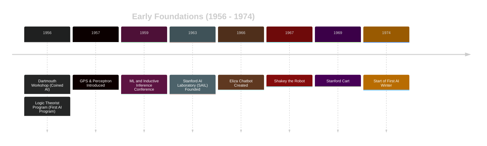
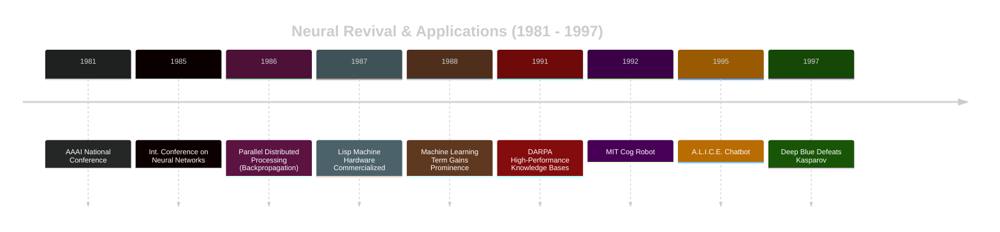
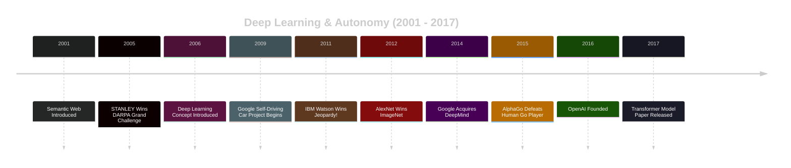
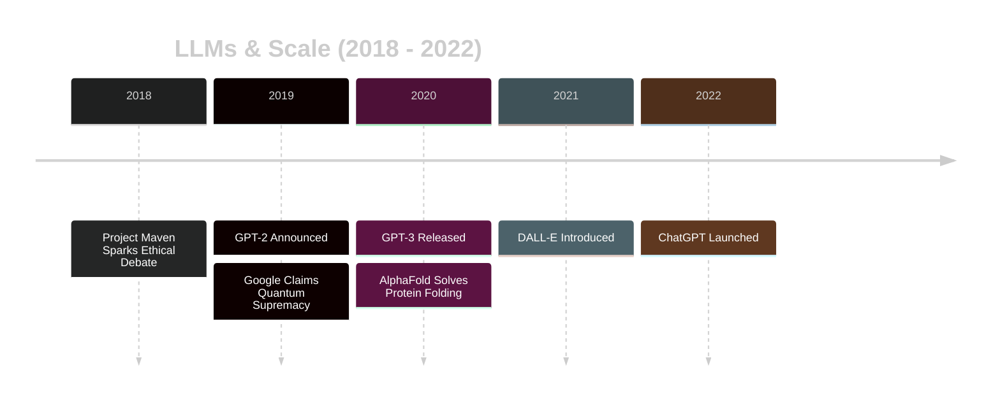
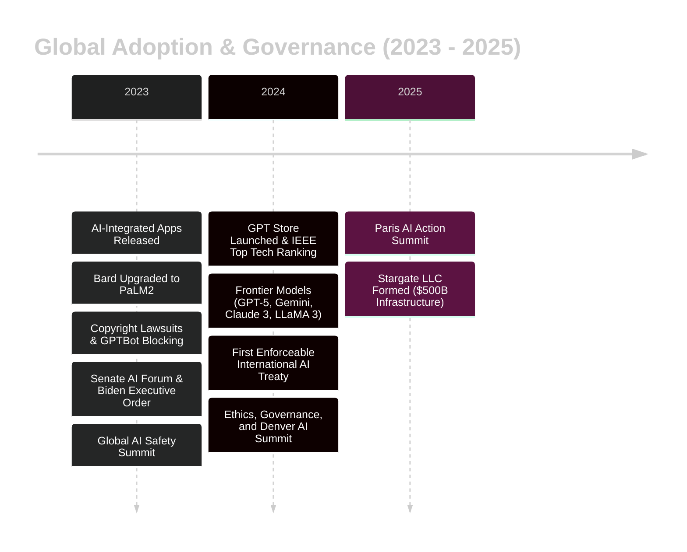

## Timeline of Artificial Intelligence
### Early Foundations (1956-1974)

### Neural Revival & Applications (1981 - 1997)

### Deep Learning & Autonomy (2001 - 2017)

### LLMs & Scale (2018-2022)

### Global Adoption & Governance (2023 - 2025)

## Responsible Advancement of AI

### 1. Collaborative Governance
As AI becomes increasingly central to society, it is essential for governments, businesses, and civil society to engage in ongoing dialogue around its responsible development and deployment.

### 2. Ethical and Regulatory Foundations  
The rapid pace of AI innovation demands robust regulatory frameworks that promote ethical use, mitigate risks, and ensure transparency and accountability.

### 3. Workforce Readiness  
To thrive in an AI-driven economy, education and training programs must evolve to equip individuals with the skills needed for emerging roles and technologies.

### 4. Balanced Integration  
By fostering a thoughtful approach that maximizes AI’s benefits while addressing its challenges, society can leverage this transformative technology to drive sustainable development, enhance human well-being, and tackle global issues.