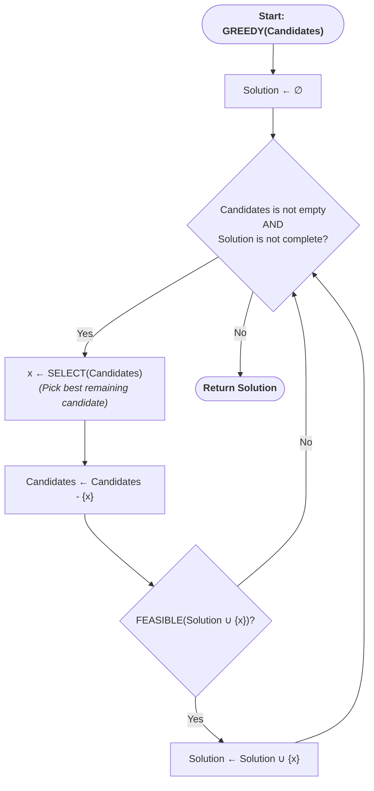

---
tags:
  - Greedy
  - algorithm
  - greedy-algorithms
description: Full definition of what is the greedy method and general scheme of the greedy method
aliases:
  - greedy method
---
> [!abstract] Overview
> The **greedy method** is an algorithmic paradigm for solving optimization problems. It builds a solution incrementally, one piece at a time, and at every step it makes the choice that looks best _at that moment_ — the **locally optimal choice** — without reconsidering it later and without regard for how that choice affects future steps.

---
## Greedy Method Candidates
A problem is a good candidate for a greedy algorithm if it has two properties:

1. **Greedy-choice property** — A globally optimal solution can be reached by making a sequence of locally optimal (greedy) choices. In other words, choosing the best option available right now never prevents you from reaching the overall best solution.
2. **Optimal substructure** — An optimal solution to the problem contains within it optimal solutions to its subproblems. After a greedy choice is made, what remains is a smaller instance of the same type of problem.

If both properties hold, a greedy algorithm produces a correct, optimal result — and typically does so far faster than approaches like [[Computer Science Introduction/Algorithms/Dynamic Programming/index|Dynamic Programming]] or **brute-force search**, because it never backtracks or re-examines past decisions.

If the properties do _not_ hold, a greedy algorithm may still run quickly, but it can produce a suboptimal or outright incorrect result.

---
## Core Idea

Instead of exploring all possible solutions (which is often exponential in cost), the greedy method:

- Looks only at the current state of the problem.
- Picks the option that maximizes (or minimizes) some local criterion.
- Commits to that choice permanently — there is no "undo."
- Reduces the problem to a smaller instance and repeats.

This "never look back" behavior is what makes greedy algorithms simple and fast, but also what makes them risky to apply without proof that the greedy-choice property holds.

---
## General Schema

Most greedy algorithms follow the same abstract structure, regardless of the specific problem:

### Components of the schema

|Component|Role|
|---|---|
|**Candidate set**|The full pool of elements from which a solution is built (e.g., edges, items, activities).|
|**Selection function**|Picks the most promising candidate remaining, according to a greedy criterion (e.g., smallest weight, largest value, earliest finish time).|
|**Feasibility function**|Checks whether a candidate can be added to the current partial solution without violating problem constraints.|
|**Objective function**|Assigns a value to a solution; this is what the algorithm is trying to optimize (maximize or minimize).|
|**Solution function**|Determines whether a complete/valid solution has been reached, so the algorithm knows when to stop.|

> [!note]
> A greedy algorithm is essentially an instantiation of this schema: define the candidate set, the selection rule, and the feasibility check for your specific problem, and the loop does the rest.

---
## General Design Steps

1. **Model the problem** as making a sequence of choices, where each choice reduces the problem to a smaller version of itself.
2. **Define the greedy criterion** — the rule for picking the "best" candidate at each step (e.g., sort by ratio, by weight, by deadline).
3. **Prove (or at least argue) the greedy-choice property** — show that taking the locally best choice first never rules out an optimal solution. This is usually done via an _exchange argument_: assume an optimal solution that doesn't start with the greedy choice, and show it can be transformed into one that does, without making it worse.
4. **Prove optimal substructure** — show that after the greedy choice, the remaining problem is a smaller instance of the same problem.
5. **Implement the loop**: sort/prioritize candidates, iterate, select, check feasibility, add to solution.

---
## Classic Examples

|Problem|Greedy Criterion|Notes|
|---|---|---|
|**Activity Selection**|Pick the activity with the earliest finish time among those compatible with what's already chosen|Provably optimal|
|**Fractional Knapsack**|Pick items with the highest value-to-weight ratio first|Optimal (fails for 0/1 knapsack)|
|**Huffman Coding**|Repeatedly merge the two lowest-frequency nodes|Produces an optimal prefix code|
|**Kruskal's / Prim's MST**|Repeatedly pick the cheapest edge that doesn't create a cycle (Kruskal) or that extends the tree (Prim)|Optimal for minimum spanning trees|
|**Dijkstra's Shortest Path**|Always expand the closest unvisited node|Optimal for non-negative edge weights|
|**Coin Change (canonical systems, e.g. US coins)**|Always use the largest denomination that fits|Optimal only for certain coin systems|

---
## When Greedy Fails

Greedy algorithms are not universally correct. Classic counterexamples:

- **[[The Knapsack Problem Example|Knapsack Problem]]**: picking the highest value-to-weight ratio item first can leave unused capacity that a different combination would have filled better. Dynamic programming is required.
- **Coin Change with arbitrary denominations** (e.g., coins of 1, 3, 4 to make 6): greedily picking the largest coin (4) first leads to 4+1+1 (3 coins), while the optimal is 3+3 (2 coins).
- **Longest Path problems**: locally extending the path with the "best" next edge does not generally yield the globally longest path.

> [!info] The Lesson
> Greedy is a _design strategy_, not a guarantee. Its correctness must be established per-problem. Read [[Techniques to Prove Optimality]] for full write ups of methods to prove correctness & optimality

---
## Complexity Characteristics

Greedy algorithms are generally efficient because each element is considered once (or the candidates are sorted once, then scanned once):

- Typical time complexity: **O(n log n)**, dominated by sorting the candidates.
- Space complexity: usually **O(n)**, for storing candidates and the solution.
- No backtracking, no re-computation of subproblems — unlike [[Computer Science Introduction/Algorithms/Dynamic Programming/index|Dynamic Programming]], which often trades extra memory (memoization tables) for guaranteed correctness on problems where greedy fails.

---
## Greedy vs. Dynamic Programming

|Aspect|Greedy Method|Dynamic Programming|
|---|---|---|
|Choice strategy|Makes one irrevocable choice at each step|Explores multiple choices, keeps best via subproblem results|
|Requires proof of correctness|Yes (greedy-choice property)|No — correctness follows from recurrence|
|Speed|Generally faster|Generally slower (more subproblems evaluated)|
|Memory|Low|Often higher (memoization/tables)|
|Applicability|Narrower — only works when greedy-choice property holds|Broader — works whenever optimal substructure holds|

---
## Summary

The greedy method solves optimization problems by repeatedly making the locally best choice, never revisiting past decisions, and relying on the problem having the greedy-choice property and optimal substructure to guarantee a globally optimal result. Its general schema — candidate set, selection function, feasibility check, objective function — applies across a huge range of problems, but each application requires its own correctness argument, since greedy is fast and simple only when it is actually valid for the problem at hand.

---
# Related Categories

- [[Computer Science Introduction/Algorithms/Greedy Algorithms/index|Greedy Algorithms]]
- [[Computer Science Introduction/Algorithms/Dynamic Programming/index|Dynamic Programming]]