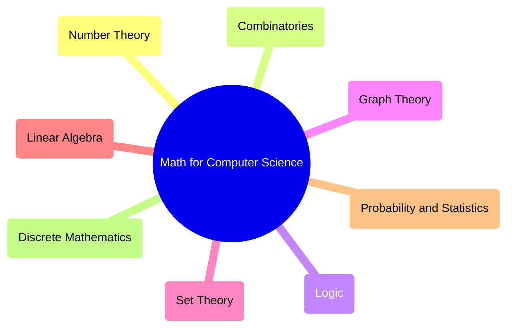

Computer Science at its core utilizes various Mathematical concepts. From simple [[Binary]] to advanced [[AI Overview|Artificial Intelligence]] and [[Computer Science Introduction/Algorithms/index|Algorithms]], Math plays a crucial role in the concepts in Computer Science

---
## Number Theory

> [!INFO]
> Focuses on **numeric systems**, **conversions** and **arithmetic operations** used in computing
- [[Number Systems]]
- [[Conversion between number systems]]
- [[Arithmetic Operations]]
- [[Modular Arithmetic]]
- [[Greatest Common Divisor]]
- [[Congruency]]
- [[Fermats Little Theorem]]
- [[Euclid's Division Algorithm]]

## Combinatorics

> [!INFO]
> Deals with **counting**, **arrangement** and **discrete structures**
- [[Computer Science Theory/Discrete Structures/Counting/index|Counting]]
- [[Tree Diagram]]
- [[Pigeonhole Principle]]
- [[Inclusion Exclusion]]
- [[Computer Science Theory/Discrete Structures/Discrete Algorithms/Recursive Algorithms/Solving Recurrence Closed Form/index|Recurrence Relations]]
- [[Asymptotic Notation|Algorithm and Complexity]]

## Discrete Mathematics

> [!INFO]
> Study of **logic**, **sets**, **functions** and **relations** fundamental for [[Computer Science Introduction/Data Structures/index|Data Structures]], [[Computer Science Introduction/Algorithms/index|Algorithms]] and **digital circuits**
- [[Set Theory]]
- [[Propositional Logic]]
- [[Function in Mathematics]]
- [[Relations and Their Properties]]
- [[Principle of Mathematical Induction]]
- [[Boolean Algebra]]

## Linear Algebra

> [!INFO]
> Explores **vectors**, **matrices** and **transformations** used in *graphics*, [[Artificial Intelligence/machine-learning/index|Machine Learning]] and [[Data Science/index|Data Science]]
- [[Vector and Vector Space]]
- [[Matrices]]
- [[Matrix Diagonalization]]
- [[Eigenvalues and Eigenvectors]]
- [[Systems of Linear Equations]]
- [[Gaussian Elimination to Solve Linear Equations]]
- [[Principle Component Analysis]]

## Calculus

> [!INFO]
> Used in **optimization** and **modeling** continuous systems
- [[Limits, Continuity and Differentiation]]
- [[Integration]]
- [[Partial Derivative]]
- [[Differential Equation]]

## Graph Theory

> [!INFO]
> Mathematical study of graphs, their **types** and **properties**
- [[Graphs]]
- [[Graphs#Types of Graphs|Types of Graphs]]
- [[Graphs#Graph Representations|Graph Representations]]
- [[Graph Reachability]]
- [[Planar Graphs and Graph Coloring]]
- [[Handshaking Lemma]]

## Probability and Statistics

> [!INFO]
> Tools for **analyzing uncertainty and data**
- [[Computer Science Theory/Discrete Structures/Probability/index|Probability]]
- [[Bayes' Theorem]]
- [[Probability Distributions]]
- [[Descriptive Statistics]]
- [[Sampling]]
- [[Hypothesis Testing]]
- [[Data Science/Regression Analysis/index|Regression Analysis]]

---
## Resource
[Mathematics For Computer Science - GeeksforGeeks](https://www.geeksforgeeks.org/computer-science-fundamentals/mathematics-for-computer-science/)