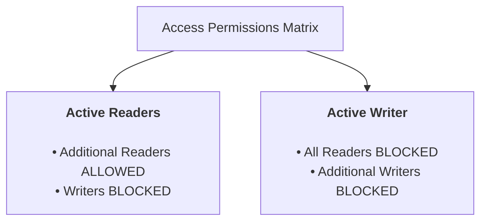

> [!abstract] Abstract
> The **Reader-Writer Problem** models access to a shared resource (such as a database, file, or tree structure) accessed by two classes of threads: **Readers** (who only inspect data) and **Writers** (who modify data). To maximize throughput while preventing corruption, the protocol permits **multiple concurrent readers** or **one exclusive writer**, but never both simultaneously.
> 
> - **Category:** Classical Synchronization Problems
> - **Access Invariants:**
>   1. Multiple Readers can read concurrently.
>   2. Only one Writer can write at a time.
>   3. If a Writer is active, no Readers or other Writers may access the resource.

---

# 1. Operational Rules & Constraints



| Active State | Incoming Reader | Incoming Writer |
|---|---|---|
| **No Active Threads** | Granted Immediately | Granted Immediately |
| **Active Readers Present** | **Granted** (Concurrent Reading) | **Blocked** (Must wait for all readers to finish) |
| **Active Writer Present** | **Blocked** | **Blocked** |

---

# 2. Semaphore Implementation (First Readers-Writers Solution)

This solution prioritizes readers (readers-preference): no reader is kept waiting unless a writer has already obtained permission to modify the object.

### Shared State Variables
*   `int read_count = 0;`: Tracks the number of active reader threads.
*   `semaphore mutex = 1;`: Binary semaphore protecting modifications to `read_count`.
*   `semaphore block_write = 1;`: Binary semaphore controlling exclusive access for writers (and the first/last reader).

```c
int read_count = 0;
semaphore mutex = 1;
semaphore block_write = 1;

void writer() {
    wait(&block_write); // Block if any readers or another writer are active
    
    /* --- WRITING CRITICAL SECTION --- */
    perform_write_operation();
    
    signal(&block_write);
}

void reader() {
    // --- READER ENTRY SEQUENCE ---
    wait(&mutex);
    read_count++;
    if (read_count == 1) {
        wait(&block_write); // FIRST reader locks out writers
    }
    signal(&mutex);

    /* --- READING CRITICAL SECTION (Concurrent Access Allowed) --- */
    perform_read_operation();

    // --- READER EXIT SEQUENCE ---
    wait(&mutex);
    read_count--;
    if (read_count == 0) {
        signal(&block_write); // LAST reader allows writers back in
    }
    signal(&mutex);
}
```

---

# 3. Code Execution Mechanics

1.  **First Reader Arrives (`read_count == 1`):** The first reader calls `wait(&block_write)`. If a writer is active, the first reader blocks on `block_write` (holding up all subsequent readers at `mutex`). If no writer is active, the first reader claims `block_write`.
2.  **Subsequent Readers Arrive (`read_count > 1`):** Subsequent readers increment `read_count`, bypass `block_write`, and immediately begin reading concurrently.
3.  **Intermediate Readers Exit:** Exiting readers decrement `read_count`. As long as `read_count > 0`, `block_write` remains held.
4.  **Last Reader Exits (`read_count == 0`):** The final exiting reader calls `signal(&block_write)`, unblocking any waiting writer.

> [!warning] Reader Starvation Risk
> In a readers-preference implementation, if a continuous stream of reader threads arrives, `read_count` never drops to $0$. As a result, waiting writer threads can be starved indefinitely. Writers-preference variants solve this by blocking new incoming readers when a writer is queued.

---

# Related Notes

- [[Operating Systems/Concurrency & Synchronization/Synchronization Primitives/Semaphores|Semaphores]]
- [[Operating Systems/Concurrency & Synchronization/Synchronization Patterns/Producer-Consumer Problem|Producer-Consumer Problem]]
- [[Operating Systems/Concurrency & Synchronization/Synchronization Primitives/Locks|Locks]]