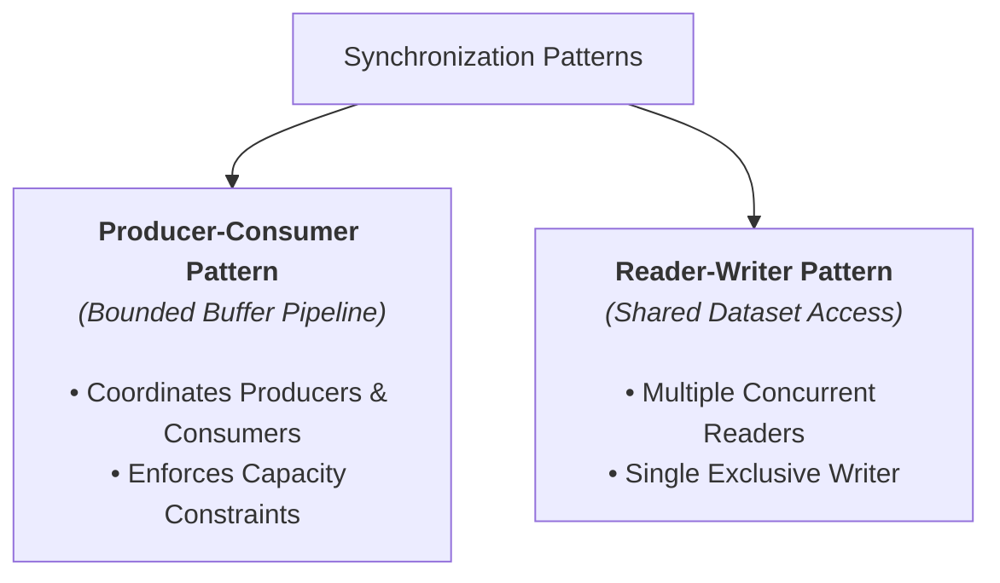

> [!abstract] Overview
> **Synchronization Patterns** are standardized solutions to classic concurrency problems encountered when designing multi-threaded operating systems, database engines, and network pipelines. They demonstrate how to combine synchronization primitives to coordinate access to shared data structures.

---

# Classical Synchronization Problems

| Pattern Link | Description | Primary Challenge | Solution Mechanisms |
|---|---|---|---|
| **[[Operating Systems/Concurrency & Synchronization/Synchronization Patterns/Producer-Consumer Problem\|Producer-Consumer Problem]]** | Manages a fixed-capacity bounded buffer shared between data-generating producers and data-consuming consumers. | Preventing buffer overflow, underflow, and lost wakeups | Counting Semaphores OR Mutex Lock + Condition Variables |
| **[[Operating Systems/Concurrency & Synchronization/Synchronization Patterns/Reader-Writer Problem\|Reader-Writer Problem]]** | Manages concurrent read access while ensuring exclusive write access to shared datasets. | Allowing concurrent readers without data corruption or writer starvation | Binary Semaphores (`mutex`, `block_write`) + Reader Tracking |

---

# Pattern Classification

---

# Related Modules

- [[Operating Systems/Concurrency & Synchronization/Synchronization Primitives/index|Synchronization Primitives Directory]]
- [[Operating Systems/Concurrency & Synchronization/Critical Sections & Mutual Exclusion|Critical Sections & Mutual Exclusion]]
- [[Operating Systems/Concurrency & Synchronization/index|Concurrency & Synchronization Main Index]]