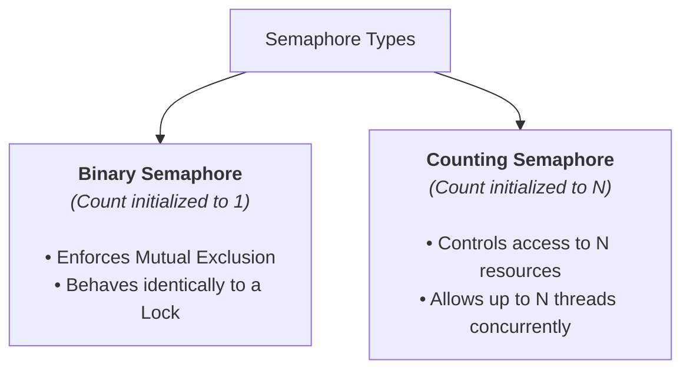

> [!abstract] Abstract
> Invented by Edsger Dijkstra in the mid-1960s, a **Semaphore** is an integer-valued synchronization variable used to manage access to shared resources and coordinate thread execution sequences. Unlike basic locks, semaphores maintain an internal non-negative integer counter that retains event history, allowing threads to perform **Mutual Exclusion** or **Event Sequencing** via atomic `wait()` ($P$) and `signal()` ($V$) operations.
> 
> - **Category:** Intermediate Synchronization Primitives
> - **Core Operations:** `wait(s)` (or $P(s)$) and `signal(s)` (or $V(s)$).
> - **Key Property:** Memory of past signals (counter retains history).

---

# 1. Semaphore Operations & Semantics

A semaphore $s$ is initialized to a non-negative integer value and supports two atomic, indivisible operations:

*   **`wait(s)` (also known as $P(s)$ - *proberen*, "to test"):** Decrements $s$ by $1$. If $s \le 0$ prior to decrementing (or if no resources remain), the calling thread blocks and is placed onto the semaphore's wait queue.
*   **`signal(s)` (also known as $V(s)$ - *verhogen*, "to increment"):** Increments $s$ by $1$. If any threads are blocked on $s$'s wait queue, one thread is unblocked and moved to the Ready queue.

```c
// Conceptual Definition (Must be executed ATOMICALLY)
void wait(Semaphore* s) {
    while (s->count <= 0); // Block until resource is available
    s->count--;
}

void signal(Semaphore* s) {
    s->count++;
}
```

> [!important] Semaphore "History" Property
> Unlike Condition Variables (which are memoryless), `signal()` on a semaphore is remembered. If `signal()` is called when no threads are waiting, the semaphore counter increments. That saved increment allows a future `wait()` call to proceed immediately without blocking.

---

# 2. Types of Semaphores



### 1. Binary Semaphore (`count = 1`)
*   Value takes on only $0$ or $1$.
*   Used exclusively to enforce **Mutual Exclusion** across a critical section (functions like a lock).

### 2. Counting Semaphore (`count = N`)
*   Value ranges over non-negative integers ($N \ge 0$).
*   Represents a finite pool of $N$ identical resources (e.g., $N$ available buffers, $N$ database connection slots). Up to $N$ threads can enter simultaneously before subsequent threads block.

---

# 3. Kernel Implementation of Blocking Semaphores

To avoid busy-waiting, a semaphore encapsulates an integer counter, an internal `guard` spinlock, and a thread wait queue `Q`:

```c
struct semaphore {
    int count = 1;
    bool guard = false;
    queue Q;
};

void wait(struct semaphore* s) {
    disable_interrupts();
    while (test_and_set(&s->guard)); // Acquire internal spinlock guard
    
    s->count--;
    if (s->count < 0) {
        put_current_thread_on(s->Q);
        s->guard = false;            // Release guard before sleeping!
        block_current_thread();      // Sleep (Context switch)
    } else {
        s->guard = false;            // Release guard
    }
    enable_interrupts();
}

void signal(struct semaphore* s) {
    disable_interrupts();
    while (test_and_set(&s->guard)); // Acquire internal spinlock guard
    
    s->count++;
    if (s->count <= 0) {             // Threads are waiting on queue
        move_waiting_thread_to_ready_queue(s->Q);
    }
    
    s->guard = false;                // Release guard
    enable_interrupts();
}
```

---

# 4. Benefits & Trade-offs of Semaphores

| Feature | Locks | Semaphores |
|---|---|---|
| **Internal State** | Boolean (`held = true/false`) | Non-negative Integer (`count = N`) |
| **Primary Use Cases** | Mutual Exclusion only | Mutual Exclusion **AND** Event Sequencing / Resource Counting |
| **Signal Memory** | No | Yes (Counter increments persist) |
| **Drawbacks** | Cannot handle resource pools | Unstructured; mixing `wait()` and `signal()` can lead to complex bugs or deadlocks |

---

# Related Notes

- [[Operating Systems/Concurrency & Synchronization/Synchronization Patterns/Producer-Consumer Problem|Producer-Consumer Problem]]
- [[Operating Systems/Concurrency & Synchronization/Synchronization Patterns/Reader-Writer Problem|Reader-Writer Problem]]
- [[Operating Systems/Concurrency & Synchronization/Synchronization Primitives/Locks|Locks]]
- [[Operating Systems/Concurrency & Synchronization/Synchronization Primitives/Condition Variables|Condition Variables]]