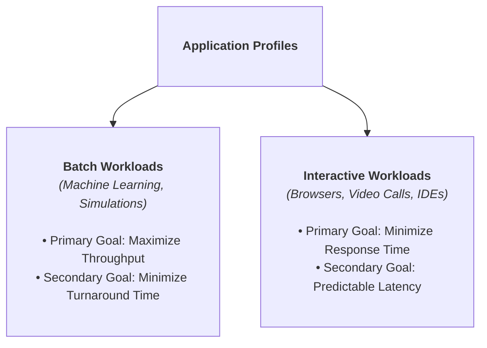

> [!abstract] Abstract
> The **CPU Scheduler** (or Dispatcher) multiplexes physical CPU cores among active threads to create the processing illusion of dedicated execution. By strictly decoupling **Policy** (decision logic selecting the next thread) from **Mechanism** (saving/restoring registers), the kernel can optimize execution for specific performance metrics—such as **Turnaround Time**, **Response Time**, and **CPU Utilization**.
> 
> - **Category:** OS Kernel Scheduling Principles
> - **Core Invariant:** Policy decides *what* thread runs; Mechanism handles *how* execution switches.
> - **Key Trade-off:** High throughput vs. low interactive response latency.

---

# 1. Policy vs. Mechanism

CPU virtualization relies on a strict separation between low-level mechanism and high-level policy:

*   **Mechanism (The "How"):** System infrastructure routines that perform context switches, manipulate state queues, and handle hardware timer interrupts.
*   **Policy (The "What"):** Algorithmic rules that select which runnable thread to dispatch next and determine its execution time slice.

```c
void yield() {
    thread_t old_thread = current_thread;
    
    current_thread = get_next_thread();         // POLICY: Selects target thread
    
    append_to_queue(ready_queue, old_thread);
    context_switch(old_thread, current_thread);   // MECHANISM: Assembly register swap
    return;
}
```

---

# 2. When Does the Scheduler Run?

The CPU Scheduler is invoked whenever execution control returns to the kernel through an event:

1.  **Running $\to$ Waiting:** A thread issues a blocking I/O system call (e.g., `read()`) or waits on a synchronization primitive.
2.  **Running $\to$ Ready:** A hardware timer interrupt fires, preempting the active thread.
3.  **Waiting $\to$ Ready:** An external hardware I/O interrupt completes, unblocking a thread.
4.  **Termination:** A thread exits explicitly (`exit()`) or encounters an unhandled fault.

![[Pasted image 20260715145033.png]]

---

# 3. Core Scheduling Metrics

Schedulers are evaluated against quantitative mathematical performance metrics:

### 1. Turnaround Time ($T_{\text{turnaround}}$)
The total time elapsed from job arrival to complete execution:
$$T_{\text{turnaround}} = T_{\text{completion}} - T_{\text{arrival}}$$

### 2. Response Time ($T_{\text{response}}$)
The time elapsed from job arrival until it first begins executing on a CPU core:
$$T_{\text{response}} = T_{\text{firstrun}} - T_{\text{arrival}}$$

### 3. Throughput
The number of completed jobs executed per unit of time (e.g., jobs/sec).

### 4. Overhead
The fraction of CPU execution time lost to non-productive management tasks (context switching, queue manipulation, schedule selection).

### 5. CPU Utilization
The fraction of total elapsed time the system spends performing useful application work:
$$\text{CPU Utilization} = \frac{\text{Time Doing Useful Work}}{\text{Total Time}}$$

---

# 4. Workload Goals & Application Profiles

Schedulers optimize for different metrics depending on the target workload profile:


### Starvation
**Starvation** is an undesirable condition where a runnable thread is indefinitely denied access to a resource (CPU time or locks) because higher-priority tasks continuously monopolize execution.

> [!warning] Starvation vs. Deadlock
> *   **Deadlock:** A set of threads is stuck in a closed dependency loop where **no progress is possible**.
> *   **Starvation:** High-priority threads continue making forward progress, while low-priority threads are starved of CPU time.

---

# 5. Context Switch Overhead & CPU Utilization Math

Context switches do not perform useful application work. A typical scheduling quantum is $1\text{ ms}$, while a typical hardware context switch takes $1\text{ }\mu\text{s}$.

### Case 1: CPU-Bound Workload ($1\text{ ms}$ Quantum, $1\text{ }\mu\text{s}$ Overhead)
Three CPU-bound jobs run for their entire allocated $1\text{ ms}$ quantum:
$$\text{CPU Utilization} = \frac{3 \times 1\text{ ms}}{3 \times 1\text{ ms} + 3 \times 1\text{ }\mu\text{s}} = \frac{3000\text{ }\mu\text{s}}{3003\text{ }\mu\text{s}} \approx 99.9\%$$

### Case 2: I/O-Bound Workload ($20\text{ }\mu\text{s}$ CPU Burst, $1\text{ }\mu\text{s}$ Overhead)
Three I/O-bound jobs execute for only $20\text{ }\mu\text{s}$ before issuing an I/O request and yielding:
$$\text{CPU Utilization} = \frac{3 \times 20\text{ }\mu\text{s}}{3 \times 20\text{ }\mu\text{s} + 3 \times 1\text{ }\mu\text{s}} = \frac{60\text{ }\mu\text{s}}{63\text{ }\mu\text{s}} \approx 95.2\%$$

---

# Related Notes

- [[Operating Systems/Kernel & Architecture/CPU Scheduling/Classic Scheduling Algorithms|Classic Scheduling Algorithms]]
- [[Operating Systems/Kernel & Architecture/CPU Scheduling/Multilevel Feedback Queue & Real-World Schedulers|Multilevel Feedback Queue & Real-World Schedulers]]
- [[Operating Systems/Kernel & Architecture/Thread/Thread Context Switch & Scheduling|Thread Context Switch & Scheduling]]