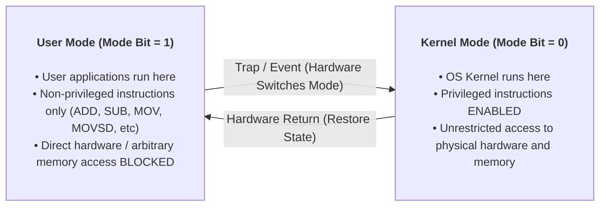

> [!abstract] Abstract
> To protect the operating system from buggy or malicious applications—and to protect applications from each other—hardware must enforce privilege boundaries. Modern CPUs achieve this using **Dual-Mode Operation**, switching between User Mode and Kernel Mode via a hardware-managed mode bit.
> 
> - **Category:** Hardware Security & CPU Architecture
> - **Core Hardware Primitives:** Mode Bit, Protected Control Registers, MMU.
> - **Primary Invariant:** Unprivileged user code cannot directly execute privileged instructions or access kernel memory.

---

# User Mode vs. Kernel Mode

The CPU core enforces privilege isolation using a hardware **mode bit** stored in a protected control register:

*   **Kernel Mode (Mode Bit = 0):** The CPU can execute **all** machine instructions, access all physical memory addresses, and interface directly with I/O devices.
*   **User Mode (Mode Bit = 1):** The CPU can execute only **non-privileged** instructions. Any attempt to execute a privileged instruction or touch restricted memory triggers an immediate hardware trap.

---

# Privileged Instructions

Privileged instructions are a restricted subset of CPU commands that only execute when the mode bit is set to Kernel Mode ($0$). If executed in User Mode, the CPU halts execution and raises a hardware fault.

Key categories of privileged instructions include:
1.  **I/O Operations:** Reading or writing directly to raw disk controllers, network cards, or GPU registers.
2.  **Memory Management State:** Modifying Page Table Pointers, Segmentation registers, or clearing Translation Lookaside Buffer (TLB) entries.
3.  **CPU Control Registers:** Changing CPU operational flags, toggling interrupt enable bits, or altering the mode bit itself.

---

# Memory Protection

The OS kernel must protect its memory from user programs, while also isolating user programs from one another.

![[Pasted image 20260720131010.png]]

This protection is enforced at hardware speed by the **Memory Management Unit (MMU)**:
*   **Page Table Pointers & Permissions:** Define which virtual memory ranges are accessible, readable, writable, or executable by user-mode code.
*   **Segmentation & TLB:** Enforce hardware memory boundaries on every memory access instruction.

> [!important] Software Elevation vs. Hardware Privilege
> Running an application as `root` or Administrator grants software-level API permissions inside the OS, but the CPU still executes that code in **User Mode**. It cannot execute privileged CPU instructions without trapping into the kernel via a system call.

---

# Related Notes

- [[Interrupts and Exceptions|Interrupts and Exceptions]]
- [[System Calls]]
- [[Introduction to Operating Systems]]