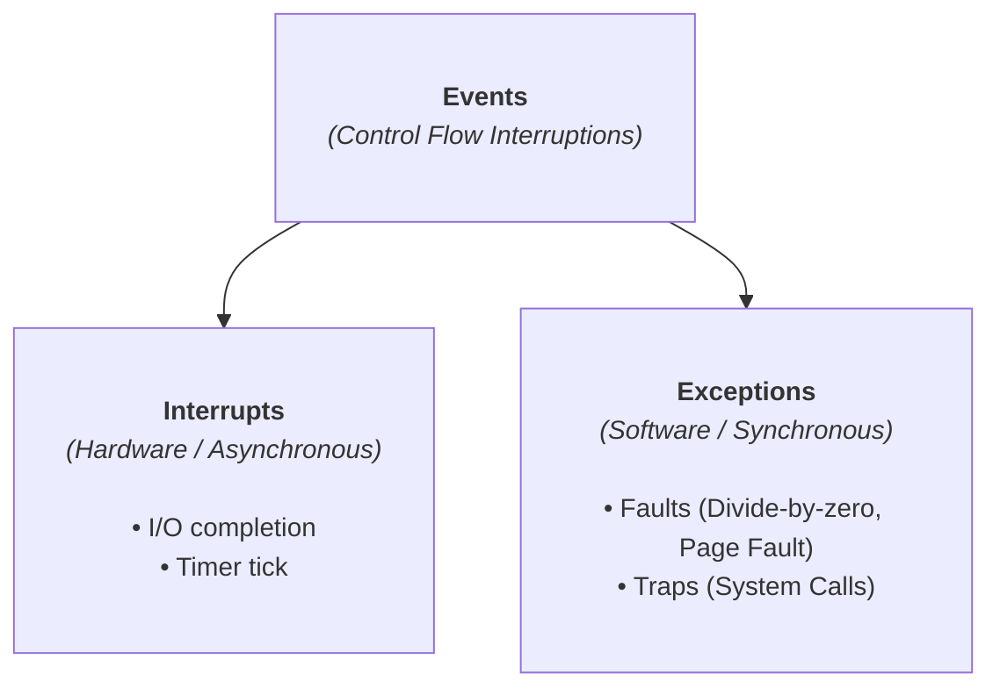
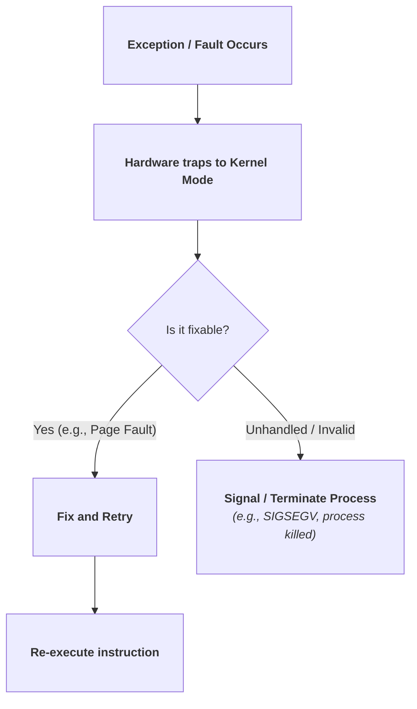

> [!abstract] Abstract
> An **Event** is an unnatural change in CPU control flow that transfers execution from user applications to kernel handlers. After initial boot, the Operating System acts as a giant event handler—sitting passively in memory and executing **only** in response to external hardware interrupts or software exceptions.
> 
> - **Category:** Control Flow & Hardware Dispatch
> - **Core Classifications:** Asynchronous Interrupts vs. Synchronous Exceptions/Faults.
> - **Key Hardware Primitive:** Hardware Timer (enables preemption and CPU scheduling).

---

# Event Taxonomy

When an event occurs, the CPU immediately pauses current execution, switches the mode bit to Kernel Mode ($0$), saves caller state (PC, registers), and vectors to an event handler in kernel space.

| Metric | Interrupts | Exceptions / Faults |
|---|---|---|
| **Source** | External hardware devices | Internal CPU instruction execution |
| **Timing** | **Asynchronous** (Unrelated to current instruction) | **Synchronous** (Tied directly to active instruction) |
| **Intent** | Signal I/O completion or timer ticks | Signal execution errors or request OS services |

---

# Exceptions and Fault Handling

An **Exception** (or Fault) occurs when the CPU detects an abnormal condition while executing an instruction (e.g., page fault, divide-by-zero, invalid opcode).

### Exception Processing Workflow
1. Hardware pauses the faulting instruction and captures the exception ID.
2. Hardware saves execution context (Program Counter, registers, flags).
3. CPU switches to Kernel Mode and jumps to the exception handler address in the **Trap Vector Table**.
4. The OS processes the fault using one of four strategies:

### Fault Recovery Strategies
1.  **Fix and Retry:** Resolve the issue transparently and re-execute the *exact same instruction*.
    *   *Example:* On a **Page Fault**, the OS loads the missing memory page from disk into RAM, updates the page table, and restarts the instruction.
2.  **User Signal:** Deliver a signal to a user-registered handler (e.g., POSIX `SIGSEGV` or `SIGFPE`).
3.  **Process Termination:** Kill the faulting process, write a core dump, and free its resources.
4.  **Kernel Panic:** If a fault occurs **inside Kernel Mode**, the OS cannot safely recover. It halts execution, dumps state, and crashes (`panic` in Unix, BSOD in Windows) to prevent data corruption.

---

# Hardware Interrupts & Timers

### Hardware Interrupts
Hardware interrupts inform the OS of external device events. Modern processors use **precise interrupts**, guaranteeing control transfers strictly on instruction boundaries.

1. Device triggers an interrupt line on the interrupt controller.
2. CPU finishes the current instruction, disables lower-priority interrupts, and saves execution state.
3. CPU jumps to the Interrupt Service Routine (ISR) in the kernel.
4. ISR services the device, re-enables interrupts, and resumes the paused user program.

### The Hardware Timer: Enabling Preemption
The **Hardware Timer** is an independent clock chip that generates periodic interrupts (e.g., every 1ms–10ms).

> [!warning] Why the Hardware Timer is Critical
> Without a hardware timer, a user process in an infinite loop (`while(1);`) would monopolize the CPU core indefinitely. 

Setting the timer is a **privileged instruction**. The kernel uses timer interrupts to regain CPU control and execute the **CPU Scheduler**, enabling fair time-sharing concurrency across applications.

---

# Asynchronous I/O Execution Cycle

To prevent the CPU from idling during slow disk or network transfers, the kernel pairs system calls with asynchronous hardware interrupts:

![[Pasted image 20260720171623.png]]

1.  **Request:** A user process executes a `read()` system call.
2.  **Dispatch & Block:** The kernel dispatches the command to the disk controller, moves the calling process to the **Blocked** state, and context-switches the CPU to another runnable process.
3.  **Independent Operation:** The disk controller retrieves data while the CPU continues executing other tasks.
4.  **Interrupt Completion:** The disk controller fires an I/O completion interrupt once data sits in memory.
5.  **Wake-up:** The CPU jumps to the I/O interrupt handler, marks the blocked process as **Ready**, and resumes execution.

---

# Related Notes

- [[Dual-Mode Operation & Memory Protection|Dual-Mode Operation]]
- [[System Calls]]
- [[Computer Science/Operating Systems/Kernel & Architecture/Process/index|Process]]
- [[Computer Science/Operating Systems/Kernel & Architecture/Thread/index|Thread]]