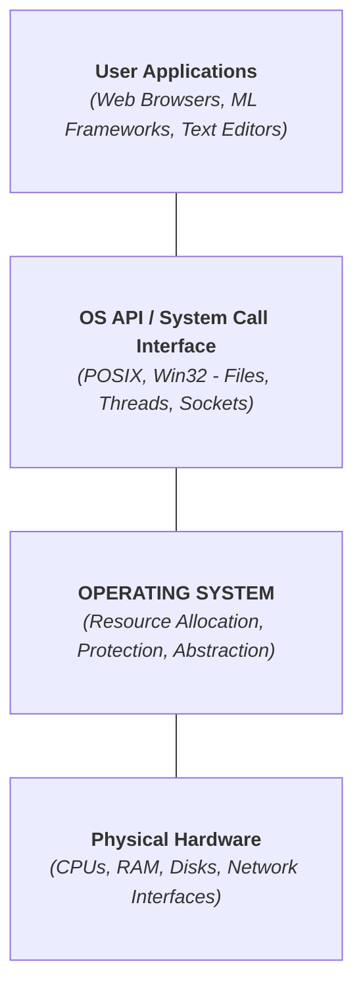
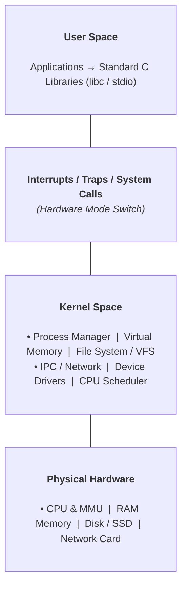

> [!abstract] Abstract
> An **Operating System (OS)** is a fundamental software layer that sits directly between user applications and raw physical hardware. It serves a dual purpose: acting as a **Resource Manager** that safely allocates, reclaims, and multiplexes physical hardware below, and an **Abstraction Layer** that presents clean, virtualized logical interfaces (e.g., files, processes, sockets) to applications above.
> 
> - **Category:** System Architecture & Operating System Foundations
> - **Primary Responsibilities:** Resource Allocation, Hardware Abstraction, Isolation & Protection, Concurrency.
> - **Core Design Philosophy:** Strict **Separation of Policy and Mechanism**.

---

# What is an Operating System?

At its most foundational level, an Operating System is the software engine that controls and mediates access to physical computing resources. It abstracts away complex, messy hardware details and replaces them with clean, standardized logical interfaces.

---

# The Dual Role of the OS

An OS operates from two primary perspectives: looking **down** toward hardware, and looking **up** toward user software.

### 1. Managing Resources (Looking Down)
Hardware consists of finite, physical assets. The OS manages, allocates, and reclaims these resources while protecting applications from interfering with one another:

*   **Computation (CPUs):** Time-shares CPU core execution cycles across multiple active threads/processes.
*   **Volatile Storage (RAM):** Allocates memory spaces to running processes and reclaims memory when processes terminate.
*   **Persistent Storage (Disks/SSDs):** Manages non-volatile storage media blocks and organizes physical storage structures into accessible structures.
*   **Communication & Devices:** Controls network interfaces, keyboards, monitors, and graphics adapters via specialized device drivers.

### 2. Providing Abstractions (Looking Up)
Direct interaction with raw hardware registers is error-prone, insecure, and complex. The OS provides logical objects and standardized operations on those objects:

| Hardware Resource | OS Logical Abstraction | Operations Provided |
|---|---|---|
| Physical CPU Cores | **Processes / Threads** | `create()`, `yield()`, `exit()`, `wait()` |
| Physical RAM Blocks | **Virtual Memory / Address Space** | `malloc()`, `mmap()`, `sbrk()` |
| Disk Storage Sectors | **Files & Directories** | `open()`, `read()`, `write()`, `close()` |
| Network Cards (NICs) | **Sockets & Pipes (IPC)** | `socket()`, `bind()`, `connect()`, `send()` |

> [!tip] The Core Illusions of the OS
> By virtualizing hardware, the OS provides every application with the illusion that it has **infinite memory** and is the **sole application running** on a dedicated CPU core.

---

# System Architecture & Layering

In a typical system (such as Unix/Linux), software and hardware are organized into distinct privilege layers separating unprivileged user operations from privileged kernel tasks:

![[Pasted image 20260720002942.png]]

![[Pasted image 20260720002852.png]]

---

# Fundamental Design Principle: Policy vs. Mechanism

A foundational guiding principle in systems engineering is the explicit **Separation of Policy and Mechanism**:

*   **Mechanism (The "How"):** The technical tool or implementation that achieves a particular functional capability.
*   **Policy (The "What"):** The decision-making rules or algorithms that determine which goal should be achieved.

### CPU Scheduling Example
*   **Mechanism:** Context switching routines, saving/restoring CPU register states, and manipulating execution run-queues.
*   **Policy Options:** 
    1. *Round-Robin Policy:* Treat all user processes completely equally.
    2. *Priority Policy:* Give interactive applications priority over background processes.
    3. *Real-Time Policy:* Guarantee hard execution deadlines for critical audio/video processing.

> [!important] Why Separate Policy from Mechanism?
> Decoupling policy from mechanism ensures system **flexibility**. System architects can change, tune, or completely replace the policy (e.g., switching from a Fair-Share CPU scheduler to a Real-Time scheduler) without needing to rewrite or modify the underlying hardware context-switching mechanisms.

---

# Trade-offs, Conflicts, and Evolution

Operating systems are constrained by conflicting operational goals. System designers must navigate core engineering trade-offs based on target application needs:

### Conflicting Operational Goals
| Goal Conflict | Operational Trade-off Description |
|---|---|
| **Fairness vs. Efficiency** | Dividing CPU time equally among 100 threads introduces frequent context-switching overhead, reducing total computational throughput. |
| **Security vs. Performance** | Enforcing strict memory boundary checks and cryptographic isolation adds latency to system calls and memory accesses. |
| **Portability vs. Performance** | Providing a generic, portable driver interface across all hardware platforms may obscure hardware-specific vendor optimizations. |

### System Evolution Drivers
While core OS concepts originate from early mainframe computing in the 1970s, operating systems continually adapt due to shifts in:
1.  **Hardware Trajectories:** Mainframes $\to$ Minicomputers $\to$ Desktop PCs $\to$ Laptops $\to$ Smartphones $\to$ Wearables / Embedded Systems.
2.  **Application Demands:** Command-line batch execution $\to$ Graphical User Interfaces $\to$ Web-based cloud services $\to$ Machine Learning workloads and Virtual Reality.

---

# Core OS Design Principles Summary

*   **Abstraction:** Hide physical hardware complexity behind uniform, clean interfaces.
*   **Modularity:** Divide the kernel into distinct, well-defined subsystems (e.g., Virtual Memory Manager, Virtual File System).
*   **Simplicity:** Keep core primitives simple to minimize bug surfaces and security vulnerabilities.
*   **Caching:** Store frequently accessed data in fast volatile memory to mask slow persistent device latency.
*   **Isolation & Protection:** Prevent untrusted or buggy user programs from corrupting other applications or crashing the system kernel.

---

# Related Notes

- [[System Calls]]
- [[Computer Science/Operating Systems/Kernel & Architecture/Process/index|Process]]
- [[Computer Science/Operating Systems/Kernel & Architecture/Thread/index|Thread]]
- [[Computer Science/Operating Systems/index|Operating System Index]]