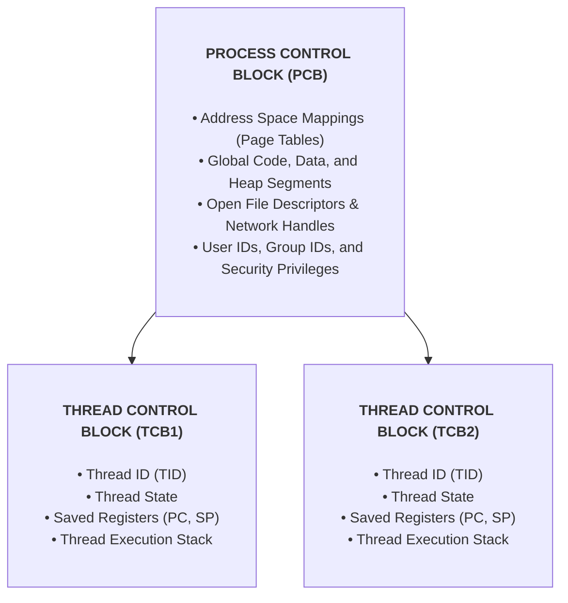

> [!abstract] Abstract
> To execute tasks concurrently, applications can either launch multiple processes via `fork()` or spawn multiple **Threads** within a single process. While multi-process models incur high memory and context-switching overhead, threads separate the execution state (PC, registers, stack) from the process resource container (address space, open files). Threads act as the primary unit of CPU scheduling in modern operating systems.
> 
> - **Category:** OS Scheduling & Execution Primitives
> - **Core Invariant:** Threads in a process share code, global data, heap, and files, but each maintains its own private execution stack, registers, and TCB.
> - **Key Data Structure:** Thread Control Block (TCB).

---

# 1. Why Separate Processes from Execution Streams?

Handling concurrent tasks using multiple processes requires allocating duplicate page tables, creating new Process Control Blocks (PCBs), and setting up explicit Inter-Process Communication (IPC) regions.

![[Pasted image 20260714103517.png]]

Cooperating tasks within an application naturally share resources:
*   **Shared Attributes:** Executable code, global data variables, heap memory allocations, open file descriptors, and network sockets.
*   **Unshared Attributes:** Private execution state—specifically the Program Counter (PC), CPU registers, and the function call stack.

> [!important] Key Architectural Shift
> Modern operating systems decouple the concept of a process from its execution state:
> *   **Process:** The physical resource boundary (address space, permissions, file tables).
> *   **Thread:** A single sequential execution stream within a process (PC, stack pointer, register set).

---

# 2. Multithreaded Address Space Layout

In a traditional single-threaded process, the virtual address space contains one execution stack growing down toward the heap. In a **multithreaded process**, the single address space is modified to accommodate **multiple independent thread stacks**:

![[Pasted image 20260714221827.png]]

![[Pasted image 20260714221953.png]]

Each thread receives its own allocated stack region to track private procedure calls, local variables, and return addresses. However, because all thread stacks reside within the same virtual memory space, threads can access each other's memory pointers if shared explicitly.

---

# 3. PCB vs. Thread Control Block (TCB)

Because a single process can host multiple threads, process information is divided into **shared process-wide metadata** and **per-thread execution state**:

When a thread is paused, the CPU hardware registers are saved into its **Thread Control Block (TCB)**. When the thread is resumed, its hardware registers are restored from its TCB back into the CPU.

---

# 4. Concurrency vs. Parallelism

Multithreading provides benefits on both single-core and multi-core CPU architectures, but the execution mechanics differ fundamentally:

### Concurrency
Multiple execution threads make progress during overlapping time windows by time-sharing a single CPU core via interleaved execution.

![[Pasted image 20260715162719.png]]

### Parallelism
Multiple execution threads execute simultaneously across physically separate CPU cores at the exact same instant in time.

![[Pasted image 20260720223634.png]]

| Parameter | Concurrency | Parallelism |
|---|---|---|
| **Core Requirement** | Can run on a **single** CPU core | Requires **multiple** physical CPU cores / processors |
| **Execution Pattern** | Interleaved time-slicing execution | True simultaneous instruction execution |
| **Primary Goal** | Responsiveness, overlapping I/O latency | Maximum computational throughput speedup |

---

# Related Notes

- [[Operating Systems/Kernel & Architecture/Thread/Thread Context Switch & Scheduling|Thread Context Switch & Scheduling]]
- [[Operating Systems/Kernel & Architecture/Thread/Kernel vs User Level Threads|Kernel vs User Level Threads]]
- [[Operating Systems/Kernel & Architecture/Process/Process Abstraction & PCB|Process Abstraction & PCB]]