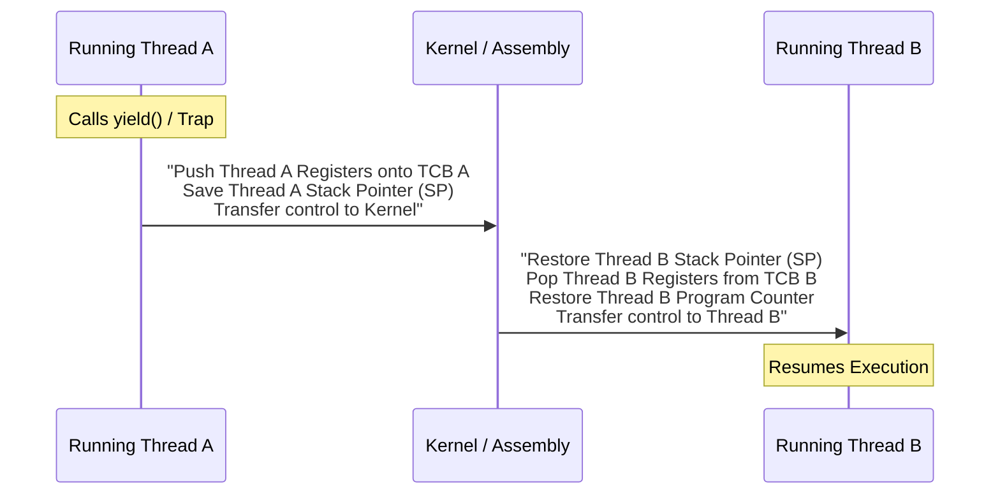

> [!abstract] Abstract
> Thread context switching is the low-level mechanism of saving the hardware execution context (PC, SP, registers) of an active thread into its TCB and loading the saved context of another runnable thread. Thread execution is orchestrated via kernel state queues using either **Non-Preemptive** (voluntary yield) or **Preemptive** (involuntary timer interrupt) scheduling.
> 
> - **Category:** OS Scheduling & Low-Level Mechanics
> - **Core Operations:** State queue linking/unlinking, context switching via assembly, hardware timer preemption.
> - **Key Primitives:** `yield()`, TCB State Queues, Hardware Timer.

---

# 1. Thread Execution States & State Queues

Like processes, threads transition through three primary execution states: **Running**, **Ready**, and **Waiting (Blocked)**.

![[Pasted image 20260715145033.png]]

### Kernel State Queues
To manage thousands of active threads efficiently, the OS kernel maintains doubly linked state queues:
*   **Ready Queue:** A queue holding TCB pointers of threads ready to execute on a CPU core.
*   **Waiting Queues:** Separate event queues holding blocked threads waiting on specific operations:
    *   *Disk Wait Queue:* Threads waiting for disk I/O blocks.
    *   *Timer Wait Queue:* Threads sleeping for a set duration.
    *   *Synchronization Wait Queue:* Threads waiting on mutexes, semaphores, or condition variables.

When a thread changes state, the OS unlinks its TCB from its current queue and links it into another state queue.

---

# 2. Non-Preemptive Scheduling & `yield()`

In a **Non-Preemptive** scheduling environment, a running thread executes continuously until it voluntarily yields control of the CPU by calling an explicit routine like `yield()`, `sleep()`, or exiting.

### Ping-Pong Execution Example
```c
// Ping Thread
while (1) {
    printf("ping\n");
    yield();
}

// Pong Thread
while (1) {
    printf("pong\n");
    yield();
}
```

*Execution Trace:* `ping` $\to$ `yield()` $\to$ `pong` $\to$ `yield()` $\to$ `ping` ...

### Implementing `yield()`
When a thread calls `yield()`, it voluntarily surrenders the CPU core to the next runnable thread:

```c
void yield() {
    thread_t old_thread = current_thread;
    
    // Move old thread to back of ready queue so it is not lost
    append_to_queue(ready_queue, old_thread);
    
    // Select next runnable thread
    current_thread = get_next_thread(ready_queue);
    
    // Magic step: Switch execution context
    context_switch(old_thread, current_thread);
    
    return; // Execution resumes here when old_thread is scheduled again!
}
```

---

# 3. The Context Switch Mechanism

The low-level `context_switch(old_thread, new_thread)` routine saves and restores hardware registers. It is written in assembly language because standard high-level language compilers cannot manipulate raw hardware registers directly.


### Context Switch Lifecycle
1.  **Save Active Context:** Push all current machine registers (PC, SP, general registers) onto `old_thread`'s stack or TCB.
2.  **Update Pointers:** Change internal tracking pointer `current_thread = new_thread`.
3.  **Restore Target Context:** Pop saved register values from `new_thread`'s stack or TCB back into physical CPU registers.
4.  **Resume Execution:** Overwrite the CPU's Program Counter (PC) with `new_thread`'s saved PC value. The CPU resumes executing `new_thread` seamlessly.

---

# 4. Preemptive Scheduling

Non-preemptive multithreading relies entirely on user cooperative yielding. If a thread enters a bugged infinite loop (`while(1);`), the entire CPU core locks up because no other thread gets scheduled.

Modern operating systems mandate **Preemptive Scheduling**:
1.  **Periodic Hardware Timer:** The hardware timer chip fires an interrupt at fixed intervals (e.g., every 1ms–10ms).
2.  **Involuntary Trap:** The timer interrupt forces the currently running thread into Kernel Mode and jumps to the kernel's timer interrupt service routine.
3.  **Forced Yield:** The timer handler automatically invokes `yield()` on behalf of the running thread, moving it to the Ready Queue and context switching to another thread.

---

# Related Notes

- [[Operating Systems/Kernel & Architecture/Thread/Thread Abstraction & TCB|Thread Abstraction & TCB]]
- [[Operating Systems/Kernel & Architecture/Thread/Kernel vs User Level Threads|Kernel vs User Level Threads]]
- [[Operating Systems/Kernel & Architecture/Interrupts and Exceptions|Interrupts and Exceptions]]
- [[Operating Systems/Kernel & Architecture/Process/Process Abstraction & PCB|Process Abstraction & PCB]]