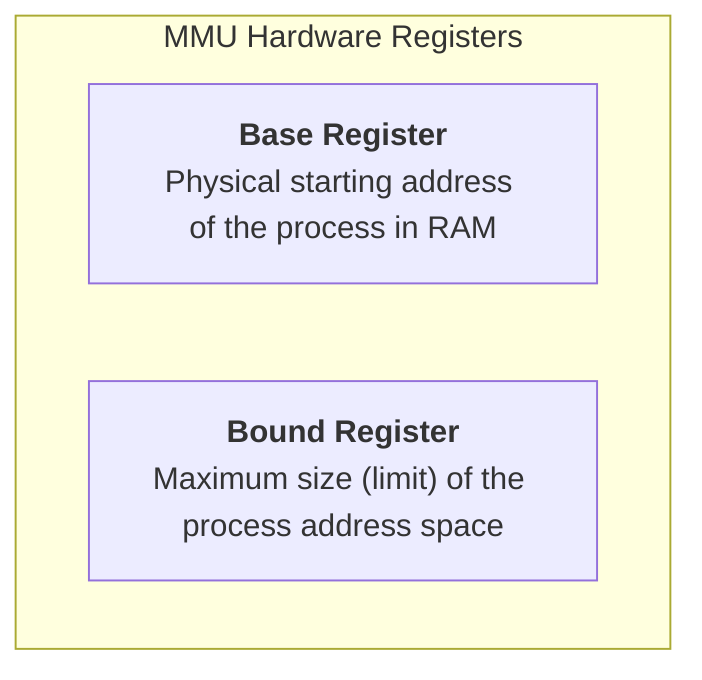

> [!abstract] Abstract
> **Base and Bound** (also known as Base and Limit) is a single-segment contiguous hardware address translation mechanism. The hardware MMU maintains two registers per process: a **Base Register** (holding the physical starting address) and a **Bound Register** (holding the total address space size). It provides fast translation and basic protection, but suffers from severe memory fragmentation.
> 
> - **Category:** Hardware Address Translation Primitives
> - **Hardware Registers:** Base Register, Bound (Limit) Register.
> - **Translation Formula:** $\text{Physical Address} = \text{Virtual Address} + \text{Base}$.
> - **Protection Boundary:** $0 \le \text{Virtual Address} < \text{Bound}$.

---

# Base and Bound Hardware Mechanism

First popularized in hardware architectures like the Cray-1 (1976), **Base and Bound** allocates a single contiguous block of physical RAM to an entire process virtual address space.

![[Pasted image 20260725212211.png]]

---

# Address Translation & Boundary Checking

When a running process issues a virtual address $VA$:

![[Pasted image 20260725212225.png]]

1.  **Hardware Bounds Check:** The MMU verifies that the virtual address falls within the process limit:
    $$0 \le VA < \text{Bound}$$
    *If $VA \ge \text{Bound}$, the MMU hardware triggers an exception (Fault / Segmentation Violation).*
2.  **Physical Address Calculation:** If the bounds check succeeds, the hardware translates the virtual address:
    $$\text{Physical Address} (PA) = VA + \text{Base}$$

---

# Context Switching Base and Bound Registers

Because physical memory locations differ across processes, the Base and Bound registers must be swapped during every context switch:

1.  The kernel saves the active process's Base and Bound register values into its **Process Control Block (PCB)**.
2.  The kernel restores the next process's saved Base and Bound values from its PCB into the CPU's MMU registers.
3.  The CPU resumes execution; all subsequent virtual addresses are translated using the new process's Base and Bound limits.

---

# Trade-offs & Limitations

### Advantages
*   **Simplicity & Speed:** Hardware translation requires only one fast addition ($VA + \text{Base}$) and one comparison ($VA < \text{Bound}$).
*   **Dynamic Relocation:** The kernel can move a process anywhere in physical RAM at runtime simply by copying its memory and updating its Base register.
*   **Hardware Protection:** The Bound register prevents processes from reading or overwriting memory belonging to other processes or the kernel.

### Limitations
1.  **External Fragmentation:** Allocating contiguous blocks of varying sizes creates unusable memory gaps (holes) scattered across physical RAM between processes.
2.  **Internal Fragmentation:** Unused space between the growing heap and stack inside the bound allocation sits idle and cannot be reclaimed by other processes.
3.  **No Memory Sharing:** Because the entire address space is bound in one contiguous block, two processes cannot share read-only code sections (e.g., shared libraries).

---

# Related Notes

- [[Operating Systems/Memory Management/Virtual Memory & Address Translation Fundamentals|Virtual Memory & Address Translation Fundamentals]]
- [[Operating Systems/Memory Management/Segmentation|Segmentation]]
- [[Operating Systems/Memory Management/Paging & Page Tables|Paging & Page Tables]]
- [[Operating Systems/Kernel & Architecture/Dual-Mode Operation & Memory Protection|Dual-Mode Operation & Memory Protection]]