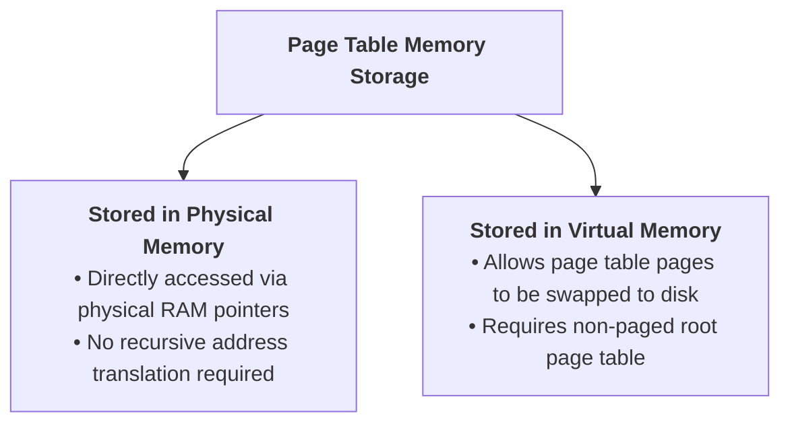
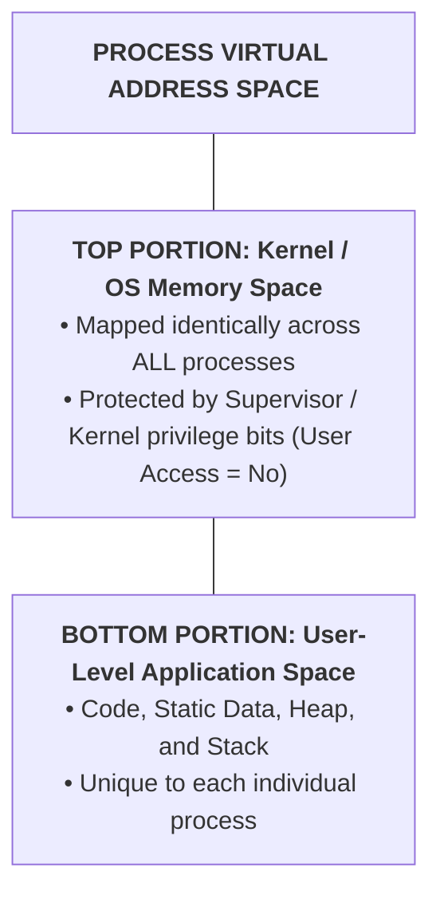

> [!abstract] Abstract
> Because page tables are too large to fit inside MMU registers, they are stored in physical RAM. The hardware points to the root table using a dedicated register (e.g., `CR3` on x86). To ensure fast, safe execution during [[Operating Systems/Kernel & Architecture/System Calls|system calls]], the operating system kernel maps its own **Kernel Address Space** into the upper region of every process's [[Operating Systems/Memory Management/Virtual Memory & Address Translation Fundamentals|Virtual Address Space]].
> 
> - **Category:** Kernel Memory Architecture
> - **Key Control Hardware:** Top-level Page Table Base Register (`CR3` in x86).
> - **Security Mechanism:** Kernel Page Table Isolation (KPTI).

---

## Storing & Addressing Page Tables

Page tables reside in main memory (RAM). Schedulers configure page tables using two primary architectural approaches:

1.  **Physical Memory Storage:** The MMU dereferences physical pointers directly. No translation is needed to look up page tables.
2.  **Virtual Memory Storage:** Page tables reside within kernel virtual memory. Unused secondary page tables can be swapped to disk when physical RAM is low. To prevent infinite translation loops, the outermost root page directory is pinned permanently in physical RAM.

---

## Page Table Base Registers

The CPU maintains a specialized control register that holds the physical address of the active process's top-level page table (e.g., `CR3` on x86 architectures):

![[Pasted image 20260726001833.png]]

When performing a [[Operating Systems/Kernel & Architecture/Thread/Thread Context Switch & Scheduling|context switch]], the OS kernel updates `CR3` to point to the incoming process's page directory. A single write to `CR3` instantly alters the active virtual memory mapping.

---

## The Kernel Address Space Split

To handle interrupts, hardware exceptions, and system calls efficiently, the operating system kernel maps itself into the upper address range of **every** process's virtual address space:

![[Pasted image 20260726002405.png]]

![[Pasted image 20260726002510.png]]

### Privileged Enforcement
*   **User Mode Execution:** The process can access only the bottom user-level portion. Attempts to access upper kernel addresses trigger a hardware protection fault.
*   **Kernel Mode Execution:** When a [[Operating Systems/Kernel & Architecture/System Calls|system call]] or interrupt traps into Kernel Mode, the CPU gains permission to access the upper kernel addresses directly without performing an expensive context switch or swapping page tables.

---

## Context Switches & Kernel Page Table Isolation (KPTI)

During a standard context switch between Process A and Process B, only the lower (user-level) page table mappings change. The upper (kernel-level) mappings remain identical.

> [!security] Kernel Page Table Isolation (KPTI)
> To mitigate speculative execution side-channel attacks (such as Meltdown), modern operating systems utilize **Kernel Page Table Isolation (KPTI)**. KPTI maintains two sets of page tables for each process:
> 1.  **User-Space Page Table:** Maps user memory and a minimal set of kernel entry trampolines.
> 2.  **Kernel-Space Page Table:** Maps the complete address space (User + Kernel).
> 
> Trapping into the kernel switches `CR3` to the kernel-space page table, preventing speculative user-mode reads of kernel memory.

---

## Related Notes

- [[Operating Systems/Memory Management/Multi-Level Page Tables|Multi-Level Page Tables]]
- [[Operating Systems/Memory Management/Page Table Entries & Memory Overhead|Page Table Entries & Memory Overhead]]
- [[Operating Systems/Kernel & Architecture/System Calls|System Calls]]
- [[Operating Systems/Kernel & Architecture/Dual-Mode Operation & Memory Protection|Dual-Mode Operation & Memory Protection]]