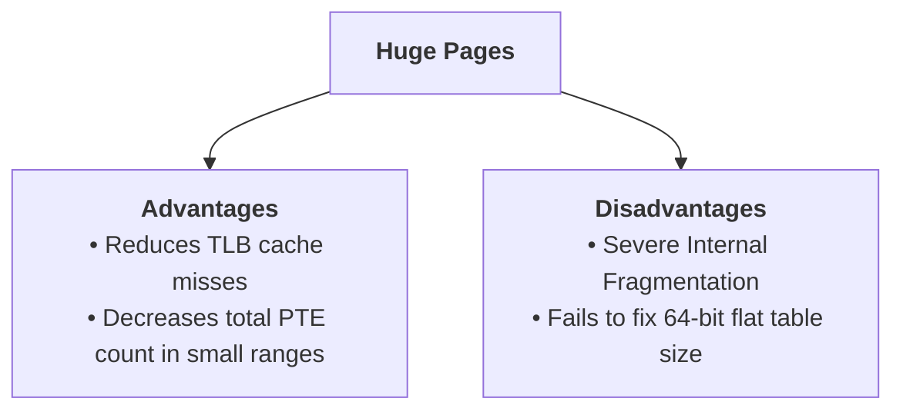

> [!abstract] Abstract
> A **Page Table Entry (PTE)** is a hardware-readable data structure that stores the physical mapping and operational status of a single virtual page. Flat, single-level linear page tables store an array of PTEs for every possible page in a process's [[Operating Systems/Memory Management/Virtual Memory & Address Translation Fundamentals|Virtual Address Space]]. While simple, linear page tables suffer from severe memory overhead in large address spaces, an issue that cannot be solved by **Huge Pages** alone.
> 
> - **Category:** Address Translation Structures
> - **Core Concept:** Per-page metadata flags and address mapping.
> - **Primary Deficit:** Linear page tables scale linearly with address space size, causing massive RAM waste.

---

## Per-Process Paging Architecture

When using [[Operating Systems/Memory Management/Paging & Page Tables|paging]], each process maintains its own independent page table:

![[Pasted image 20260725234000.png]]

Physical memory allocations are sourced directly from an OS-managed free list of fixed-size frames. Swapping pages to disk uses the page table's metadata flags to track valid in-memory pages versus swapped-out pages.

![[Pasted image 20260725234207.png]]

---

## Page Table Entry (PTE) Bit Structure

A Page Table Entry contains the physical location mapping along with operational control bits evaluated by MMU hardware on every memory access:

| Dirty | Access | Valid | Protection | Page Frame Number |
| :---: | :----: | :---: | :--------: | :---------------: |
|   M   |   R    |   V   |    Prot    |     PFN / PPN     |
|   1   |   1    |   1   |     3      |        20         |

![[Pasted image 20260725234708.png]]

| Field / Bit Name      | Symbol        | Description & Hardware Usage                                                                                                                                                |
| --------------------- | ------------- | --------------------------------------------------------------------------------------------------------------------------------------------------------------------------- |
| **Page Frame Number** | **PFN / PPN** | Physical page frame number in RAM corresponding to the virtual page.                                                                                                        |
| **Valid Bit**         | **V**         | Indicates whether the page is loaded in physical RAM. If `0`, an access triggers a **Page Fault** exception.                                                                |
| **Modify Bit**        | **M / Dirty** | Set by hardware on a write operation. Indicates the page has been modified and must be flushed to disk before eviction.                                                     |
| **Reference Bit**     | **R**         | Set by hardware on read or write. Used by OS page replacement algorithms to identify active pages.                                                                          |
| **Protection Bits**   | **Prot**      | Defines allowed access modes: Read, Write, Execute (R/W/X). Protecting Virtual Page 0 with no permissions catches null pointer dereferences (causing a segmentation fault). |

---

## Linear Page Table Memory Overhead

A linear page table assumes a flat array of PTEs indexed directly by the Virtual Page Number (VPN). The memory required to store a linear table scales with address space size:

![[Pasted image 20260725235351.png]]

### 32-Bit Address Space Calculation
*   Address Space: $2^{32}\text{ bytes} = 4\text{ GB}$.
*   Page Size: $4\text{ KB} = 2^{12}\text{ bytes} \implies 12\text{-bit}$ Offset.
*   Virtual Page Number (VPN): $32 - 12 = \mathbf{20\text{ bits}} \implies 2^{20} = 1,048,576\text{ entries}$.
*   PTE Size: $4\text{ bytes}$.
*   **Total Page Table Size:**
    $$2^{20}\text{ PTEs} \times 4\text{ bytes per PTE} = \mathbf{4\text{ MB per process}}$$
If $25$ processes are running simultaneously, the system wastes $100\text{ MB}$ of physical RAM strictly for linear page tables.

### 64-Bit Address Space Calculation
*   Address Space: $2^{64}\text{ bytes}$.
*   Page Size: $4\text{ KB} = 2^{12}\text{ bytes} \implies 12\text{-bit}$ Offset.
*   Virtual Page Number (VPN): $64 - 12 = \mathbf{52\text{ bits}} \implies 2^{52}\text{ entries}$.
*   PTE Size: $4\text{ bytes}$.
*   **Total Page Table Size:**
    $$2^{52}\text{ PTEs} \times 4\text{ bytes per PTE} = \mathbf{16\text{ Petabytes per process}}$$

![[Pasted image 20260725235602.png]]

Linear page tables are completely unviable for large or 64-bit address spaces.

---

## Huge Pages & Trade-offs

One approach to reducing the total entry count is allocating **Huge Pages** (e.g., $2\text{ MB}$ or $1\text{ GB}$ pages instead of $4\text{ KB}$):

### Why Huge Pages Alone Do Not Solve Single-Level Table Size
Even with huge pages, a single-level flat page table in a 64-bit space requires absurd memory:
*   **$2\text{ MB}$ Pages ($2^{21}\text{ bytes}$):** Leaves $43\text{ bits}$ for VPN $\implies 2^{43}\text{ entries} \times 4\text{ bytes} = \mathbf{32\text{ TB of page tables}}$.
*   **$1\text{ GB}$ Pages ($2^{30}\text{ bytes}$):** Leaves $34\text{ bits}$ for VPN $\implies 2^{34}\text{ entries} \times 4\text{ bytes} = \mathbf{64\text{ GB of page tables}}$.

While huge pages improve Translation Lookaside Buffer (TLB) performance for memory-intensive applications, solving the page table memory size problem requires **hierarchical indirection** via [[Operating Systems/Memory Management/Multi-Level Page Tables|Multi-Level Page Tables]].

---

## Related Notes

- [[Operating Systems/Memory Management/Paging & Page Tables|Paging & Page Tables]]
- [[Operating Systems/Memory Management/Multi-Level Page Tables|Multi-Level Page Tables]]
- [[Operating Systems/Memory Management/Kernel Address Space & Page Table Storage|Kernel Address Space & Page Table Storage]]
- [[Operating Systems/Memory Management/Virtual Memory & Address Translation Fundamentals|Virtual Memory & Address Translation Fundamentals]]