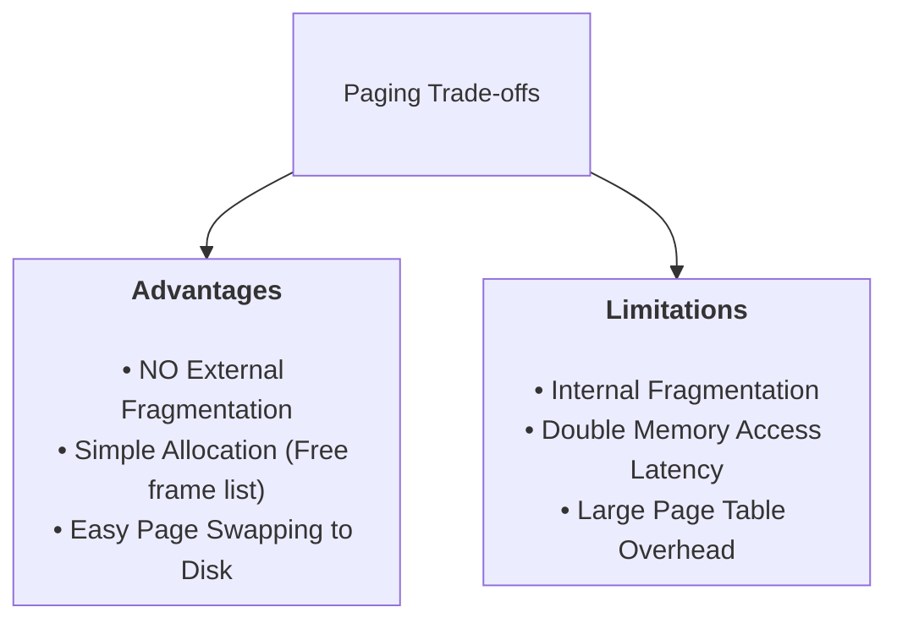

> [!abstract] Abstract
> **Paging** completely eliminates external fragmentation by dividing both virtual and physical memory into fixed-size chunks called **Pages** and **Page Frames** (typically $4\text{ KB}$). The OS maintains a per-process **Page Table** that maps Virtual Page Numbers (VPN) to physical Page Frame Numbers (PFN). Address translation uses bitwise concatenation rather than addition, yielding fast hardware lookup.
> 
> - **Category:** Fixed-Size Address Translation Architecture
> - **Primary Unit Size:** $4\text{ KB}$ ($2^{12}\text{ bytes}$).
> - **Key Advantage:** Eliminates External Fragmentation entirely (all physical frames are identical in size).

---

# Paging Architecture

In a paged system, physical memory is partitioned into fixed-sized blocks called **Page Frames (PFN)**, and virtual memory is partitioned into identical fixed-sized blocks called **Pages (VPN)**.

![[Pasted image 20260725213242.png]]

### Virtual Address Structure
A Virtual Address ($VA$) is split into two bitfields:
1.  **Virtual Page Number (VPN):** Indexes into the process's Page Table.
2.  **Offset:** Identifies the exact byte location within the target page.

![[Pasted image 20260725213523.png]]

Because page sizes are powers of two (e.g., $4\text{ KB} = 2^{12}\text{ bytes}$), translation does **not** require arithmetic addition—the MMU simply concatenates the translated PFN with the original Offset.

---

# Step-by-Step Address Translation Math

Consider a **32-bit architecture** with **$4\text{ KB}$ pages**:
*   Page size = $4\text{ KB} = 4096\text{ bytes} = 2^{12}\text{ bytes} \implies$ **12 bits** reserved for the Offset (hexadecimal range `0x000` to `0xFFF`).
*   Remaining upper bits = $32 - 12 = \mathbf{20\text{ bits}}$ reserved for the Virtual Page Number (VPN) ($2^{20} = 1,048,576$ possible pages).

![[Pasted image 20260725214140.png]]

### Example Problem
Translate Virtual Address **`0x00007468`** into a Physical Address given the active Page Table:

![[Pasted image 20260725214314.png]]

1.  **Extract Offset:** The lowest 12 bits (3 hex digits) represent the Offset:
    $$\text{Offset} = \mathbf{\text{0x468}}$$
2.  **Extract Virtual Page Number (VPN):** The remaining upper bits represent the VPN:
    $$\text{VPN} = \text{0x00007468} \gg 12 = \mathbf{\text{0x7}}$$
3.  **Page Table Lookup:** Look up entry `0x7` in the process's Page Table:
    $$\text{Page Table Entry}[\text{0x7}] \implies \text{PFN } \mathbf{\text{0x2}}$$
4.  **Construct Physical Address:** Concatenate PFN `0x2` with Offset `0x468`:
    $$\text{Physical Address} = (\text{0x2} \times \text{0x1000}) + \text{0x468} = \mathbf{\text{0x2468}}$$

![[Pasted image 20260725214509.png]]

---

# Paging Trade-offs & Memory Overhead

### Advantages
1.  **Zero External Fragmentation:** Physical RAM is allocated from a simple free list of identical fixed-size frames. Any free frame can satisfy any page request.
2.  **Simplified Allocation & Swapping:** Allocating memory or swapping unused pages to disk is fast because all chunks share identical dimensions.

### Limitations & Solutions
1.  **Internal Fragmentation:** If a process requests $4097\text{ bytes}$, it receives two full $4\text{ KB}$ pages ($8192\text{ bytes}$), leaving $4095\text{ bytes}$ unused inside the second page.
2.  **Memory Access Latency:** Translating an address requires two physical memory accesses: first to read the Page Table Entry from RAM, then to read the actual target memory address.
    *   *Solution:* **Translation Lookaside Buffer (TLB)**—a high-speed hardware cache of recent translations inside the MMU.
3.  **Massive Page Table Overhead:** In a 32-bit system with $4\text{ KB}$ pages, each process needs $2^{20}$ Page Table Entries. At $4\text{ bytes}$ per entry, each process consumes **$4\text{ MB}$ of RAM strictly for its Page Table**!
    *   *Solution:* **Hierarchical / Multilevel Page Tables**.

---

# Related Notes

- [[Operating Systems/Memory Management/Virtual Memory & Address Translation Fundamentals|Virtual Memory & Address Translation Fundamentals]]
- [[Segmentation|Segmentation]]
- [[Base & Bound]]
- [[Operating Systems/Kernel & Architecture/Process/Process Abstraction & PCB|Process Abstraction & PCB]]