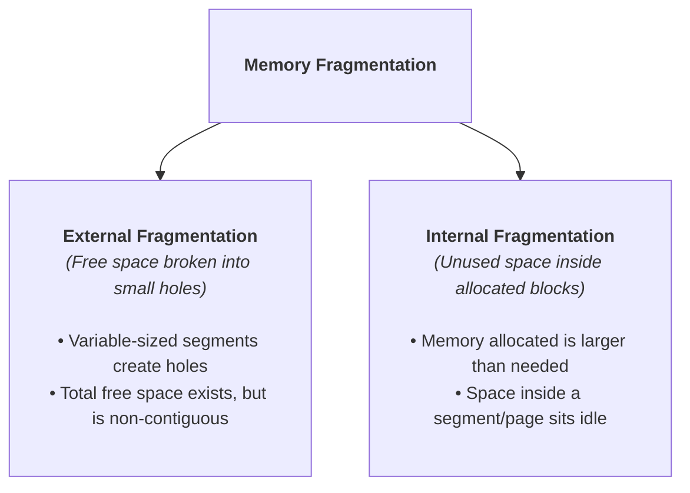

> [!abstract] Abstract
> **Segmentation** extends Base and Bound by dividing a process's virtual address space into multiple logical, variable-sized segments (such as Code, Static Data, Heap, and Stack). Managed via a per-process **Segment Table** (Segment Map), segmentation eliminates unused unallocated space between the heap and stack while enabling read-only code sharing across processes.
> 
> - **Category:** Variable-Sized Address Translation Systems
> - **Key Primitive:** Segment Table / Segment Map (Base, Bound, Permissions per segment).
> - **Primary Deficit:** **External Fragmentation** (variable-sized segment allocations create unusable memory holes).

---

# Logical Memory Segments

Unlike single-segment Base and Bound systems, **Segmentation** splits the virtual address space into independent variable-sized segments matching standard program structures:

![[Pasted image 20260725212545.png]]

![[Pasted image 20260725212810.png]]

*   **Code Segment:** Executable instructions (Read / Execute only).
*   **Static Data Segment:** Initialized and uninitialized global variables (Read / Write).
*   **Heap Segment:** Dynamically allocated memory growing upward (Read / Write).
*   **Stack Segment:** Function call frames growing downward (Read / Write).

---

# Address Translation via Segment Table

Each process maintains a **Segment Table (Segment Map)** in kernel memory containing Base addresses, Bound sizes, and Access Permissions for each segment:

![[Pasted image 20260725212723.png]]
### Translation Mechanics
A virtual address encodes both a **Segment Number** and an **Offset**:
1.  **Segment Lookup:** Use the Segment Number to index into the process's Segment Table.
2.  **Permission & Bounds Check:** Verify that the requested operation matches the segment's permissions and that $\text{Offset} < \text{Bound}$.
3.  **Physical Address Calculation:**
    $$\text{Physical Address} = \text{Segment Base} + \text{Offset}$$

---

# External vs. Internal Fragmentation

Variable-sized memory management mechanisms introduce two distinct forms of memory fragmentation:

| Fragmentation Type | Cause | Impact in Segmentation |
|---|---|---|
| **External Fragmentation** | Allocating and freeing variable-sized segments over time leaves small unusable gaps scattered across physical RAM. | **High.** Total free RAM may be $100\text{ MB}$, but if it is split into 1000 non-contiguous $100\text{ KB}$ holes, a $1\text{ MB}$ segment request fails. |
| **Internal Fragmentation** | Allocating conservative segment bounds where the application uses only a portion of the segment. | **Low to Moderate.** Substantially lower than single Base & Bound because heap and stack occupy separate segments. |

---

# Trade-offs of Segmentation

### Advantages
*   **Independent Segment Management:** Segments can grow, shrink, be moved, or swapped to disk independently.
*   **Memory Sharing:** Multiple processes can map their Code segment entries to the exact same physical RAM address, allowing shared code libraries (e.g., standard C library) to occupy physical RAM only once.
*   **Granular Protection:** Per-segment permissions prevent illegal execution of stack data or modifications to executable code.

### Disadvantages
*   **External Fragmentation:** Requires complex memory allocation algorithms (e.g., First-Fit, Best-Fit) or expensive physical memory compaction (shifting memory contents to consolidate free holes).
*   **Variable-Sized Complexity:** Managing variable segment tables adds kernel overhead compared to fixed-size paging systems.

---

# Related Notes

- [[Operating Systems/Memory Management/Base & Bound|Base & Bound]]
- [[Operating Systems/Memory Management/Virtual Memory & Address Translation Fundamentals|Virtual Memory & Address Translation Fundamentals]]
- [[Operating Systems/Memory Management/Paging & Page Tables|Paging & Page Tables]]
- [[Operating Systems/Kernel & Architecture/Dual-Mode Operation & Memory Protection|Dual-Mode Operation & Memory Protection]]