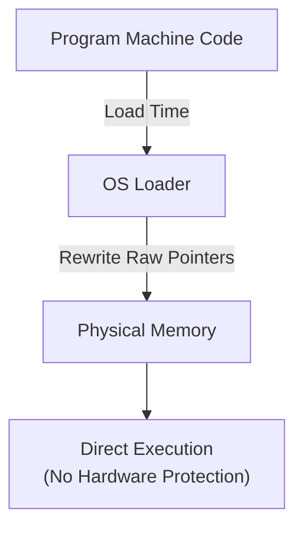
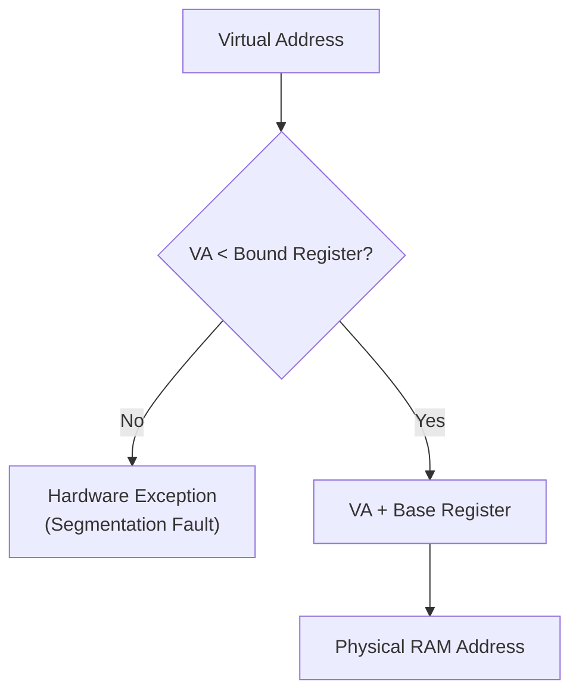
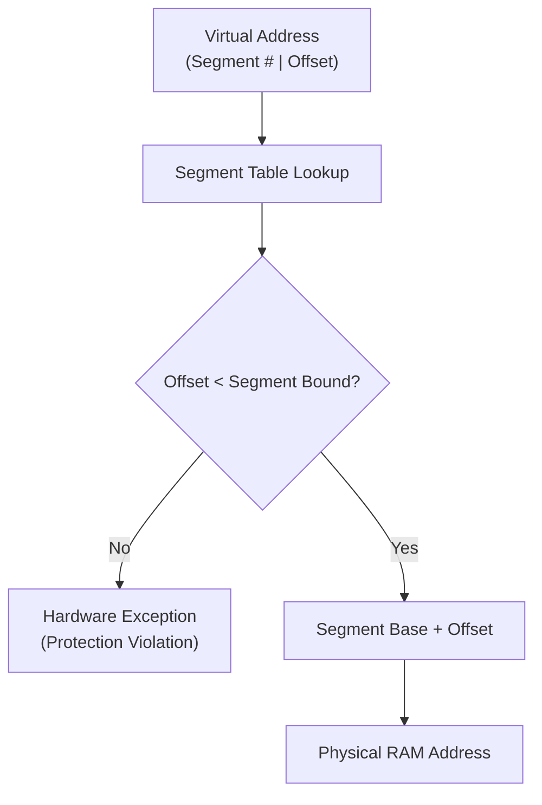
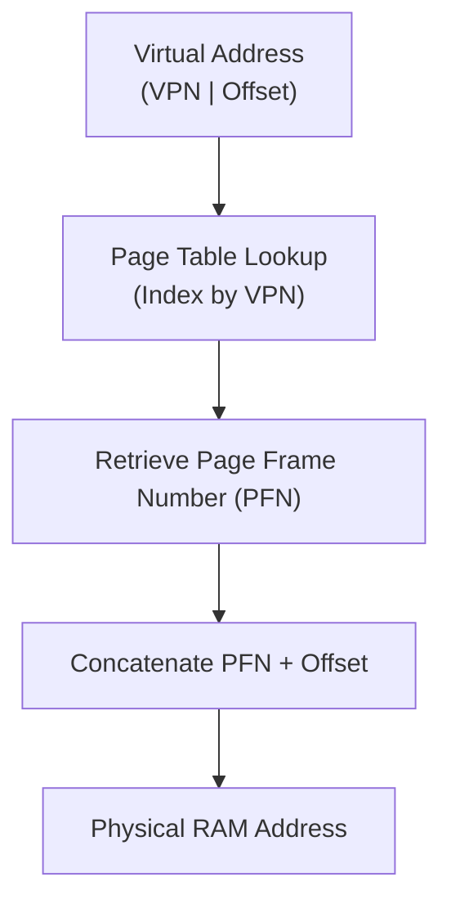
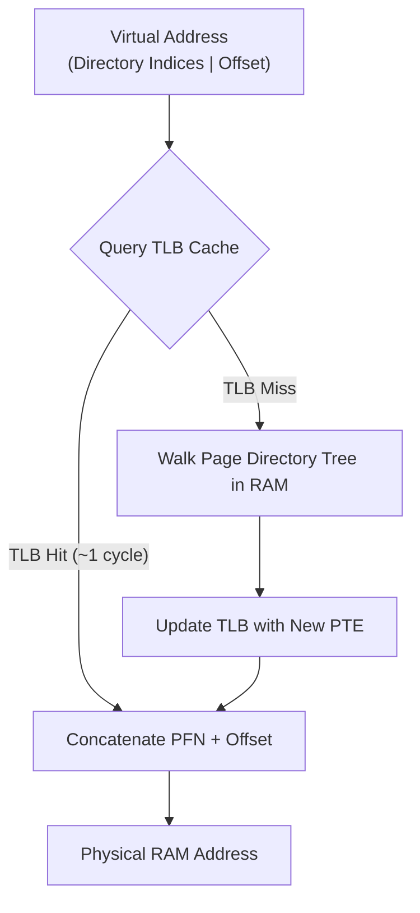

> [!abstract] Overview
> **Memory Management** is the hardware and software subsystem responsible for sharing physical RAM safely and efficiently among multiple concurrent processes. The Operating System provides the **Virtual Memory** abstraction—decoupling a process's logical address space from physical hardware locations using dedicated hardware: the **Memory Management Unit (MMU)**.

---

## Core Module Notes

| Note Link | Description | Key Concepts & Hardware Primitives |
|---|---|---|
| **[[Operating Systems/Memory Management/Virtual Memory & Address Translation Fundamentals\|Virtual Memory & Address Translation Fundamentals]]** | Covers memory management challenges, core goals (Multitasking, Transparency, Protection, Efficiency), early single-tasking, load-time static relocation, Virtual vs. Physical address spaces, and the MMU. | Virtual Memory, Address Spaces, Static Relocation, MMU |
| **[[Operating Systems/Memory Management/Base & Bound\|Base & Bound]]** | Single-segment contiguous hardware translation using Base and Bound register pairs, bounds checking formulas, and dynamic relocation. | Base Register, Bound Register, Contiguous Allocation |
| **[[Operating Systems/Memory Management/Segmentation\|Segmentation]]** | Multi-segment variable-sized address translation dividing address spaces into logical units (Code, Data, Heap, Stack), Segment Map management, and fragmentation trade-offs. | Segment Table, Logical Segments, External Fragmentation |
| **[[Operating Systems/Memory Management/Paging & Page Tables\|Paging & Page Tables]]** | Details fixed-size chunk address translation, Virtual Page Numbers (VPN) to Page Frame Numbers (PFN) mapping, page table bitwise concatenation math (`0x00007468`), and paging trade-offs. | Paging, VPN, PFN, Page Tables, Address Translation Math |
| **[[Operating Systems/Memory Management/Page Table Entries & Memory Overhead\|Page Table Entries & Memory Overhead]]** | Explores PTE control flags (Valid, Dirty, Reference, Protection), linear page table overhead calculations in 32-bit/64-bit systems, and Huge Page trade-offs. | PTE Flags, Linear Overhead, Huge Pages, Dirty Bit |
| **[[Operating Systems/Memory Management/Multi-Level Page Tables\|Multi-Level Page Tables]]** | Details hierarchical indirection via Page Directories, bit-splitting translation calculations ($10\text{-}10\text{-}12$), and x86-64 4-level paging architecture. | Multi-Level Paging, Page Directory, x86-64 Paging, Indirection |
| **[[Operating Systems/Memory Management/Kernel Address Space & Page Table Storage\|Kernel Address Space & Page Table Storage]]** | Analyzes physical vs virtual storage of page tables, `CR3` control register mechanics, user/kernel virtual address space split, and KPTI. | `CR3` Register, Kernel Split, KPTI, Page Table Storage |
| **[[Operating Systems/Memory Management/Translation Lookaside Buffer (TLB)\|Translation Lookaside Buffer (TLB)]]** | Hardware lookup acceleration via the TLB cache, hit/miss execution paths, hardware vs software miss handling, ASID tagging, and TLB shootdowns. | TLB Hit/Miss, Fully Associative Cache, ASID, TLB Shootdown |
| **[[Operating Systems/Memory Management/Demand Paging & Page Faults\|Demand Paging & Page Faults]]** | Demand-paged virtual memory principles, swap space backing stores, page fault exception traps, badvaddr registers, and instruction restart. | Demand Paging, Page Fault Handler, Swap Space, Instruction Restart |
| **[[Operating Systems/Memory Management/Advanced Virtual Memory Features\|Advanced Virtual Memory Features]]** | Explores Shared Memory (`shm_open`), Copy-on-Write (`fork` optimization via lazy page replication), and Memory-Mapped Files (`mmap`). | Shared Memory, Copy-on-Write (CoW), Memory-Mapped Files (`mmap`) |

---

## Address Translation Paradigms

### Static Relocation (Load-Time Rewriting)

### Base and Bound (Single Contiguous Segment)

### Segmentation (Multi-Segment Variable-Sized Memory)

### Single-Level Paging (Fixed-Size 4 KB Pages)

### Multi-Level Paging with TLB Caching (Modern Architecture)

---

## Related Modules

- [[Operating Systems/Kernel & Architecture/Process/Process Abstraction & PCB|Process Abstraction & PCB]]
- [[Operating Systems/Kernel & Architecture/Dual-Mode Operation & Memory Protection|Dual-Mode Operation & Memory Protection]]
- [[Operating Systems/index|Operating Systems Main Directory]]