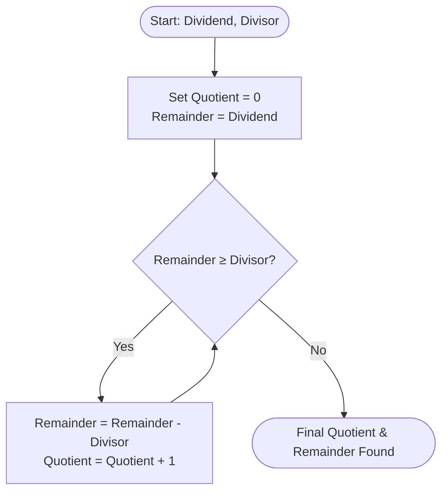

> [!abstract] Abstract
> **Multipliers and Dividers** execute multi-cycle or high-density combinational arithmetic in modern ALUs. Binary multiplication computes the sum of shifted **partial products** generated by bitwise AND operations, implemented in hardware via dense **Array Multipliers** using arrays of AND gates, Half Adders, and Full Adders. Binary division operates as the inverse process through **iterative repeated subtraction**, requiring dedicated subtractors, adders, and comparators to compute the Quotient and Remainder.

---

## Binary Multiplication Principles

Multiplying an $N$-bit multiplicand $A$ by an $M$-bit multiplier $B$ yields a product $P$ up to $(N + M)$ bits wide:

$$P = A \times B = \left( \sum_{i=0}^{N-1} a_i 2^i \right) \times \left( \sum_{j=0}^{M-1} b_j 2^j \right) = \sum_{i=0}^{N-1} \sum_{j=0}^{M-1} (a_i \cdot b_j) 2^{i+j}$$

![[Pasted image 20260824130709.png]]
*N-Bit x M-Bit Multiplier Block Symbol*

### Long Multiplication by Hand

In binary, generating a partial product bit $p_{i,j}$ is equivalent to a logical **AND** operation:

$$p_{i,j} = a_i \cdot b_j = \begin{cases} a_i & \text{if } b_j = 1 \\ 0 & \text{if } b_j = 0 \end{cases}$$

![[Pasted image 20260821182126.png]]
*Generalized Partial Product Generation for 4-Bit Multiplication*

### Array Multiplier Hardware Architecture

An **Array Multiplier** computes all partial products in parallel using an array of **AND gates**, then sums the shifted partial product columns using a grid matrix of **Half Adders (HA)** and **Full Adders (FA)**.

![[Pasted image 20260824130637.png]]
*4x4 Combinational Array Multiplier Architecture*

### Structural Components

1. **Partial Product Generator:** An array of $N \times M$ AND gates generating every single-bit term $a_i b_j$.
2. **Adder Reduction Matrix:**
   * **Half Adders:** Used at column boundaries where only two bits are added.
   * **Full Adders:** Used in intermediate array cells to sum three bits (partial product bit, sum bit from upper row, carry bit from adjacent cell).
3. **Final Vector Adder:** A bottom-row Ripple-Carry or Carry-Lookahead Adder to compute the final high-order product bits.

> [!note] Array Performance Characteristics
> While combinational array multipliers offer fast execution, hardware area grows quadratically as $O(N \cdot M)$ gates, and propagation delay scales as $O(N + M)$ along the worst-case diagonal carry-propagation path.

---

## Binary Division & Repeated Subtraction

Division of unsigned positive binary numbers divides a **Dividend** by a **Divisor** to calculate a **Quotient** and a **Remainder**:

$$\text{Dividend} = (\text{Divisor} \times \text{Quotient}) + \text{Remainder} \quad \text{where } 0 \le \text{Remainder} < \text{Divisor}$$

### Iterative Repeated Subtraction Algorithm

The basic hardware approach iteratively subtracts the divisor from the dividend while incrementing a quotient counter until the remaining dividend is strictly less than the divisor.

### Hardware Resource Requirements

Executing binary division via repeated subtraction requires three core hardware blocks:

* **Subtractors (2 Units / Operations):** One adder/subtractor to subtract the divisor from the dividend ($R - \text{Divisor}$), and one adder to increment the quotient register ($Q + 1$).
* **Magnitude Comparator (1 Unit):** A less-than / greater-than comparator block to evaluate the termination condition ($\text{Remainder} < \text{Divisor}$).

---

## Related Notes

- [[Mux & Demux]]
- [[Encoder & Decoder|Encoder and Decoder]]
- [[Adders & Subtractors]]
- [[Comparator|Comparators]]
- [[Computer Systems/Digital Systems/ALU/Arithmetic Logic Unit|Arithmetic Logic Unit Integration]]
- [[Computer Systems/Digital Systems/ALU/index|ALU Submodule Index]]