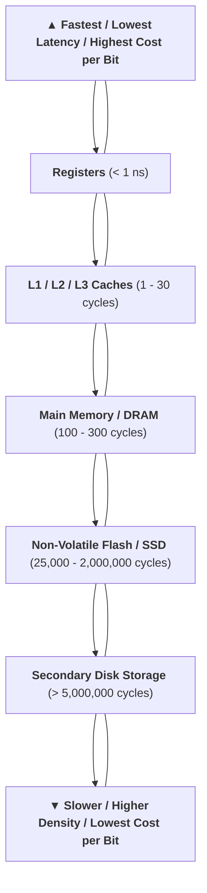

> [!abstract] Abstract
> The **Memory Hierarchy** structures storage in hierarchical layers to address three fundamental design constraints: **high operational speed**, **low power consumption**, and **timing predictability**. Because no single physical storage technology can simultaneously offer infinite bandwidth, zero leakage power, low cost, and deterministic single-cycle access, architectures combine small, fast volatile caches with dense main memory and persistent mass storage.

---

## 1. System Requirements & The Architectural Trade-Off

Modern processor architectures balance three competing memory demands:

* **Speed (Low Latency & High Bandwidth):** Minimizing CPU stall cycles during data fetch and store operations.
* **Low Power:** Reducing static leakage power in dense on-chip arrays and dynamic switching power during off-chip bus transfers.
* **Predictability:** Guaranteeing hard upper bounds on memory access latencies for real-time interrupt handlers and embedded control loops.

---

## 2. Latency & Density Spectrum

| Component             | Diagram                              | Hierarchy Level   | Primary Technology | Performance & Density Trade-Off                           |   Access Latency (Cycles)    |
| --------------------- | ------------------------------------ | ----------------- | ------------------ | --------------------------------------------------------- | :--------------------------: |
| **Cache**             | ![[Pasted image 20260831170832.png]] | Level 1 / L2 / L3 | SRAM               | Maximum speed; low density; high cost per bit.            |       $1 \text{--} 30$       |
| **Main Memory**       | ![[Pasted image 20260831170844.png]] | System RAM        | DRAM               | High density; medium latency; requires periodic refresh.  |     $100 \text{--} 300$      |
| **Solid State Drive** | ![[Pasted image 20260831170855.png]] | Mass Storage      | NAND Flash         | Non-volatile mass storage; block-addressable.             | $25,000 \text{--} 2,000,000$ |
| **Hard Disk Drive**   | ![[Pasted image 20260831170911.png]] | Secondary Storage | Magnetic Media     | Maximum capacity; lowest cost per bit; mechanical delays. |        $> 5,000,000$         |

 ---

## 3. Predictable Real-Time Memory: ARMv8 & TCM

Standard cache systems introduce latency non-determinism due to unpredictable cache misses. Real-time system architectures incorporate **Tightly Coupled Memory (TCM)** to ensure predictable execution.

![[Pasted image 20260829160322.png]]
*ARMv8 Memory Hierarchy featuring Tightly Coupled Memory*

* **Tightly Coupled Memory (TCM):** On-chip SRAM mapped directly into the physical address space alongside main memory. Unlike caches, TCM bypasses tag-matching logic, providing **deterministic, zero-wait-state single-cycle access** for time-critical interrupt service routines (ISRs) and safety algorithms.

---

## Related Notes

- [[Computer Systems/Digital Systems/Memory/Cache Design|Cache Design]]
- [[Computer Systems/Digital Systems/Memory/Memory Types|Memory Types]]
- [[Computer Systems/Digital Systems/Memory/Non-Volatile Memory (NVM)|Non-Volatile Memory (NVM)]]
- [[Computer Systems/Digital Systems/Memory/index|Memory Index]]