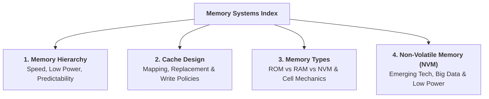

> [!abstract] Overview
> **Memory Systems** provide large-scale bit storage organized into addressable multi-bit words across digital computing platforms. The **`Computer Systems/Digital Systems/Memory/`** directory structures memory principles into four core submodules: balancing architectural trade-offs in the **Memory Hierarchy**, optimizing hit rates via **Cache Design**, analyzing physical cell structures across **Memory Types** (ROM vs. RAM), and surveying **Emerging Non-Volatile Memory (NVM)** architectures.

---

## 1. Directory Structure & Summary Framework

---

## 2. Submodule Summaries

### 1. [[Computer Systems/Digital Systems/Memory/Memory Hierarchy|Memory Hierarchy]]
* **Core Focus:** Balancing system needs around **speed**, **low power consumption**, and **predictability**.
* **Key Topics:** Multi-level latency pyramids (Cycles: Cache $1\text{--}30$, DRAM $100\text{--}300$, SSD $25\text{k}\text{--}2\text{M}$), density vs. access cost trade-offs, ARMv8 memory subsystem, and **Tightly Coupled Memory (TCM)** for deterministic real-time execution.

### 2. [[Computer Systems/Digital Systems/Memory/Cache Design|Cache Design]]
* **Core Focus:** Structural cache organization, address mapping mechanics, and performance modeling.
* **Key Topics:** Address mapping strategies (Direct-Mapped, $N$-Way Set Associative, Fully Associative), line replacement policies (LRU, FIFO, Random), write policies (Write-Through vs. Write-Back, Write-Allocate), and **Average Memory Access Time (AMAT)** equations.

### 3. [[Computer Systems/Digital Systems/Memory/Memory Types|Memory Types]]
* **Core Focus:** $m \times n$ array organization, composition expansion rules, and physical RAM storage cells.
* **Key Topics:** $k = \log_2 m$ addressing math, bit-width expansion (wider words) and address depth expansion (more words via decoders), square RAM grid layout, and transistor-level mechanics across **Register Files ($\approx 46\text{T}$)**, **SRAM ($6\text{T}$)**, and **DRAM ($1\text{T}1\text{C}$ refresh)**.

### 4. [[Computer Systems/Digital Systems/Memory/Non-Volatile Memory (NVM)|Non-Volatile Memory (NVM)]]
* **Core Focus:** Traditional floating-gate ROM/Flash and maturing **Emerging NVM** technologies targeting big data and energy-efficient architectures.
* **Key Topics:** Evolutionary ROM spectrum (EPROM, EEPROM, Flash), emerging NVM technologies (**FeRAM 1T-1C**, **STT-RAM/MRAM MTJ**, **PCM**, **1T FeFET**, **ReRAM 1T-1R / 3D Crossbar**), quantitative comparison matrices, and cache/DRAM/Flash replacement mappings.

---

## Related Directories

- [[Computer Systems/Digital Systems/Register Transfer Level (RTL) Design/index|Register Transfer Level (RTL) Design]]
- [[Computer Systems/Digital Systems/Sequential Circuit/index|Sequential Circuits Index]]
- [[Computer Systems/Digital Systems/ALU/index|Arithmetic Logic Units (ALUs)]]
- [[Computer Systems/Digital Systems/index|Digital Systems Main Index]]
- [[Computer Systems/index|Computer Systems Hub]]