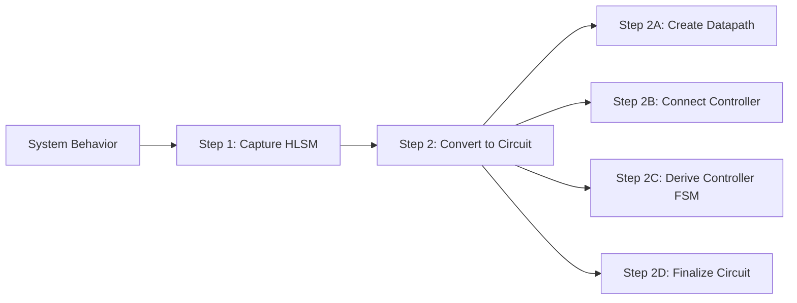

> [!abstract] Abstract
> **Register-Transfer Level (RTL) Synthesis** translates high-level behavioral models (such as software algorithms or High-Level State Machines) into structural hardware composed of a **Datapath** and a **Controller**. The datapath executes data operations using registers, adders, multiplexers, and comparators, while the controller (a classical FSM) manages the datapath via control signals based on status feedback and external inputs. The entire system's maximum operational clock frequency ($f_{\max}$) is bounded by the worst-case register-to-register critical path delay spanning the datapath, controller, and their interconnecting interface.

---

## 1. The Official RTL Design Process

Converting a high-level system behavioral specification into digital hardware follows a structured 2-phase, 5-step synthesis methodology:



### Synthesis Step Summary

| Step | Phase / Sub-step | Description |
|:---:|:---:|---|
| **Step 1** | **Capture Behavior** | Describe desired system behavior as a **High-Level State Machine (HLSM)** using states, transitions, multi-bit variables, and complex arithmetic expressions. |
| **Step 2A** | **Create Datapath** | Instantiate storage elements (registers) and functional units (adders, comparators, shifters) to perform all multi-bit data operations defined in the HLSM. |
| **Step 2B** | **Connect Controller** | Map external control inputs/outputs and datapath status signals to a centralized controller block. Routing load/clear signals to datapath registers. |
| **Step 2C** | **Derive Controller FSM** | Convert the HLSM into a classical **Finite State Machine (FSM)** by replacing all data operations with explicit control assertions and status inputs. |
| **Step 2D** | **Finalize Circuit** | Synthesize the controller FSM into state registers and combinational excitation logic. |

---

## 2. Walkthrough: Soda Dispenser RTL Synthesis

![[High Level State Machines#Example Soda Dispenser Controller]]
### Step 1: HLSM Behavior Capture
The soda dispenser continuously checks for coin deposits (`c`), updates an accumulated total sum (`tot = tot + a`), compares `tot` against the soda cost (`s`), and asserts the dispense signal (`d = '1'`) when `tot >= s`.

![[Pasted image 20260826153201.png]]
*HLSM for Soda Dispenser Controller*

### Step 2A: Building the Datapath
To support the HLSM's data operations, the datapath requires:
* **Register (`tot`):** An 8-bit register to store accumulated coin values over time (with `tot_ld` and `tot_clr` control lines).
* **Adder (8-Bit):** To compute `tot + a`.
* **Comparator (8-Bit):** To evaluate $tot < s$ (generating status output `tot_lt_s`).

![[Pasted image 20260826153438.png]]
*Soda Dispenser Datapath Hardware Schematic*

### Step 2B & 2C: Controller Interface & FSM Derivation
The controller manages the datapath using status feedback (`tot_lt_s`) and external control (`c`), issuing load (`tot_ld`), clear (`tot_clr`), and dispense (`d`) signals.

![[Pasted image 20260826153726.png]]
*Integrated Datapath-Controller Interface*

![[Pasted image 20260826153910.png]]
*Derived Controller FSM (Data Operations Replaced with Control Signals)*

### Step 2D: Controller Excitation Table

The derived FSM maps directly to a classical excitation truth table for logic gate synthesis:

| Current State ($s_1 s_0$) | Coin Detected ($c$) | Sum Less Than Cost (`tot_lt_s`) | Next State ($n_1 n_0$) | Dispense ($d$) | Register Load (`tot_ld`) | Register Clear (`tot_clr`) |
|:---:|:---:|:---:|:---:|:---:|:---:|:---:|
| **Init** ($00$) | $0$ | $X$ | $00$ | $0$ | $0$ | $1$ |
| **Init** ($00$) | $1$ | $X$ | $01$ | $0$ | $0$ | $1$ |
| **Wait** ($01$) | $0$ | $X$ | $01$ | $0$ | $0$ | $0$ |
| **Wait** ($01$) | $1$ | $X$ | $10$ | $0$ | $0$ | $0$ |
| **Add** ($10$) | $X$ | $1$ | $01$ | $0$ | $1$ | $0$ |
| **Add** ($10$) | $X$ | $0$ | $11$ | $0$ | $1$ | $0$ |
| **Disp** ($11$) | $X$ | $X$ | $00$ | $1$ | $0$ | $0$ |

![[Pasted image 20260826154045.png]]
*Final Hardware Logic Gate Implementation*

---

## 3. RTL Timing & Critical Path Delay

In RTL design, system operating frequency ($f_{\max} = \frac{1}{T_c}$) is strictly constrained by the **longest register-to-register path** (Critical Path).


### Critical Path Locations
1. **Inside the Datapath:** Delays through wide arithmetic structures (e.g., array multipliers, long adder chains).
2. **Inside the Controller:** Delays through complex next-state excitation logic.
3. **Across Datapath-Controller Boundaries:** Status signal evaluation delays feeding into controller decision logic.

### Sequential Timing Governing Equations

To prevent timing violations across hundreds or thousands of internal RTL paths, all register-to-register paths must satisfy:

$$\text{Setup Time Constraint: } T_c \ge t_{pcq} + t_{pd} + t_{\text{setup}} + t_{\text{skew}}$$

$$\text{Hold Time Constraint: } t_{ccq} + t_{cd} > t_{\text{hold}} + t_{\text{skew}}$$

---

## 4. Behavioral Synthesis: C Code to Gates

High-Level Synthesis (HLS) automated tools compile behavioral software algorithms directly into HLSM state machines.

### Example: Sum of Absolute Differences (SAD)

```c
int SAD(byte A[256], byte B[256]) {
    uint sum;
    short uint i;
    sum = 0;
    i = 0;
    while (i < 256) {
        sum = sum + abs(A[i] - B[i]);
        i = i + 1;
    }
    return sum;
}
```

---

### C Construct to HLSM State Translation Rules

| Control Construct | C Code Pattern | Synthesized HLSM State Structure |
|---|---|---|
| **Assignment Statement** | `sum = 0;` | Converts into a single execution state containing the variable assignment.<br>![[Pasted image 20260826162937.png]] |
| **If-Then Statement** | `if (cond) { ... }` | Converts into a decision state evaluating `cond`. If true, transitions to "Then" state sequence; if false, branches directly to exit.<br>![[Pasted image 20260826163006.png]] |
| **If-Then-Else** | `if (cond) { A } else { B }` | Converts into a decision state branching to two distinct state pathways before re-converging.<br>![[Pasted image 20260826163121.png]] |
| **While Loop** | `while (cond) { ... }` | Converts into a loop-head decision state. If true, executes loop body states and loops back; if false, exits.<br>![[Pasted image 20260826163223.png]] |

---

## 5. Dedicated Hardware Circuit vs. Microprocessor Execution

Comparing the performance of the Sum of Absolute Differences (SAD) algorithm on a custom synthesized RTL circuit versus execution on a general-purpose microprocessor highlights the architectural efficiency of application-specific hardware.

### Execution Performance Breakdown

* **Custom Dedicated Circuit:**
  * Executes each loop iteration across 2 dedicated states ($S_2$ and $S_3$).
  * Requires $2$ clock cycles per array item:
    $$\text{Total Cycles}_{\text{Circuit}} = 256 \times 2 = 512 \text{ clock cycles}$$
* **General-Purpose Microprocessor:**
  * For each iteration ($i = 1 \dots 256$), the processor must fetch memory values into local registers, compute the difference, calculate absolute value, update the sum accumulator, and increment the loop counter.
  * Requires approximately $6$ clock cycles per array item:
    $$\text{Total Cycles}_{\text{Processor}} = 256 \times 6 = 1536 \text{ clock cycles}$$

| Architecture | Execution Strategy | Cycles / Iteration | Total Execution Cycles | Relative Performance |
|---|---|:---:|:---:|:---:|
| **Microprocessor** | Sequential Software Instructions | $6$ | $1536$ | $1.0\times$ (Baseline) |
| **Custom RTL Circuit** | Dedicated Hardware Datapath | $2$ | $512$ | **$\sim 3.0\times$ Faster (300%)** |

> [!tip] Hardware Parallelism Potential
> While a sequential RTL implementation is **$\sim 3\times$ faster** than a microprocessor, hardware throughput can be scaled further by leveraging **parallelism**—such as unrolling loops and processing multiple array elements simultaneously via parallel adder/subtractor trees.

---

## Related Notes

- [[High Level State Machines]]
- [[Computer Systems/Digital Systems/Sequential Circuit/Finite State Machines|Finite State Machines]]
- [[Computer Systems/Digital Systems/ALU/Arithmetic Logic Unit|Arithmetic Logic Unit Integration]]
- [[Computer Systems/Digital Systems/Sequential Circuit/Timing Constraints in Sequential Designs|Timing Constraints in Sequential Designs]]
- [[Computer Systems/Digital Systems/Sequential Circuit/index|Sequential Circuits Index]]