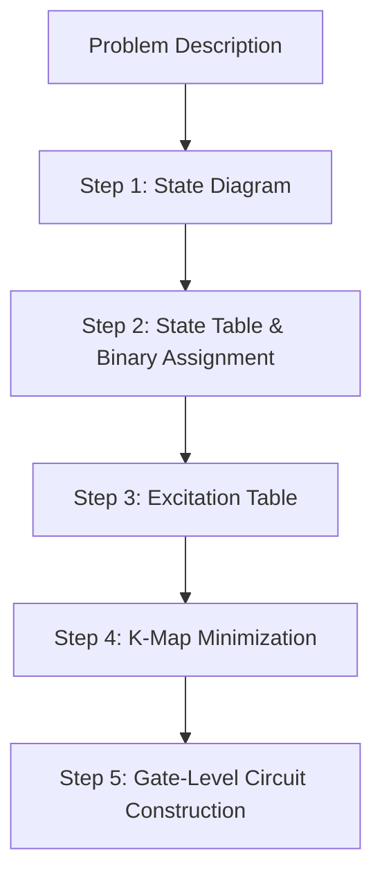

> [!abstract] Abstract
> **Finite State Machines (FSMs)** provide the core architectural paradigm for designing complex sequential controllers. Unlike purely combinational logic, sequential networks incorporate state-storing memory elements (Flip-Flops) and feedback paths to track historical state. FSM architectures fall into two primary classes: **Moore Machines** (where outputs depend strictly on the current state) and **Mealy Machines** (where outputs depend on both current state and present inputs). Designing an FSM follows a systematic 5-step synthesis pipeline—from state diagram conceptualization to K-map logic minimization.

---

## 1. Circuit Specifications: Combinational vs. Sequential

Digital circuits are broadly classified into **Combinational Networks** (memoryless) and **Sequential Networks** (state-dependent).

| Specification Method | Combinational Networks | Sequential Networks |
|---|---|---|
| **Primary Representation** | Truth Tables | State Transition Diagrams |
| **Logic Equations** | Boolean Algebraic Equations | Characteristic Equations & Excitation Equations |
| **Structural Modeling** | Logic Gate Diagrams (Strictly Acyclic / No Feedback) | Logic Diagrams (Flip-Flops + Cyclic Feedback Loops) |

![[Pasted image 20260825131238.png]]
*Combinational Circuit Model (No Feedback)*

![[Pasted image 20260825131445.png]]
*Sequential Circuit Model (Flip-Flop Memory + Feedback Loop)*

---

## 2. 2-Bit Counter Synthesis Example

A **2-bit counter** cycles through binary states $S_0(00) \to S_1(01) \to S_2(10) \to S_3(11) \to S_0(00)$ on consecutive clock pulses.

![[Pasted image 20260825131645.png]]
*State Diagram for a 2-Bit Synchronous Counter*

### State Transition Table

| Current State ($S_i$) | Next State ($S_{next}$) | Current State Bits ($Q_1(t), Q_0(t)$) | Next State Bits ($Q_1(t+1), Q_0(t+1)$) |
|:---:|:---:|:---:|:---:|
| $S_0$ | $S_1$ | $00$ | $01$ |
| $S_1$ | $S_2$ | $01$ | $10$ |
| $S_2$ | $S_3$ | $10$ | $11$ |
| $S_3$ | $S_0$ | $11$ | $00$ |

### D Flip-Flop Excitation Logic

Using D Flip-Flops, the excitation inputs $D_1(t)$ and $D_0(t)$ must match the target next-state outputs $Q_1(t+1)$ and $Q_0(t+1)$:

$$\begin{aligned}
D_0(t) &= \overline{Q_0(t)} \\
D_1(t) &= Q_0(t)\overline{Q_1(t)} + \overline{Q_0(t)}Q_1(t) = Q_0(t) \oplus Q_1(t)
\end{aligned}$$

![[Pasted image 20260825180104.png]]
*Circuit Implementation of 2-Bit Counter using D Flip-Flops*

> [!important] Key Sequential Intuition
> When working with Flip-Flops, the **outputs ($Q$)** represent the **Current State**, whereas the **inputs ($D$)** represent the computed **Next State** that will be loaded on the subsequent clock edge.

---

## 3. Finite State Machine (FSM) Foundations

An FSM is a formal mathematical model of computation consisting of:
1. A finite set of **States** ($S$).
2. A set of **Inputs** ($X$) and **Outputs** ($Y$).
3. A designated **Initial State** ($S_0$).
4. A set of **State Transitions** governed by input conditions.

![[Pasted image 20260825180403.png]]
*Generic Finite State Machine Conceptual Framework*

### Deterministic Transition Rules
* For $n$ input variables, exactly $2^n$ outgoing transitions exist for each state.
* **Exclusivity:** Exactly **one** transition condition can evaluate to TRUE at any given clock cycle.

---

## 4. Mealy vs. Moore Machines
### Comparison Matrix

| Property                   | Mealy Machine                                                                                    | Moore Machine                                                        |
| -------------------------- | ------------------------------------------------------------------------------------------------ | -------------------------------------------------------------------- |
| Block Diagram              | ![[Pasted image 20260825181556.png]]                                                             | ![[Pasted image 20260825181714.png]]                                 |
| State Diagram              | ![[Pasted image 20260825181606.png]]                                                             | ![[Pasted image 20260825181729.png]]                                 |
| **Output Equation**        | $y_i(t) = f_i(X(t), S(t))$                                                                       | $y_i(t) = f_i(S(t))$                                                 |
| **Next-State Equation**    | $S(t+1) = g_i(X(t), S(t))$                                                                       | $S(t+1) = g_i(X(t), S(t))$                                           |
| **Output Dependency**      | Functions of **both** Current State and Present Input.                                           | Functions **strictly** of Current State.                             |
| **Output Timing Response** | Outputs react **immediately** to input changes within the cycle (susceptible to input glitches). | Outputs change **only on the active clock edge** when state updates. |
| **State Count**            | Often requires **fewer states** than an equivalent Moore machine.                                | May require **more states** to decode identical sequence logic.      |

---

## 5. Systematic 5-Step FSM Design Procedure

Synthesizing a functional FSM from a behavioral specification follows a structured 5-step pipeline:

1. **State Diagram Construction:** Draw a high-level Mealy or Moore state diagram representing all valid operating modes and transitions.
2. **State Table & Binary State Assignment:** Construct a state table mapping $(S_{\text{current}}, X) \to S_{\text{next}}$. Assign binary state codes to symbolic states (e.g., $S_0 \to 00_2, S_1 \to 01_2$).
3. **Excitation Table Generation:** Expand the binary state table into an excitation truth table detailing flip-flop input signals ($D, JK, T$) and circuit outputs ($Y$) for every input/state combination.
4. **K-Map Logic Minimization:** Construct Karnaugh Maps for every next-state bit and circuit output line to derive minimal Sum-of-Products (SOP) expressions.
5. **Circuit Implementation:** Draw the final logic gate schematic, connecting combinational excitation logic to the data inputs of state flip-flops.

---

## Related Notes

- [[Computer Systems/Digital Systems/ALU/Mux & Demux|Mux & Demux]]
- [[Computer Systems/Digital Systems/ALU/Arithmetic Logic Unit|Arithmetic Logic Unit Integration]]
- [[Computer Systems/Digital Systems/Logic Design/index|Logic Design & K-Maps]]
- [[Computer Systems/Digital Systems/index|Digital Systems Index]]