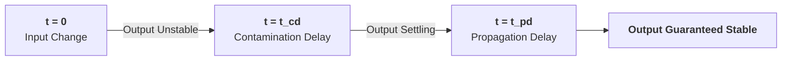
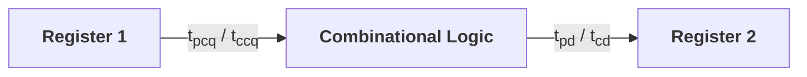

> [!abstract] Abstract
> **Timing Analysis** in digital circuits guarantees that logic signals propagate cleanly without violating storage element setup and hold constraints. Because real-world logic gates and wires experience physical electrical delays ($RC$), signals do not change instantaneously. **Combinational timing** is bounded by **contamination delay ($t_{cd}$)** and **propagation delay ($t_{pd}$)**. In **sequential circuits**, registers impose strict **setup ($t_{\text{setup}}$)** and **hold ($t_{\text{hold}}$)** time windows relative to clock edges. Additionally, spatial variation in clock signal arrival—known as **Clock Skew ($t_{\text{skew}}$)**—degrades the maximum operating frequency ($T_c$) and increases the risk of hold time race conditions.

---

## 1. Combinational Logic Timing Dynamics

Signals flowing through combinational networks experience delays dictated by transistor capacitance and resistance ($RC$).

* **Contamination Delay ($t_{cd}$):** The **minimum time** from when an input changes until the output *starts* to change. It is determined by the **shortest delay path** (fewest gates) through the circuit:
  $$t_{cd} \approx RC$$
* **Propagation Delay ($t_{pd}$):** The **maximum time** from when an input changes until the output is **guaranteed to reach its final stable value** (stops changing). It is determined by the **critical path** (longest delay path) through the circuit:
  $$t_{pd} \approx 4RC$$

![[Pasted image 20260825193656.png]]
*Shortest Path (Red / $t_{cd}$) vs. Critical Path (Blue / $t_{pd}$) in Combinational Logic*

---

## 2. Sequential Timing Parameters

Flip-flops require inputs to remain stable around the active clock edge to reliably capture state without entering a metastable condition.

![[Pasted image 20260825194251.png]]
*Sequential Timing Windows around Active Clock Edge*

![[Pasted image 20260825194513.png]]
*Flip-Flop Output Delay Ranges ($t_{ccq}$ and $t_{pcq}$)*

### Storage Element Constraints

* **Setup Time ($t_{\text{setup}}$):** Minimum duration **before** the active clock edge that data input $D$ must remain completely stable.
* **Hold Time ($t_{\text{hold}}$):** Minimum duration **after** the active clock edge that data input $D$ must remain completely stable.
* **Aperture Time ($t_a$):** Total window around the clock edge during which data $D$ must not change:
  $$t_a = t_{\text{setup}} + t_{\text{hold}}$$

### Clock-to-Q Output Delays

* **Clock-to-Q Contamination Delay ($t_{ccq}$):** Minimum time after the clock edge before output $Q$ begins to change (might become unstable).
* **Clock-to-Q Propagation Delay ($t_{pcq}$):** Maximum time after the clock edge when output $Q$ is guaranteed to be stable at its new value.

---

## 3. Ideal Clock Timing Constraints

In an ideal system where the clock edge arrives at all flip-flops simultaneously, the clock period $T_c$ and combinational paths must satisfy two critical constraints:

### Setup Time Constraint (Max Delay Limit)
The total delay along the longest path between two registers must be shorter than one clock cycle ($T_c$) minus the setup time required by the destination flip-flop.

$$T_c \ge t_{pcq} + t_{pd} + t_{\text{setup}}$$

$$\text{Maximum Allowed Logic Delay: } t_{pd} \le T_c - (t_{pcq} + t_{\text{setup}})$$

> [!important] Fixing Setup Violations
> A setup violation means the data path is **too slow** (or clock frequency $f = \frac{1}{T_c}$ is too high). It can be resolved by:
> 1. Increasing the clock period $T_c$ (lowering operating frequency).
> 2. Pipelining or reducing the critical path logic delay ($t_{pd}$).

### Hold Time Constraint (Min Delay Limit)
The fastest possible signal update from the launching register must not arrive at the destination register before its hold time window has elapsed.

$$t_{\text{hold}} < t_{ccq} + t_{cd}$$

$$\text{Minimum Required Logic Delay: } t_{cd} > t_{\text{hold}} - t_{ccq}$$

> [!warning] Fixing Hold Violations
> A hold violation means the data path is **too fast**—the new value overwrites the old value before the destination register finishes sampling. **Lowering the clock frequency cannot fix a hold violation** because hold constraints are independent of $T_c$.
> 
> **Fix:** Insert intentional delay along the minimum delay path (e.g., adding **two NOT gates / buffers in series**).

---

## 4. Clock Skew Analysis ($t_{\text{skew}}$)

In real physical chips, wire interconnect lengths and buffer delays cause the active clock edge to arrive at different registers at slightly different times. The maximum arrival time difference between any two registers is defined as **Clock Skew ($t_{\text{skew}}$)**.

![[Pasted image 20260825200109.png]]
*Clock Skew between Launching Register (CLK1) and Receiving Register (CLK2)*

### Setup Time Constraint with Clock Skew

**Worst-Case Scenario:** $CLK_2$ arrives **earlier** than $CLK_1$ by $t_{\text{skew}}$ (destination clock is early), shrinking the available clock cycle time.

![[Pasted image 20260825201406.png]]
*Setup Timing Analysis under Worst-Case Early Receiving Clock ($CLK_2$)*

$$T_c \ge t_{pcq} + t_{pd} + t_{\text{setup}} + t_{\text{skew}}$$

$$t_{pd} \le T_c - (t_{pcq} + t_{\text{setup}} + t_{\text{skew}})$$

### Hold Time Constraint with Clock Skew

**Worst-Case Scenario:** $CLK_2$ arrives **later** than $CLK_1$ by $t_{\text{skew}}$ (destination clock is delayed), giving the launching register extra time to prematurely overwrite the receiving register's input.

![[Pasted image 20260825202306.png]]
*Hold Timing Analysis under Worst-Case Late Receiving Clock ($CLK_2$)*

$$t_{ccq} + t_{cd} > t_{\text{hold}} + t_{\text{skew}}$$

$$t_{cd} > t_{\text{hold}} + t_{\text{skew}} - t_{ccq}$$

$$t_{\text{hold}} < t_{cd} + t_{ccq} - t_{\text{skew}}$$

---

## 5. Constraint Summary Reference

| Constraint | Ideal Clock Equation | Equation with Clock Skew ($t_{\text{skew}}$) | Primary Impact |
|---|---|---|---|
| **Setup Time** *(Max Delay)* | $T_c \ge t_{pcq} + t_{pd} + t_{\text{setup}}$ | $T_c \ge t_{pcq} + t_{pd} + t_{\text{setup}} + t_{\text{skew}}$ | Determines **maximum clock frequency** ($f_{\max} = \frac{1}{T_c}$) |
| **Hold Time** *(Min Delay)* | $t_{\text{hold}} < t_{ccq} + t_{cd}$ | $t_{\text{hold}} < t_{ccq} + t_{cd} - t_{\text{skew}}$ | Guarantees **data integrity** (independent of $T_c$) |

---

## Related Notes

- [[Latches & Flip-Flops]]
- [[Registers and Counters|Registers & Counters]]
- [[Finite State Machines]]
- [[Computer Systems/Digital Systems/Sequential Circuit/index|Sequential Circuit Index]]