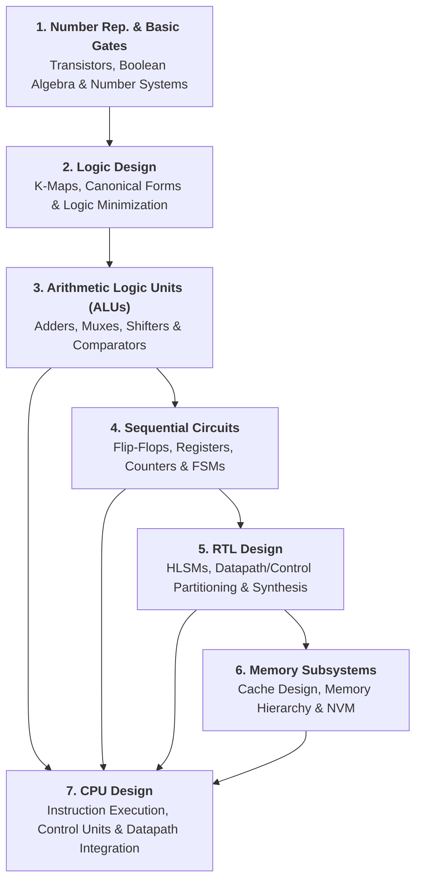

> [!abstract] Overview
> **Digital Systems** forms the architectural bridge between physical semiconductor transistors and programmable, general-purpose computing processors. This directory organizes digital design principles into a 6-layer modular hierarchy: foundational **Number Representation & Logic Gates**, Boolean optimization in **Logic Design**, combinational operators in **Arithmetic Logic Units (ALUs)**, state storage in **Sequential Circuits**, high-level system partitioning in **RTL Design**, and high-density **Memory Subsystems**—culminating in complete **CPU Design**.

---

## 1. System Abstraction Roadmap

---

## 2. Directory Structure & Submodule Index

| Module / Directory | Focus & Hardware Scope | Key Topics & Sub-Files |
|---|---|---|
| **1. [[Computer Systems/Digital Systems/Number Representation & Basic Logic Gates/index\|Number Rep. & Logic Gates]]** | Binary primitives and CMOS gate physics. | Number Systems, Two's Complement, CMOS Transistors, Logic Gates. |
| **2. [[Computer Systems/Digital Systems/Logic Design/index\|Logic Design]]** | Boolean optimization and minimization. | Logic Functions, Canonical SOP/POS, Logic Simplification with K-Maps. |
| **3. [[Computer Systems/Digital Systems/ALU/index\|Arithmetic Logic Unit (ALU)]]** | Combinational data processing elements. | Adders/Subtractors, Multipliers, Shifters, Mux/Demux, Encoders, ALUs. |
| **4. [[Computer Systems/Digital Systems/Sequential Circuit/index\|Sequential Circuits]]** | Clocked storage, counters, and FSMs. | Latches/Flip-Flops, Registers/Counters, FSMs, Setup/Hold Timing Analysis. |
| **5. [[Computer Systems/Digital Systems/Register Transfer Level (RTL) Design/index\|RTL Design]]** | High-level synthesis and datapath control. | High-Level State Machines (HLSM), 4-Step Synthesis, FIR Filters. |
| **6. [[Computer Systems/Digital Systems/Memory/index\|Memory Subsystems]]** | Storage cell arrays and cache hierarchies. | Memory Hierarchy, Cache Design (AMAT), SRAM (6T), DRAM, Emerging NVM. |
| **7. [[Computer Systems/Digital Systems/CPU Design\|CPU Design]]** | Full processor integration and execution. | Datapath, Control Unit, Instruction Fetch/Decode/Execute, Pipelining. |

---

## 3. Submodule Roadmaps

### 1. [[Computer Systems/Digital Systems/Number Representation & Basic Logic Gates/index|Number Representation & Basic Logic Gates]]
* [[Computer Systems/Digital Systems/Number Representation & Basic Logic Gates/Number Systems and Boolean Algebra|Number Systems and Boolean Algebra]] — Positional notation, Two's complement representation, and Boolean theorems.
* [[Computer Systems/Digital Systems/Number Representation & Basic Logic Gates/Transistors & Gates|Transistors & Gates]] — N-Type/P-Type MOSFET switch models, CMOS inverter gates, and logic gate topologies.

### 2. [[Computer Systems/Digital Systems/Logic Design/index|Logic Design]]
* [[Computer Systems/Digital Systems/Logic Design/Logic Functions|Logic Functions]] — Truth tables, minterms, maxterms, and functional completeness.
* [[Computer Systems/Digital Systems/Logic Design/Canonical Representation|Canonical Representation]] — Sum-of-Products (SOP) and Product-of-Sums (POS) standard expressions.
* [[Computer Systems/Digital Systems/Logic Design/Logic Simplification with K-maps|Logic Simplification with K-maps]] — Karnaugh Map minimization, implicants, essential prime implicants, and Don't Care ($X$) conditions.

### 3. [[Computer Systems/Digital Systems/ALU/index|Arithmetic Logic Units (ALUs)]]
* [[Computer Systems/Digital Systems/ALU/Adders & Subtractors|Adders & Subtractors]] — Half adders, full adders, ripple-carry adders, and carry-lookahead adders.
* [[Computer Systems/Digital Systems/ALU/Multiplier & Divider|Multiplier & Divider]] — Array multipliers, sequential shift-and-add multipliers, and divider circuits.
* [[Computer Systems/Digital Systems/ALU/Shifters|Shifters]] — Logical shifters, arithmetic shifters, rotators, and barrel shifters.
* [[Computer Systems/Digital Systems/ALU/Mux & Demux|Mux & Demux]] — Multiplexers as universal logic generators and demultiplexer routing.
* [[Computer Systems/Digital Systems/ALU/Encoder & Decoder|Encoder & Decoder]] — Binary decoders, priority encoders, and enable logic.
* [[Computer Systems/Digital Systems/ALU/Comparator|Comparator]] — Magnitude comparators ($=, <, >$) for multi-bit words.
* [[Computer Systems/Digital Systems/ALU/Arithmetic Logic Unit|Arithmetic Logic Unit]] — Multi-function ALU integration combining arithmetic, logic, and status flag flags.
### 4. [[Computer Systems/Digital Systems/Sequential Circuit/index|Sequential Circuits]]
* [[Computer Systems/Digital Systems/Sequential Circuit/Latches & Flip-Flops|Latches & Flip-Flops]] — SR latches, D latches, master-slave D flip-flops, and edge-triggering.
* [[Computer Systems/Digital Systems/Sequential Circuit/Registers and Counters|Registers and Counters]] — Parallel registers, shift registers, universal shift registers, and modulo state counters.
* [[Computer Systems/Digital Systems/Sequential Circuit/Finite State Machines|Finite State Machines]] — State transition diagrams, state tables, Mealy vs. Moore machines, and 5-step FSM synthesis.
* [[Computer Systems/Digital Systems/Sequential Circuit/Timing Constraints in Sequential Designs|Timing Constraints in Sequential Designs]] — Contamination/propagation delays, setup/hold constraints, and clock skew ($t_{\text{skew}}$).

### 5. [[Computer Systems/Digital Systems/Register Transfer Level (RTL) Design/index|Register Transfer Level (RTL) Design]]
* [[Computer Systems/Digital Systems/Register Transfer Level (RTL) Design/High Level State Machines|High Level State Machines]] — Behavioral state modeling, multi-bit local variable storage, and arithmetic conditions.
* [[Computer Systems/Digital Systems/Register Transfer Level (RTL) Design/RTL Design Process|RTL Design Process]] — Step-by-step conversion of HLSMs into Datapath + Controller hardware, and High-Level Synthesis (C to gates).
* [[Computer Systems/Digital Systems/Register Transfer Level (RTL) Design/Data-Dominant RTL Design & FIR Filters|Data-Dominant RTL Design & FIR Filters]] — Data-dominant vs. control-dominant trade-offs, Finite Impulse Response (FIR) filter design, and logarithmic adder trees.
### 6. [[Computer Systems/Digital Systems/Memory/index|Memory Subsystems]]
* [[Computer Systems/Digital Systems/Memory/Memory Hierarchy|Memory Hierarchy]] — Latency pyramids, access trade-offs (speed, low power, predictability), and ARMv8 Tightly Coupled Memory (TCM).
* [[Computer Systems/Digital Systems/Memory/Cache Design|Cache Design]] — Mapping policies (Direct-Mapped, Set-Associative), replacement rules (LRU), write policies, and AMAT equations.
* [[Computer Systems/Digital Systems/Memory/Memory Types|Memory Types]] — $m \times n$ array organization, composition expansion (wider words / more words), and cell structures (46T Register File, 6T SRAM, 1T1C DRAM).
* [[Computer Systems/Digital Systems/Memory/Non-Volatile Memory (NVM)|Non-Volatile Memory (NVM)]] — Floating-gate ROM/Flash evolution and emerging NVM technologies (FeRAM, STT-RAM/MRAM, PCM, FeFET, ReRAM).

### 7. Core Standalone Module: [[Computer Systems/Digital Systems/CPU Design|CPU Design]]
* Integration of the datapath, control unit, register file, and memory interface to realize an instruction set architecture (ISA) execution pipeline.

---

## Related Parent Directories

- [[Computer Systems/index|Computer Systems Main Index]]