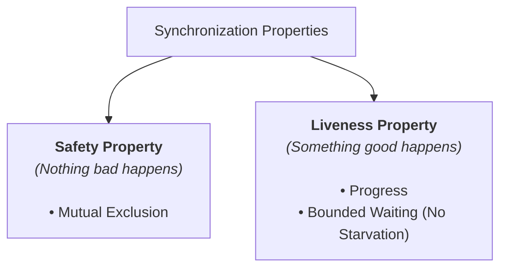

> [!abstract] Abstract
> To eliminate race conditions, concurrent algorithms enforce **Synchronization** by creating **Critical Sections**—blocks of code accessing shared resources that only one thread may execute at any given time. Correct critical section design must satisfy three core properties: **Safety** (Mutual Exclusion), **Liveness** (Progress and Bounded Waiting), and **Performance**.
> 
> - **Category:** Synchronization Fundamentals
> - **Core Concept:** Creating atomic execution regions around shared mutable state.
> - **Golden Rule:** Prioritize **Safety** first, but ensure **Liveness** is maintained to prevent deadlocks and starvation.

---

# 1. What is a Critical Section?

A **Critical Section** is a segment of code that accesses shared mutable resources (such as global variables, heap structures, or file handles) and must not be concurrently executed by more than one thread.

![[Pasted image 20260721115632.png]]

### The Canal Lock Analogy
A critical section functions like a canal lock (boat lock) between two bodies of water. Only one ship can enter the lock at a time. The gate closes behind it, allowing it to safely adjust water levels before exiting, ensuring the two bodies of water do not flood uncontrollably.

```c
void withdraw(Account* account, int amount) {
    // ---- ENTER CRITICAL SECTION (Acquire Lock) ----
    
    balance = get_balance(account);
    balance = balance - amount;
    put_balance(account, balance);
    
    // ---- EXIT CRITICAL SECTION (Release Lock) ----
}
```

---

# 2. The Four Goals of Critical Section Design

Any valid solution for protecting a critical section must satisfy four fundamental requirements:

### 1. Mutual Exclusion (Safety)
If thread $T_1$ is executing inside the critical section, then **no other thread** $T_2$ can be executing in that critical section simultaneously.

### 2. Progress (Liveness)
If no thread is currently executing in the critical section and some threads want to enter, only those threads **not** executing in their remainder section can participate in deciding which thread enters next. A thread outside the critical section cannot prevent another runnable thread from entering.

### 3. Bounded Waiting / No Starvation (Liveness)
There must be a bound on the number of times other threads are allowed to enter the critical section after a thread $T$ has made a request to enter, before $T$'s request is granted. **No thread should wait indefinitely (starvation).**

### 4. Performance
The execution overhead of entering, checking, and exiting the critical section must be minimal relative to the actual work performed inside the section. Threads should not waste CPU cycles spinning unnecessarily.

---

# 3. Categorizing Goals: Safety vs. Liveness

When evaluating concurrent systems, the four requirements map into two formal formalisms:



| Property Category | Goal Enforced | Meaning | Failure Mode |
|---|---|---|---|
| **Safety** | **Mutual Exclusion** | Ensures the system never enters an invalid or corrupted state. | Race condition, corrupted data structures. |
| **Liveness** | **Progress & Bounded Waiting** | Ensures the system makes forward progress and doesn't freeze. | Deadlock, Livelock, Starvation. |
| **Performance** | **Minimal Overhead** | Keeps lock acquisition fast and CPU usage efficient. | High lock contention, excessive spin-locking. |

> [!tip] Golden Rule of Concurrent Design
> When designing concurrent algorithms, **always guarantee Safety (Mutual Exclusion) first**, then refine the algorithm to guarantee **Liveness** and optimize for **Performance**.

---

# Related Notes

- [[Race Conditions & Shared State|Race Conditions & Shared State]]
- [[Thread Abstraction & TCB|Thread Abstraction & TCB]]
- [[Computer Systems/Operating Systems/Concurrency & Synchronization/index|Concurrency & Synchronization Index]]