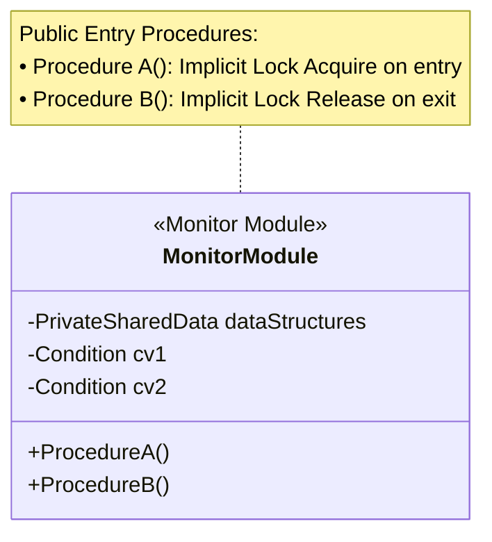

> [!abstract] Abstract
> A **Monitor** is a high-level programming language construct that controls access to shared data by encapsulating shared variables, procedures, and synchronization code into a unified module. The compiler automatically injects mutual exclusion locks at entry and exit points of monitor procedures, preventing unstructured lock bugs while allowing threads to synchronize via internal **Condition Variables**.
> 
> - **Category:** High-Level Language Primitives
> - **Primary Mechanism:** Compiler-enforced implicit mutual exclusion + internal Condition Variables.
> - **Key Invariant:** Only one thread can be executing inside any monitor procedure at any given time.

---

# 1. What is a Monitor?

While locks and semaphores require developers to manually invoke `acquire()` / `release()` or `wait()` / `signal()`, **Monitors** delegate lock management to the compiler.



### Core Characteristics
1.  **Encapsulation:** Shared state variables are private to the monitor and accessible only through its defined procedures.
2.  **Implicit Mutual Exclusion:** The compiler automatically ensures that at most **one thread** is executing inside any monitor procedure at a time.
3.  **Integrated Condition Variables:** Threads can block inside a monitor procedure by calling `wait()` on an internal condition variable, which temporarily releases the monitor lock so another thread can enter.

---

# 2. Producer-Consumer Implementation with a Monitor

Because mutual exclusion is implicit, pseudocode inside a monitor focuses purely on state checking and signaling:

```java
Monitor BoundedBufferMonitor {
    // Shared private state
    Item buffer[N];
    int count = 0;
    
    // Internal condition variables
    Condition not_full;
    Condition not_empty;

    public void put_resource(Item item) {
        // Mutual Exclusion is IMPLICITLY enforced here (acquire)
        while (count == N) {
            wait(not_full); // Temporarily releases monitor lock and sleeps
        }
        
        insert_into_buffer(item);
        count++;
        
        signal(not_empty);
        // Mutual Exclusion is IMPLICITLY released on exit
    }

    public Item get_resource() {
        // Mutual Exclusion is IMPLICITLY enforced here (acquire)
        while (count == 0) {
            wait(not_empty); // Temporarily releases monitor lock and sleeps
        }
        
        Item item = remove_from_buffer();
        count--;
        
        signal(not_full);
        return item;
        // Mutual Exclusion is IMPLICITLY released on exit
    }
}
```

---

# 3. Comprehensive Primitive Comparison Matrix

| Primitive | Level | Mutual Exclusion | Event Coordination | Lock Management | Primary Limitation |
|---|---|---|---|---|---|
| **Locks (Mutexes)** | Low-Level | **Yes** | No | Manual (`acquire`/`release`) | Prone to missing `release()` calls |
| **Semaphores** | Mid-Level | **Yes** (Binary) | **Yes** (Counting) | Manual (`wait`/`signal`) | Unstructured; history counter can confuse state logic |
| **Condition Variables** | Mid-Level | No | **Yes** | Manual (Paired with Lock) | Memoryless; must re-check conditions in `while` loop |
| **Monitors** | High-Level | **Yes** (Implicit) | **Yes** (Via internal CVs) | **Automatic** (Compiler) | Requires language/runtime support (e.g., Java `synchronized`) |

---

# Related Notes

- [[Locks|Locks]]
- [[Condition Variables|Condition Variables]]
- [[Semaphores|Semaphores]]
- [[Producer-Consumer Problem|Producer-Consumer Problem]]