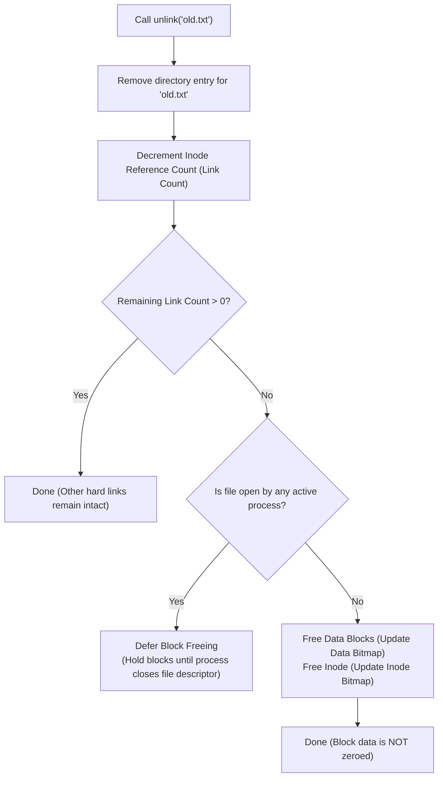

> [!abstract] Abstract
> File systems support **Aliasing**—referencing a single underlying file under multiple names or path locations—via **Hard Links** and **Symbolic (Soft) Links**. Managing these aliases involves specific kernel lifecycle operations for file creation, atomic renaming (`rename`), and reference-counted deletion (`unlink`).

---

# Hard Links vs. Symbolic (Soft) Links

## Hard Links
A **Hard Link** is a directory entry that maps a filename directly to an existing inode number.

![[Pasted image 20260801171122.png]]

*   **Syscall & Command:** Created via the `link` system call (`ln target alias`).
*   **Mechanics:** Points directly to the target file's inode. All hard links to a file share identical inode numbers, permissions, and ownership.
*   **Directory Hard Links:** `.` (current directory) and `..` (parent directory) are system-managed hard links to directory inodes.
*   **Limitations:**
    1.  Users cannot manually create hard links to directories (prevents circular directory loops).
    2.  Cannot span across different file systems (inodes are local to a specific file system volume).
## Symbolic (Soft) Links
A **Symbolic Link** is a distinct, special file whose stored content is a text string representing another file's path name.

![[Pasted image 20260801171235.png]]

*   **Syscall & Command:** Created via the `symlink` system call (`ln -s target alias`).
*   **Mechanics:** Possesses its own unique inode flagged as a symlink. During path name translation, the file system reads the stored path string and restarts translation from that path.
*   **Capabilities & Trade-offs:**
    *   Can link across different file systems and point to directories.
    *   Can become a "dangling link" if the target file is moved or deleted.
    *   Slower than hard links due to extra path lookup iterations.

## Comparison Summary

| Attribute | Hard Link | Symbolic (Soft) Link |
|---|---|---|
| **Target Pointer** | Points directly to target **Inode** | Stores text string of target **Path** |
| **System Call** | `link()` (`ln file alias`) | `symlink()` (`ln -s file alias`) |
| **Inode Identity** | Identical inode number as target | Unique inode number (flagged as symlink) |
| **Cross-Filesystem** | No | Yes |
| **Directory Links** | No (restricted to OS `.` and `..`) | Yes |
| **Dangling Pointers** | Impossible (held by reference count) | Possible (if target path is deleted) |
| **Performance** | Direct lookup | Slower (requires extra path translation) |

---

# File Lifecycle Operations

## 1. File Creation Sequence
Creating a new file (e.g., `new.txt`) follows a strict allocation workflow:

- Allocate an **inode**
	- Initialize the metadata (owner, protection, timestamp, etc)
	- Update inode bitmap
- Allocate a **directory entry**
	- Entry maps `new.txt` to the allocated inode
- When process starts writing, allocate data blocks
	- Update inode to point to allocated data blocks
	- Update data block bitmap
	- Continue to allocate blocks on demand

## 2. File Renaming (`rename`)
Rather than allocating a new file, copying data blocks, and deleting the old file, the `rename` system call (`mv old new`) operates atomically at the directory level:

![[Pasted image 20260801171832.png]]

1.  Create a new directory entry mapping the new name to the existing inode.
2.  Remove the old directory entry.
3.  Data blocks and inode contents remain entirely untouched.

## 3. File Deletion & Unlinking (`unlink`)
In Unix, file deletion uses the `unlink` system call (`rm old.txt`), operating on directory entries and inode link counts:

![[Pasted image 20260801172155.png]]

> [!important] Open File Handle Exception
> If a file's reference count drops to `0` while an active process still holds an open file descriptor to it, the directory entry is removed immediately, but physical block freeing is deferred until all processes close the file handle.

---

## Related Notes

- [[Multi-Level Indexed Layout|Unix Inodes]]
- [[File System Layout|File System Layout]]
- [[File Systems & Storage Technologies|File Systems & Storage Technologies]]