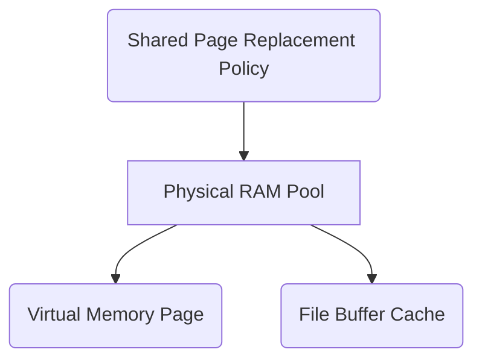
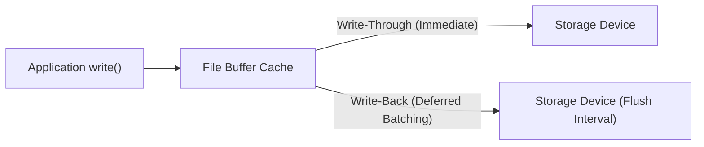

> [!abstract] Abstract
> The **File Buffer Cache** is a system-wide memory cache that holds frequently accessed disk blocks in RAM to capture temporal and spatial locality. By caching all filesystem block types (superblocks, inodes, directory blocks, and data blocks), it accelerates I/O by allowing disk reads and writes to execute at DRAM speeds. Modern operating systems merge virtual memory pages and storage buffer blocks into a single **Unified Page Cache** to dynamically balance physical memory allocation.

---

## Path Name Translation Without Caching

Reading a file from disk using an absolute path (e.g., `/one`) requires traversing filesystem metadata starting from process control structures down to physical disk blocks. 

Without caching, resolving and reading `/one` involves a 5-step sequence across kernel tables and physical media:

![[Pasted image 20260802152040.png]]

1. **Process Table to File Pointer:** The process queries its [[Process Abstraction & PCB|PCB]] file descriptor table to locate the entry in the system-wide **Open File Table**.
2. **Superblock Read:** Read the fixed **Superblock** from physical storage to find the inode location of the root directory (`/`).
3. **Root Inode Read:** Read the inode for `/` into memory to locate the data blocks storing root directory entries.
4. **Root Directory Data Read:** Read `/`'s data block to look up the entry `"one"` and retrieve its associated inode number.
5. **Target Inode & Data Read:** Read the inode for `"one"` to obtain its physical block pointers, then read the target data block into user memory.

---

## File Buffer Cache Architecture

Because applications exhibit high spatial and temporal locality when reading and writing files, operating systems maintain a **File Buffer Cache** in physical RAM.

![[Pasted image 20260802152316.png]]

*   **System-Wide Sharing:** A single buffer cache is shared across all processes, eliminating duplicate disk reads when multiple processes access the same files.
*   **Universal Block Caching:** Caches metadata blocks (superblocks, inodes, directory entries) alongside standard file data blocks.
*   **Path Translation Acceleration:** On a cache hit during path resolution, the kernel reads inodes and directory entries directly from DRAM without issuing physical disk read operations.

---

## Physical Memory Split: Unified Page Cache

Historically, operating systems partitioned physical memory into two fixed regions: one for **Virtual Memory** (user process stack, heap, code pages) and one for the **File Buffer Cache**.

**Modern Unified Page Cache**


### Challenges of Fixed Partitioning
*   If a system runs heavy I/O workloads with low process memory demands, buffer space runs out while virtual memory stays idle.
*   Conversely, memory-heavy applications starve for memory while the buffer cache goes underutilized.

### Modern Solution: Unified Page Cache
Modern kernels unify file blocks and virtual memory pages into a single physical memory pool:
*   Any physical page frame can store either a virtual memory page or a cached file block.
*   A single, unified [[Page Replacement Algorithms|Page Replacement Algorithm]] (e.g., Clock or LRU) manages eviction based on overall system memory pressure.

**Legacy Fixed Size Partition**


---

## Read & Write Execution Workflows

### 1. Read Execution (`read`)

When an application invokes `read(fd, buffer, count)`:

![[Pasted image 20260802153359.png]]

```c
void read(int fd, void *buffer, size_t count) {
    if (block_in_buffer_cache(fd, block_id)) {
        // Cache Hit: Fast DRAM-to-DRAM copy
        copy_bytes(buffer_cache_page, user_buffer, count);
    } else {
        // Cache Miss: Evict if memory is full and read from storage
        if (memory_full()) evict_page();
        read_block_from_storage_to_cache(fd, block_id);
        copy_bytes(buffer_cache_page, user_buffer, count);
    }
}
```

---

### 2. Write Execution (`write`)

When an application invokes `write(fd, buffer, count)`:

![[Pasted image 20260802153549.png]]

```c
void write(int fd, void *buffer, size_t count) {
    if (block_in_buffer_cache(fd, block_id)) {
        // Cache Hit: Write into cache and mark block dirty
        copy_bytes(user_buffer, buffer_cache_page, count);
        mark_block_dirty(buffer_cache_page);
    } else {
        // Cache Miss: Prepare space, read block, then update
        if (memory_full()) evict_page();
        read_block_from_storage_to_cache(fd, block_id);
        copy_bytes(user_buffer, buffer_cache_page, count);
        mark_block_dirty(buffer_cache_page);
    }
}
```

---
## Write Policies: Write-Through vs. Write-Back
When data is written to the buffer cache, the application receives a success return code. However, data is not persistent until written to underlying storage. 


| Write Policy | Operational Mechanism | Advantages | Disadvantages |
|---|---|---|---|
| **Write-Through** | Synchronously writes modified data to the storage device immediately upon every write call. | Simple implementation; guarantees strong crash consistency; storage always mirrors cache state. | Slow writes; application blocks on storage latency ($5\text{--}10\text{ ms}$ for HDDs); high write volume. |
| **Write-Back** | Buffers writes in RAM, marking pages as "dirty." A background kernel thread flushes dirty pages to disk periodically (e.g., every 30s in Unix). | Extremely fast writes; enables I/O batching and write coalescing; extends storage lifespan. | Risk of data loss on sudden power failure or system crash prior to flushing. |

---

## Related Notes

- [[Common File Operations|Common File Operations]]
- [[Multi-Level Indexed Layout|Multi-Level Indexed Layout]]
- [[Demand Paging & Page Faults|Demand Paging & Page Faults]]
- [[Page Replacement Algorithms|Page Replacement Algorithms]]
- [[Process Abstraction & PCB|Process Abstraction & PCB]]