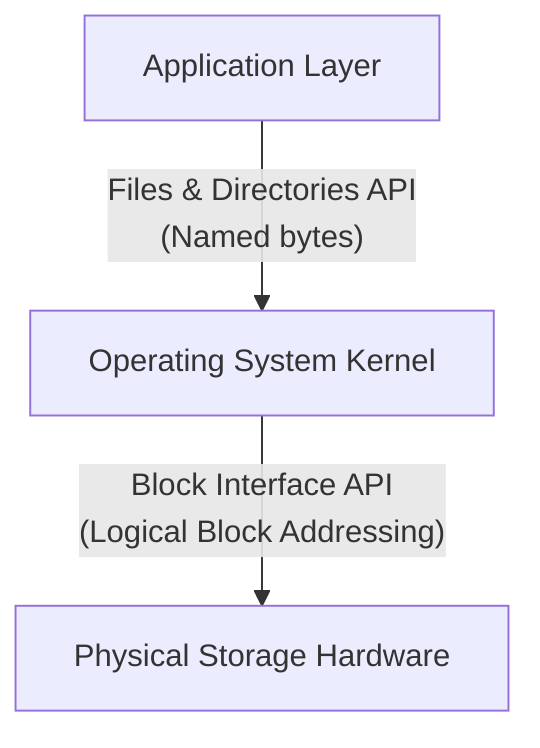

> [!abstract] Abstract
> The **File System Layout** dictates how logical files and directories are mapped onto physical storage blocks via the hardware **Block Interface**. Because real-world workloads feature extreme size non-uniformity (most files are small, but most storage capacity is consumed by a few large files), file systems employ distinct **Block Allocation Strategies**—Contiguous, Linked, Indexed, and Multi-Level Indexed—to balance sequential throughput, random access speed, and dynamic growth.

---

## File System Abstraction Boundaries & Workload Motivations

File systems operate between two primary interfaces:

*Typical File System Data Structures*
![[Pasted image 20260731134516.png]]

### Design Challenges
*   **Dynamic File Sizing:** File sizes span 6 to 8 orders of magnitude.
*   **Hardware Non-Uniformity:** Physical disk latency varies significantly based on seek and rotational delays.
*   **System Reliability:** Preserving metadata integrity and file contents across sudden system crashes.

### Workload Characteristics (UNIX / Windows NT Measurements)
*   **File Size Non-Uniformity:** Most files are small ($\approx 8\text{ KB}$), but $90\%$ of total disk space is occupied by the top $10\%$ of large files.
*   **Spatial Locality:** Files located within the same directory are frequently accessed together.
*   **Metadata Locality:** File metadata (permissions, size, block pointers) must be accessed simultaneously with file data.

---

## File System Block Partitioning

The operating system divides physical disk space into fixed-size **File System Blocks** (typically $4\text{ KB}$):

![[Pasted image 20260731145609.png]]

*   **Block Formatting:** Block size is configured when formatting the file system and operates independently of physical disk sector sizes (e.g., a $512\text{-byte}$ sector yields 8 sectors per $4\text{ KB}$ block).
*   **Allocation Rules:** Large files span multiple contiguous or scattered blocks (e.g., a $40\text{ KB}$ file occupies 10 blocks). Small files smaller than $4\text{ KB}$ still consume an entire physical block.

---

## Block Allocation Strategies

### 1. Contiguous Allocation Layout
Allocates a continuous range of adjacent physical blocks to each file.

![[Pasted image 20260731222130.png]]

*   **Metadata:** Location of the first block on disk + total block count.
*   **Pros:** High sequential bandwidth; fast random access; minimal physical actuator seeks.
*   **Cons:** Inflexible file growth; severe external fragmentation requiring disk compaction.
### 2. Linked Allocation Layout
Stores blocks as a linked list on disk, where each block holds data and a pointer to the next block.

![[Pasted image 20260801002953.png]]

*   **Metadata:** Pointer to the first physical block.
*   **Pros:** Dynamic file growth; zero external fragmentation.
*   **Cons:** Extremely slow random access ($O(N)$ block traversal); poor sequential bandwidth; high vulnerability (a single corrupted block loses the entire remaining file chain).

### 3. Indexed Allocation Layout
Uses a dedicated **Index Block** containing an array of direct pointers to physical data blocks.

![[Pasted image 20260801003523.png]]

*   **Metadata:** Disk address of the Index Block.
*   **Pros:** Fast random access; dynamic file growth; zero external fragmentation.
*   **Cons:** Fixed index block capacity limits maximum file size; potential seek overhead if data blocks are scattered.

### 4. Multi-Level Indexed Layout
Extends indexed allocation by storing direct pointers alongside single, double, or triple **Indirect Blocks** pointing to additional index structures. 

> [!info] This layout format is the implementation of the file system today, more information [[Multi-Level Indexed Layout|here]]

![[Pasted image 20260801003836.png]]

*   **Metadata:** Disk address of the root Index Block containing direct and indirect block pointers.
*   **Pros:** Accommodates massive files dynamically while maintaining fast access for small files.
*   **Cons:** Upper ceiling on maximum file size still exists; multi-level pointer traversals add read indirection overhead.

---

## Allocation Strategy Trade-Off Summary

| Allocation Strategy | Sequential Access Speed | Random Access Speed | Dynamic File Growth | Fragmentation Profile |
|---|---|---|---|---|
| **Contiguous** | Fast | Fast | Inflexible | External Fragmentation |
| **Linked** | Slow | Very Slow ($O(N)$) | Dynamic | Zero External Fragmentation |
| **Indexed** | Moderate | Fast | Dynamic | Wasted Space on Small Files |
| **Multi-Level Indexed** | Moderate / Fast | Fast | Dynamic (Massive Files) | Minimal Overhead for Small Files |

---

## Related Notes

- [[File Systems & Storage Technologies|File Systems]]
- [[Hard Disk Drive Mechanics & Scheduling|Hard Disk Drive Mechanics & Scheduling]]
- [[Solid State Drives & NAND Flash|Solid State Drives & NAND Flash]]
- [[RAID Architectures|RAID Architectures]]