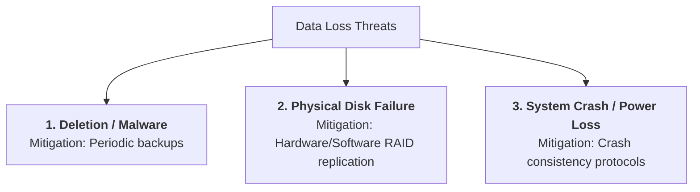
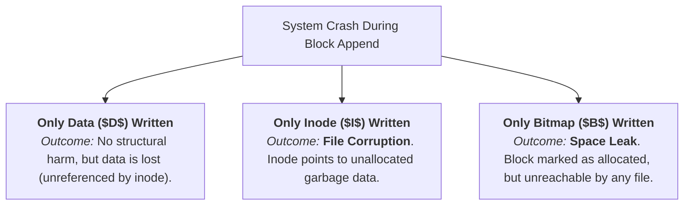
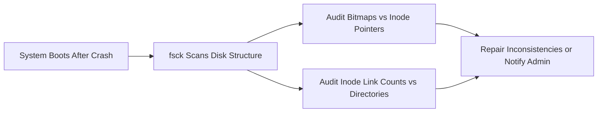
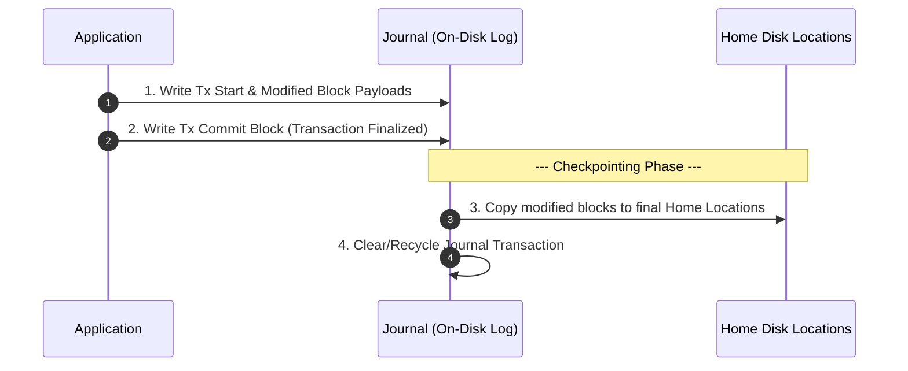

> [!abstract] Abstract
> **File System Reliability** encompasses the mechanisms used to protect persistent data against system crashes, power failures, media defects, and human errors. Because complex filesystem operations require multi-block updates (e.g., writing data, bitmaps, and inodes), an unexpected crash midway through an operation can leave the filesystem in an inconsistent state. Operating systems address this **Crash Consistency Problem** using recovery strategies ranging from post-crash scanners (**`fsck`**) and **Ordered Writes** to modern **Journaling (Write-Ahead Logging)**.

---

## Threats & The Crash Consistency Problem

File systems face three primary categories of data loss threats:

### The Multi-Block Update Problem
Most high-level file operations require writing multiple physical blocks to disk. For instance, creating a new file involves allocating an inode in the inode bitmap, writing the new inode metadata, and adding a new entry to the parent directory block.

If a crash occurs midway through a multi-block update, the file system is left in an **inconsistent state**.

---

## Case Study: Appending a Data Block

Consider appending a new data block to an existing file, which requires writing **three distinct blocks**:
1. **Data Block ($D$):** The actual user contents.
2. **Data Bitmap ($B$):** Updates the free-block map to mark block $D$ as allocated.
3. **Inode Block ($I$):** Updates the file's size and adds a pointer to block $D$.

![[Pasted image 20260802160345.png]]

Assuming single-block disk writes are atomic, a crash occurring mid-operation yields three partial write failure scenarios:

| Partial Write Case | Disk State | System Impact / Outcome |
|---|---|---|
| **Only Data Block ($D$)** | $D$ written, $B$ and $I$ unwritten | Safe. The write is effectively lost as if it never occurred. |
| **Only Inode ($I$)** | $I$ written, $D$ and $B$ unwritten | **Severe File Corruption**. Reading the file returns uninitialized garbage data. |
| **Only Bitmap ($B$)** | $B$ written, $D$ and $I$ unwritten | **Space Leak**. Storage block is marked as used but cannot be reclaimed or read. |

---

## Approach 1: File System Checker (`fsck`)

Early Unix systems used an offline utility called **`fsck` (File System Check)** that executes during system reboot following an unclean shutdown.

### Common Repairs
*   **Reclaim Leaked Blocks:** If a bitmap bit is set to $1$ but no inode points to that block, `fsck` clears the bitmap bit.
*   **Fix Discrepant Link Counts:** Adjusts the inode reference count to match the actual count of directory entries pointing to it.
*   **Recover Lost Files:** Unreferenced inodes with non-zero link counts are moved to a `/lost+found` directory.

### Drawbacks
*   **Extreme Recovery Latency:** `fsck` must perform a full traversal of all inodes and directory structures on disk ($O(\text{disk capacity})$). On multi-terabyte drives, this scan can take **hours**.
*   **Potential Data Loss:** Cannot restore file contents; can only restore structural integrity, sometimes leaving files containing garbage data.

---

## Approach 2: Ordered Writes

**Ordered Writes** prevent severe structural corruption by enforcing strict dependency ordering on disk writes so that invalid pointer references are never created.

### Core Ordering Rules
1. **Initialize target data/bitmap blocks before writing pointers to them** in inodes.
2. **Nullify existing pointers to a block before reusing it.**
3. **Set a new pointer to a resource before clearing the old pointer** (e.g., during atomic `rename`).

### Safe Append Sequence
When appending a block to a file, data and bitmap blocks are flushed before the inode pointer is committed:

*   **Pros:** Eliminates severe filesystem corruption without requiring an offline scan on reboot.
*   **Cons:** Synchronous write ordering introduces high latency overhead. Space leaks can still occur, requiring background cleaning routines.

---

## Approach 3: Journaling (Write-Ahead Logging)

Modern file systems (e.g., Linux `ext4`, Windows `NTFS`, macOS `APFS`) utilize **Journaling (Write-Ahead Logging)** to achieve fast crash recovery and guaranteed consistency.

### Core Concept
Before writing changes to their permanent home locations on disk, the file system writes a description of the intended updates into an append-only log file called the **Journal**.

![[Pasted image 20260802203801.png]]

---

### Journal Transaction Structure

The journal is managed as a circular buffer composed of transaction records:

![[Pasted image 20260802204014.png]]

1. **Transaction Start Block (`Tx Start`):** Contains the Transaction ID and metadata.
2. **Block Records / Payloads:** The actual modified blocks (data, inode, bitmap).
3. **Transaction Commit Block (`Tx Commit`):** A single block written **only after** all prior payload blocks are flushed. A transaction is considered finalized and durable **only** when the commit block is fully written to disk.

---

### Journaling Lifecycle & Checkpointing

*   **Checkpointing:** The process of copying committed blocks from the journal to their permanent "home locations" on disk, allowing the journal space to be reclaimed.
*   **Crash Recovery Protocol:**
    1. Scan the journal on boot.
    2. **Replay Committed Transactions:** Re-apply all changes from transactions that have a valid `Tx Commit` block but were not yet checkpointed (idempotent operation).
    3. **Discard Uncommitted Transactions:** Ignore partial transactions lacking a `Tx Commit` block.

![[Pasted image 20260802204643.png]]

---

## Summary Comparison of Reliability Strategies

| Metric | File System Checker (`fsck`) | Ordered Writes | Journaling (Write-Ahead Logging) |
|---|---|---|---|
| **Recovery Mechanism** | Full offline disk scan on boot | Enforces strict write dependency ordering | Replays append-only transaction log |
| **Boot Recovery Time** | Very Slow (Hours on large drives) | Instant (No scan required) | Fast (Seconds, proportional to log size) |
| **Write Performance** | Normal (No runtime ordering penalty) | Slow (Blocked on synchronous writes) | Fast (Sequential log writes, background flushing) |
| **Space Overhead** | Zero | Zero | Small fixed journal partition |
| **Write Amplification** | $1\times$ | $1\times$ | $2\times$ (Data written to log, then home) |

---

## Related Notes

- [[File Systems & Storage Technologies|File Systems & Storage Technologies]]
- [[File System Layout|File System Layout]]
- [[Multi-Level Indexed Layout|Multi-Level Indexed Layout]]
- [[File Buffer Cache|File Buffer Cache]]
- [[RAID Architectures|RAID Architectures]]