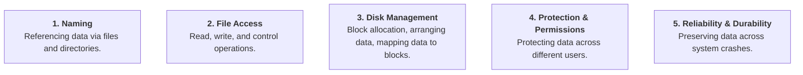

> [!abstract] Abstract
> The **File System** provides an abstraction layer mapping human-readable, byte-oriented logical structures (**Files** and **Directories**) onto non-volatile physical storage media. It manages file naming, access, storage allocation, user permissions, and crash durability, hiding physical hardware complexities behind a standardized interface (VFS in Unix, IFS in Windows).

---

## File System Components & Core Abstractions

An OS file system manages five fundamental components:

### Key Abstractions
*   **Files:** A named collection of bytes stored on durable media.
    *   *Properties:* Size, owner, last modified time, permissions.
    *   *Types:* Understood by filesystem (`link`, `character`, `block`) vs. OS/runtime (`text`, `source`, `object`, `executable`, untyped). Encoded via name or content.
*   **Directories:** A logical organization mechanism consisting of a list of entries mapping $\langle \text{Name}, \text{Location} \rangle$.
    *   Directory lists are typically unordered on disk and sorted by user utilities.
    *   *Unix Philosophy:* "Everything is a file" — directories are stored internally as files.
*   **Virtual File System Interface:** OSs abstract diverse file systems behind a unified API (**VFS** on Unix, **IFS** on Windows).

---

## Physical Reality vs. File System Abstraction

The file system translates raw physical disk characteristics into protected, reliable software abstractions:

![[Pasted image 20260728175303.png]]

![[Pasted image 20260728175311.png]]

| Physical Hardware Reality | File System Abstraction |
|---|---|
| Block-Oriented (Logical Block Address) | Byte-Oriented stream |
| Unnamed block indexes | Named Files |
| No protection among users | Users protected from each other |
| Data vulnerable to crash corruption | Robust and durable across machine failures |

---

## File Access Patterns & Sharing

### Access Patterns
1.  **Sequential Access:** Bytes are read strictly in order from start to finish.
2.  **Random Access:** Address any arbitrary byte offset directly without reading prior bytes (e.g., databases, swap files).
3.  **Indexed Access:** Uses index structures (e.g., hash tables, dictionaries) to look up specific block contents.

### File Sharing & Concurrency
File sharing provides the foundation for communication and synchronization. Key issues include:
*   Semantics when one process reads while another writes.
*   Semantics when two processes open a file for writing simultaneously.
*   Coordination primitives (e.g., file locking).

---

## Protection & Access Rights

Protection systems verify whether an action performed by a subject on an object is allowed.

### Unix Access Control Model
Unix divides access rights into three user classes:
*   **Owner (`u`):** User who owns the entry.
*   **Group (`g`):** User group associated with the entry.
*   **Public / Others (`o`):** All other system users.

Permissions for each class specify **Read (`r`)**, **Write (`w`)**, and **Execute (`x`)** access.

![[Pasted image 20260728180636.png]]

*   `chmod`: Modifies access permissions.
*   `chown`: Changes file ownership.

### Root and Administrative Privileges
*   **`root` (Unix)** and **`Administrator` (Windows)** bypass all kernel protection checks.
*   *Best Practice:* Always operate under a standard user account and utilize privilege escalation (`sudo`) only when administrative modifications are required.

---

## Memory & Storage Technology Spectrum

Storage and memory technologies exhibit distinct latency, throughput, capacity, and cost trade-offs across the hardware hierarchy:

![[Pasted image 20260731133617.png]]

| Metric | DRAM | Non-Volatile Memory (NVM) | Solid State Disks (SSD) | Hard Disk Drives (HDD) |
|---|---|---|---|---|
| **Volatility** | Volatile | Non-Volatile | Non-Volatile | Non-Volatile |
| **Latency** | $50 \text{ to } 100\text{ ns}$ | $\sim 300\text{ ns}$ | $30 \text{ to } 100 \ \mu\text{s}$ | $5 \text{ to } 10\text{ ms}$ |
| **Bandwidth** | $50 \text{ to } 100\text{ GB/s}$ | A few $\text{GB/s}$ | A few $\text{GB/s}$ | $100 \text{ to } 150\text{ MB/s}$ |
| **Capacity** | Tens of GB / module | Tens to hundreds of GB / module | $64\text{ GB to } 4\text{ TB}$ | $1 \text{ to } 8\text{ TB}$ |
| **Cost** | Highest ($\$\$\$\$\$\$$) | High ($\$\$\$\$$) | Moderate ($\$\$\$$) | Lowest ($\$\$$) |

---

## Related Notes

- [[Hard Disk Drive Mechanics & Scheduling|Hard Disk Drive Mechanics & Scheduling]]
- [[Solid State Drives & NAND Flash|Solid State Drives & NAND Flash]]
- [[RAID Architectures|RAID Architectures]]
- [[Virtual Memory & Address Translation Fundamentals|Virtual Memory & Address Translation Fundamentals]]