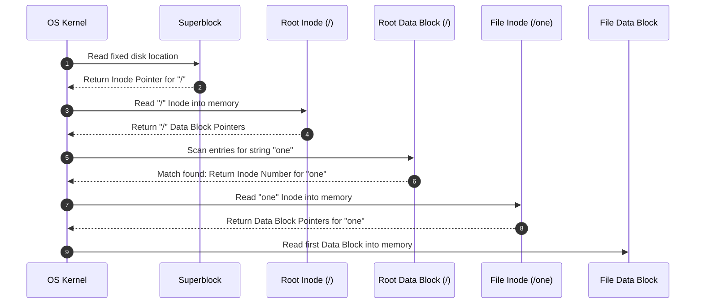

> [!abstract] Abstract
> In Unix-like operating systems, the **Inode (Index Node)** serves as the core metadata structure for file management, using an unbalanced multi-level index to efficiently handle both small and massive files. File systems anchor root directory traversal at a fixed **Superblock** location, track block allocation via **Free Maps**, and resolve hierarchical path names (e.g., `/one`) by iteratively reading directory entries and inode block pointers.

---

## Unix Inode Structure & Metadata

In Unix file systems, every file and directory is represented on disk by an **Inode (Index Node)** identified by a unique **Inode Number**. An inode contains all system metadata for a file except its filename (which is stored inside directory entry blocks).

### Inode Metadata Fields
*   **File Size:** Exact size in bytes and allocated block count.
*   **Ownership:** User ID (UID) and Group ID (GID) of the file owner.
*   **Protection Bits:** Access mode flags for user, group, and others (`rwx`).
*   **Link Count:** Total number of directory entries pointing to this inode.
*   **Timestamps:** Timestamps for creation, modification, last access, and inode state change.

---

## Unbalanced Index Structure

To optimize access for common workloads—where most files are small but a few are extremely large—Unix inodes use an **unbalanced index pointer array** (typically 15 pointers total):

![[Pasted image 20260801004721.png]]

1.  **Direct Pointers (12 pointers):** Point directly to the first 12 data blocks. Small files ($\le 48\text{ KB}$ for $4\text{ KB}$ blocks) require zero indirection.
2.  **Single Indirect Pointer (1 pointer):** Points to a disk block containing pointers to data blocks.
3.  **Double Indirect Pointer (1 pointer):** Points to a block of single indirect pointers.
4.  **Triple Indirect Pointer (1 pointer):** Points to a block of double indirect pointers, enabling massive multi-gigabyte file support.

### Inode Location & Disk Calculation
Inodes are compact ($\approx 256\text{ bytes}$ each), allowing a single $4\text{ KB}$ physical block to store multiple inodes. Given an inode number and the count of inodes that fit in a single block ($\text{InodesPerBlock}$):

$$\text{Block Number} = \left\lfloor \frac{\text{Inode Number}}{\text{InodesPerBlock}} \right\rfloor$$

$$\text{Offset within Block} = \text{Inode Number} \pmod{\text{InodesPerBlock}}$$

---

## The Superblock

The **Superblock** contains global file system state and configuration parameters required to mount and read the drive.

![[Pasted image 20260801110650.png]]

*   **Fixed Location:** Located at a pre-determined, fixed disk offset so the OS kernel can always read it on startup.
*   **Root Directory Anchor:** Stores a pointer to the root directory (`/`) inode.
*   **Path Translation Foundation:** Serves as the starting anchor for resolving all absolute path names across the file system.

---

## Free Block Allocation: Bitmaps vs. Linked Lists

The file system maintains free state tracking to determine which physical data blocks and inode slots are available for allocation:

![[Pasted image 20260801110857.png]]

| Allocation Strategy | Implementation | Advantages | Disadvantages |
|---|---|---|---|
| **Bitmap (Free Map)** | An array of bits where each bit represents a block ($1 = \text{allocated}, 0 = \text{free}$). Separate bitmaps exist for data blocks and inodes. | Fast lookup for contiguous free blocks. | Requires dedicated disk space overhead to store the bitmap. |
| **Linked List** | Unallocated free data blocks store pointers to other free blocks in a chained list. | Zero extra storage overhead; uses unallocated blocks directly. | Slow and difficult to locate contiguous ranges of free blocks. |

---

## Step-by-Step Path Name Translation

Opening a file via an absolute path name (e.g., `/one`) requires the operating system to iteratively traverse directories starting from the superblock:

1.  **Read Superblock:** Query the fixed superblock location to get the inode pointer for the root directory (`/`).
2.  **Read Root Inode:** Load the `/` inode into memory to locate the data blocks storing directory entries for `/`.
3.  **Scan Root Directory:** Read the `/` data block and search its entry list for the target filename `"one"`. Retrieve `"one"`'s inode number.
4.  **Read File Inode:** Load `"one"`'s inode into memory to obtain its data block pointers.
5.  **Access Data:** Read `"one"`'s first data block into memory to service application read/write calls.

---

## Related Notes

- [[File System Layout|File System Layout]]
- [[File Systems & Storage Technologies|File Systems & Storage Technologies]]
- [[Hard Disk Drive Mechanics & Scheduling|Hard Disk Drive Mechanics & Scheduling]]