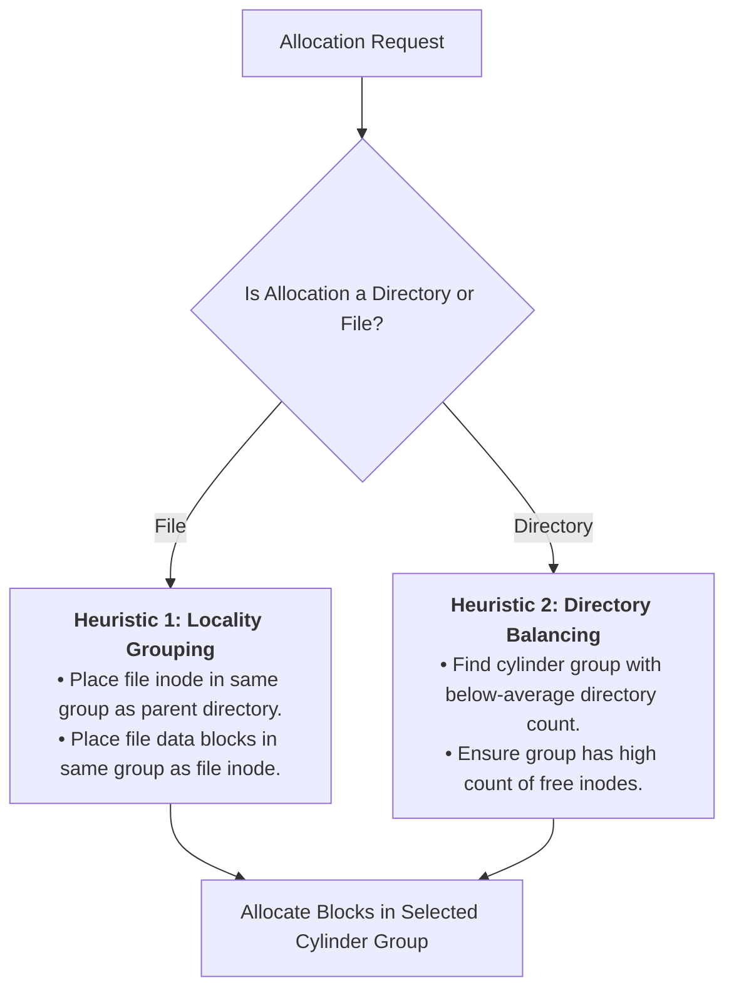

> [!abstract] Abstract
> Early file systems suffered severe mechanical seek overhead due to poor spatial layout. The **BSD Fast File System (FFS)** revolutionized storage performance by exploiting physical drive geometry through **Cylinder Groups** and intelligent placement heuristics. Modern file systems adapt these placement principles to logical block address spaces using **Block Groups**.

---

## Original Unix File System Disk Layout

The original Unix File System used a rigid, static disk partition layout:

![[Pasted image 20260801173740.png]]

### Drawbacks
1.  **High Seek Latency:** Inodes were concentrated on the outermost disk tracks, while data blocks were placed on inner tracks. Reading a file required long mechanical actuator seeks back and forth between the inode array and data blocks.
2.  **Fixed Metadata Capacity:** The inode table size was fixed at formatting, imposing a hard limit on the maximum number of files regardless of remaining disk space.
3.  **Severe Allocation Fragmentation:** Over time, free block lists became randomized, scattering file blocks across the disk and destroying sequential read bandwidth.

---

## BSD Fast File System (FFS)

To address performance bottlenecks, BSD introduced the **Fast File System (FFS)**, increasing block sizes from $512\text{ bytes}$ to $4\text{ KB}$, substituting free lists with fast **Bitmaps**, and organizing disk space around physical **Cylinder Groups**.

### Disk Cylinders & Cylinder Groups

*   **Disk Cylinder:** The set of matching tracks positioned at the same radial arm distance across all platter surfaces. Data within the same cylinder can be accessed by switching read/write heads without moving the physical actuator arm (zero seek delay).

![[Pasted image 20260801174005.png]]

*   **Cylinder Group:** A set of adjacent, consecutive cylinders. Files and metadata stored within the same cylinder group benefit from minimal seek latency.

![[Pasted image 20260801174104.png]]

### Per-Group Data Structures
FFS divides the disk into multiple autonomous cylinder groups, replicating core file system data structures inside **every** group:

![[Pasted image 20260801174227.png]]

*   **Superblock Replica:** Preserves redundant copies of global file system state to survive physical disk sector corruption.
*   **Per-Group Inode Table:** Inodes are co-located within the same group as their associated data blocks.
*   **Per-Group Bitmaps:** Local allocation bitmaps for inodes and data blocks.

---

## FFS Disk Placement Policies

FFS enforces two primary placement heuristics to optimize spatial locality and prevent global fragmentation:

1.  **File Locality Heuristic (Co-location):**
    *   Place a file's inode within the same cylinder group as its parent directory.
    *   Place a file's data blocks within the same cylinder group as its inode.
2.  **Directory Balancing Heuristic (Spreading):**
    *   Distribute new directories across different cylinder groups to avoid overcrowding a single group.
    *   Select target groups that have a low number of existing directories and a high count of free inodes.

---

## Cylinder Groups vs. Modern Block Groups

Modern storage devices (HDDs and SSDs) do not expose physical cylinder/head/sector geometry to the operating system, presenting instead a flat [[Hard Disk Drive Mechanics & Scheduling|Logical Block Address (LBA)]] block interface.

![[Pasted image 20260801224102.png]]

*   **Block Group:** Modern file systems (e.g., Linux `ext4`) adapt FFS principles to logical address spaces by dividing LBA ranges into contiguous **Block Groups**.
*   **LBA Locality:** Because consecutive logical block numbers map to physically adjacent disk sectors or flash pages, block group placement heuristics achieve the same spatial locality benefits as physical cylinder groups.

---

## Summary Comparison

| Metric | Original Unix File System | BSD Fast File System (FFS) / Modern Block Groups |
|---|---|---|
| **Block Size** | $512\text{ Bytes}$ | $4\text{ KB}$ (or larger) |
| **Free Tracking** | Linked List (Free List) | Allocation Bitmaps |
| **Inode Placement** | Concentrated in single outer array | Distributed across localized Cylinder/Block Groups |
| **Locality Optimizations** | None | Directory co-location & directory balancing heuristics |
| **Metadata Resilience** | Single Superblock | Superblock replicas across all groups |

---

## Related Notes

- [[Multi-Level Indexed Layout]]
- [[File System Layout|File System Layout]]
- [[Common File Operations]]
- [[Hard Disk Drive Mechanics & Scheduling|Hard Disk Drive Mechanics & Scheduling]]