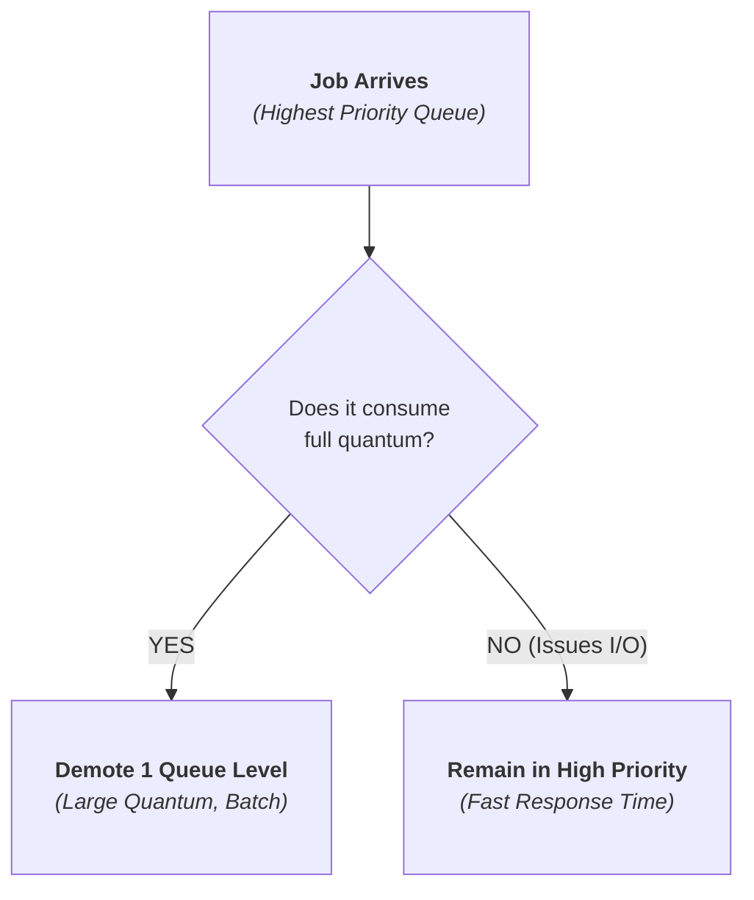

> [!abstract] Abstract
> Classical schedulers require knowing a job's future runtime to minimize turnaround time (SJF/SRTCF) or sacrifice turnaround time for interactive responsiveness (Round Robin). The **Multilevel Feedback Queue (MLFQ)** solves this by dynamically learning job behavior: it penalizes CPU-bound jobs by lowering their priority while boosting interactive I/O-bound jobs, approximating SRTCF without advance runtime knowledge.
> 
> - **Category:** Advanced & Production Scheduling Systems
> - **Core Heuristic:** Learn from past execution history to predict future behavior.
> - **Production Implementations:** Linux Completely Fair Scheduler (CFS), Windows MLFQ, macOS MLFQ.

---

# 1. Multilevel Feedback Queue (MLFQ)

MLFQ maintains multiple distinct ready queues, each assigned a different priority level and time quantum:
![[Pasted image 20260727001842.png]]
### Core MLFQ Operational Rules
1.  **Rule 1:** If $\text{Priority}(A) > \text{Priority}(B)$, $A$ runs ($B$ does not).
2.  **Rule 2:** If $\text{Priority}(A) == \text{Priority}(B)$, $A$ and $B$ run in Round Robin using the queue's quantum.
3.  **Rule 3:** New jobs enter at the **highest priority queue**.
4.  **Rule 4 (Priority Decay):** If a job uses up its entire time quantum executing on the CPU, its priority is reduced (demoted down one queue level).
5.  **Rule 5 (I/O Yielding):** If a job yields the CPU before its quantum expires (e.g., issuing an I/O request), it stays at the **same priority level** (or gets boosted).

---

# 2. How MLFQ Handles I/O and CPU Bursts

MLFQ automatically differentiates between CPU-bound and I/O-bound workloads based on runtime execution patterns:

*   **Interactive / I/O-Bound Jobs:** Perform short CPU bursts and frequently yield for I/O. They remain in high-priority queues, delivering fast **response time**.
*   **CPU-Bound Compute Jobs:** Execute long computation loops, consuming their full quantum. MLFQ demotes them to lower-priority queues with larger time slices, reducing context-switch overhead.

### Priority Boosting & Anti-Gaming Rules
*   **Starvation Prevention:** Periodically boost the priority of **all** jobs to the highest queue to ensure low-priority CPU-bound jobs make progress.
*   **Preventing Gaming:** Track total CPU time consumed at a given level rather than resetting quantum counts on short I/O bursts (prevents processes from issuing fake I/O to hog high-priority queues).

---

# 3. Production Operating System Schedulers

Modern multi-core operating systems adapt scheduling principles to handle complex multi-threaded workloads:

### 1. Linux: Completely Fair Scheduler (CFS)
Instead of traditional fixed-priority queues, modern Linux uses the **Completely Fair Scheduler (CFS)**:
*   **Virtual Runtime (`vruntime`):** Tracks the normalized amount of CPU execution time consumed by each thread.
*   **Red-Black Tree Structure:** Runnable threads are stored in a self-balancing Red-Black Tree sorted by `vruntime`. The scheduler always picks the leftmost node (the thread with the smallest `vruntime`).
*   **Weighting (`nice` levels):** High-priority threads accumulate `vruntime` more slowly, granting them larger shares of physical CPU time.

### 2. Windows: Multilevel Feedback Queue
Windows implements an MLFQ model with 32 priority levels:
*   Levels 16–31: Real-time priorities.
*   Levels 1–15: Variable dynamic priorities.
*   Priority boosts are granted dynamically when threads wake up from I/O operations or window focus events.

### 3. macOS: Multilevel Feedback Queue
macOS employs an MLFQ architecture integrated with Mach kernel scheduling primitives, automatically balancing foreground user-interface responsiveness against background daemon tasks.

---

# Related Notes

- [[CPU Scheduling Fundamentals & Metrics|CPU Scheduling Fundamentals & Metrics]]
- [[Classic Scheduling Algorithms|Classic Scheduling Algorithms]]
- [[Thread Context Switch & Scheduling|Thread Context Switch & Scheduling]]