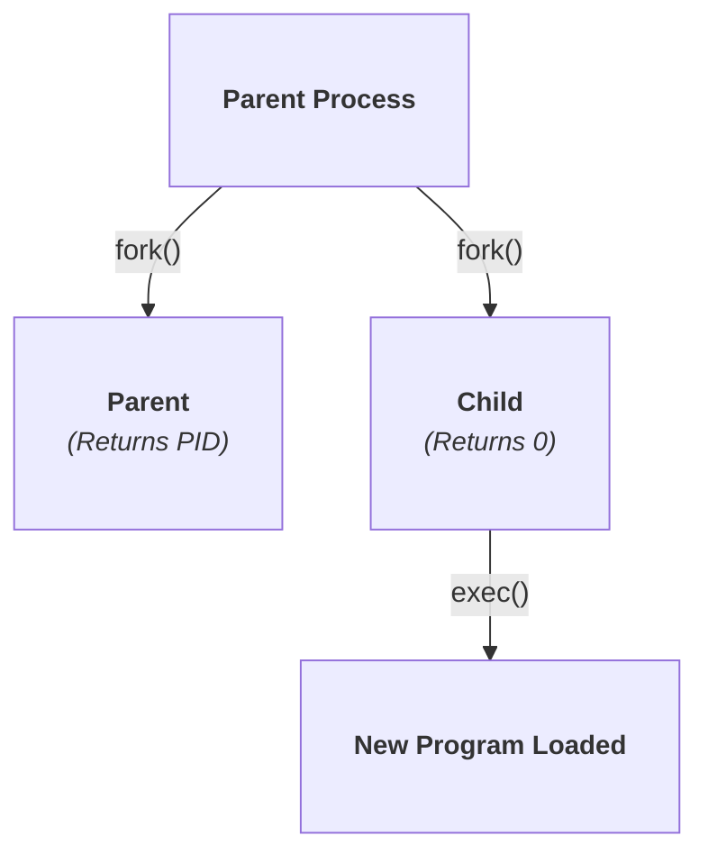
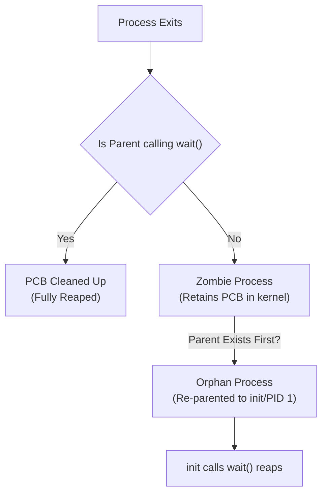

> [!abstract] Abstract
> Operating systems manage process life cycles from creation to termination using specialized system call interfaces. While Windows utilizes a single monolithic API (`CreateProcess`), Unix-like systems separate process creation into two distinct system calls: `fork()` (cloning an existing process) and `exec()` (replacing an address space with a new program).
> 
> - **Category:** OS Kernel System Calls & Process Management
> - **Core Unix APIs:** `fork()`, `exec()`, `wait()`, `exit()`
> - **Special Process Conditions:** Zombie Processes and Orphan Processes.

---

# The Process Creation Hierarchy

Every process is created by another existing process (its **Parent Process**). This forms a tree hierarchy rooted at the initial process spawned by the kernel during system boot (`init` or `systemd` with PID 1).

![[Pasted image 20260714160753.png]]

Child processes inherit properties from their parent, such as user privileges (UID/GID), working directory, and open file descriptor handles.

---

# Process Creation Models: Windows vs. Unix

Operating systems handle process creation through two distinct architectural models:

## Windows: Monolithic Creation (`CreateProcess`)
Windows uses a single system call that creates an entirely new process from scratch in one step:

```cpp
bool CreateProcess(char* prog, char* args);
```

![[Pasted image 20260714161116.png]]

1. Allocates a new PCB and address space.
2. Loads the target executable (`prog`) into memory.
3. Copies arguments (`args`) into the new address space.
4. Initializes register context and places the new process into the Ready state.
## Unix: Orthogonal Cloning & Execution (`fork` + `exec`)
Unix decouples process cloning from program loading into two distinct steps.


### 1. `int fork()`
Clones the calling parent process to create an exact child process duplicate:
*   Allocates a new PCB and copies the parent's memory address space, register context, and open file descriptors.
*   **The Duplicate Return Trick:** `fork()` is called once, but **returns twice**:
    *   To the **Parent Process:** Returns the child's new Process ID (PID $> 0$).
    *   To the **Child Process:** Returns $0$.

![[Pasted image 20260714161528.png]]

![[Pasted image 20260714161558.png]]

![[Pasted image 20260714161652.png]]

### 2. `int exec(char* prog, char* argv[])`
Overwrites the calling process's active address space with a new executable:
*   Stops the current program execution flow.
*   Loads `prog` into the *existing* address space (replacing code, data, heap, and stack).
*   Resets registers and arguments (`argv`) for the new program.
*   **Note:** `exec()` does *not* create a new process ID; open file handles and the PID remain preserved across the `exec()` boundary.

![[Pasted image 20260714165020.png]]

> [!tip] Why Separate `fork()` and `exec()`?
> Separating cloning from loading gives the child process a window between `fork()` and `exec()` to manipulate its environment—such as redirecting standard input/output file descriptors (`stdin`/`stdout`), setting environment variables, or changing privileges—without modifying the parent's environment.

---

# Process Termination & Reaping

Processes terminate explicitly by invoking `exit(int status)` or implicitly by returning from `main()`.

1.  **Resource Deallocation:** The OS closes open files, releases physical memory pages, and disconnects network handles.
2.  **PCB Preservation:** The kernel retains the process's PCB and exit status code until the parent process reads it via `wait()` or `waitpid()`.

### The `wait()` System Call
A parent process calls `wait(&status)` to suspend its own execution until one of its child processes finishes. The kernel passes the child's exit code to the parent and frees the child's remaining PCB.

---

# 4. Special Process States: Zombies & Orphans


### Zombie Process
A process that has terminated (`exit()`), but whose parent has not yet called `wait()` to collect its exit status code.
*   **Impact:** A zombie consumes zero physical memory or CPU time, but its entry remains in the kernel's process table (occupying a PID slot).

### Orphan Process
A child process whose parent process terminates before calling `wait()`.
*   **Resolution:** The kernel automatically re-parents orphan processes to the root process (`init` or `systemd`, PID 1). The `init` daemon continuously invokes `wait()` to collect exit statuses and reap orphaned processes.

---

# Related Notes

- [[Process Abstraction & PCB|Process Abstraction & PCB]]
- [[System Calls|System Calls]]