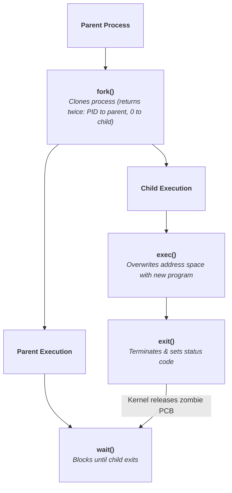

> [!abstract] Overview
> The **Process** is the primary abstraction used by an operating system to manage execution, virtualize hardware CPU cores, enforce memory boundaries, and allocate system resources. This module covers process execution structures, state transitions, lifecycle APIs, and inter-process communication models.

---

# Core Module Notes

| Note Link                                                                                                        | Description                                                                                                                                                                       | Key Primitives & APIs                                      |
| ---------------------------------------------------------------------------------------------------------------- | --------------------------------------------------------------------------------------------------------------------------------------------------------------------------------- | ---------------------------------------------------------- |
| **[[Process Abstraction & PCB\|Process Abstraction & PCB]]**     | Details the distinction between programs and processes, address space memory layouts (Text, Data, Heap, Stack), execution state transitions, and the Process Control Block (PCB). | `PCB`, `task_struct`, Address Space, Context Switching     |
| **[[Process Lifecycle & API\|Process Lifecycle & API]]**         | Covers process creation models (`fork` + `exec` vs `CreateProcess`), parent-child process hierarchies, termination mechanics, and zombie/orphan management.                       | `fork()`, `exec()`, `wait()`, `exit()`, Zombie, Orphan     |

---

# Process API Quick Reference

---

# Related Sections

- [[Dual-Mode Operation & Memory Protection|Dual-Mode Operation & Memory Protection]]
- [[System Calls|System Calls]]
- [[Interrupts and Exceptions|Interrupts and Exceptions]]
- [[Computer Systems/Operating Systems/index|Operating Systems Main Index]]