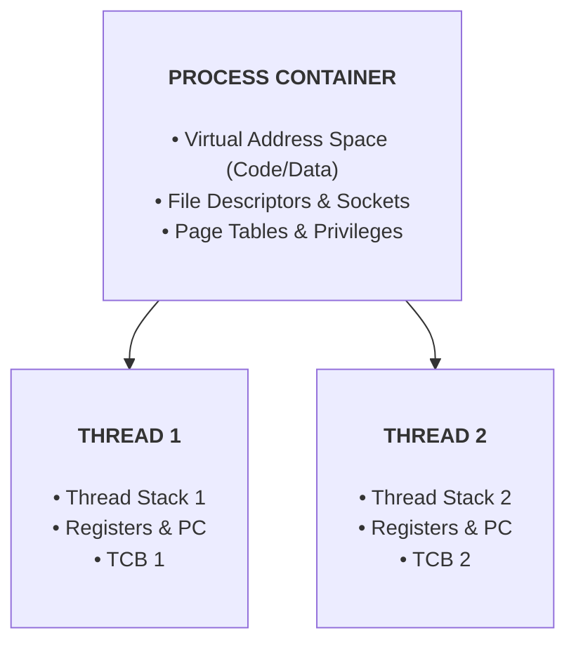

> [!abstract] Overview
> Modern operating systems separate the concept of a **Process** (the resource container) from a **Thread** (the sequential execution stream). Threads serve as the basic unit of CPU scheduling, enabling lightweight concurrency, shared address space execution, and efficient hardware parallel processing on multicore architectures.

---

# Core Module Notes

| Note Link | Description | Key Primitives & Concepts |
|---|---|---|
| **[[Thread Abstraction & TCB\|Thread Abstraction & TCB]]** | Covers the separation of process address space from execution streams, multithreaded memory layouts, PCB vs. TCB state breakdown, and Concurrency vs. Parallelism. | `TCB`, Thread Stack, Shared Memory, Concurrency vs Parallelism |
| **[[Thread Context Switch & Scheduling\|Thread Context Switch & Scheduling]]** | Explores thread execution state queues, non-preemptive voluntary `yield()` routines, hardware timer preemption, and assembly-level context switching. | `yield()`, Context Switching, Preemption, State Queues |
| **[[Kernel vs User Level Threads\|Kernel vs User Level Threads]]** | Evaluates 1:1 Kernel-Level Threads, M:1 User-Level Threads, and M:N Hybrid Multithreading Models alongside their performance trade-offs. | Kernel Threads (1:1), User Threads (M:1), Hybrid (M:N) |

---

# Multithreading Architecture Overview

---

# Related Sections

- [[Computer Systems/Operating Systems/Kernel & Architecture/Process/index|Process Management Directory]]
- [[Dual-Mode Operation & Memory Protection|Dual-Mode Operation & Memory Protection]]
- [[Interrupts and Exceptions|Interrupts and Exceptions]]
- [[Operating Systems/Concurrency & Synchronization/Mutexes & Semaphores|Mutexes & Semaphores]]
- [[Computer Systems/Operating Systems/index|Operating Systems Main Index]]