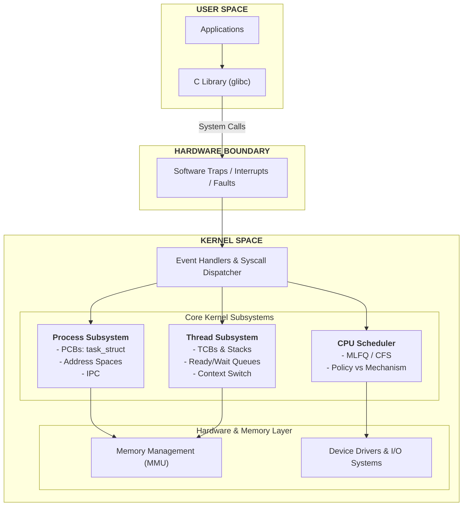

> [!abstract] Overview
> The **Kernel & System Architecture** module details how an operating system controls physical hardware, enforces isolation, handles external events, and provides abstractions for execution. It covers hardware-level privilege enforcement, event-driven kernel execution, and the primary execution subsystems: **Processes** (resource containers), **Threads** (schedulable execution streams), and **CPU Scheduling** (policy-driven core allocation).

---

# Module Structure & Notes

### 1. Hardware Privilege & Isolation Mechanics

| Note Link | Description | Core Primitives |
|---|---|---|
| **[[Dual-Mode Operation & Memory Protection\|Dual-Mode Operation & Memory Protection]]** | Hardware isolation via User/Kernel modes, mode bit registers, privileged instruction sets, and MMU protection. | Mode Bit, Privileged Instructions, MMU |
| **[[Interrupts and Exceptions\|Interrupts and Exceptions]]** | Event-driven kernel architecture, handling asynchronous hardware interrupts, synchronous faults, and hardware timer preemption. | Trap Vector Table, ISR, Hardware Timer |
| **[[System Calls\|System Calls]]** | Software trap mechanisms (`syscall`), register parameter passing, and descriptor handle translation between user and kernel space. | Software Traps, File Descriptors, Handles |

---

### 2. Execution & Resource Subsystems

#### [[Computer Systems/Operating Systems/Kernel & Architecture/Process/index|Process Management]]
*   **[[Process Abstraction & PCB\|Process Abstraction & PCB]]:** Memory address space layouts (Text, Data, Heap, Stack), execution states, and Process Control Block (`task_struct`) structures.
*   **[[Process Lifecycle & API\|Process Lifecycle & API]]:** Creation models (`fork()` + `exec()` vs. `CreateProcess`), process hierarchies, termination (`exit()`, `wait()`), and Zombie/Orphan handling.

#### [[Computer Systems/Operating Systems/Kernel & Architecture/Thread/index|Thread Management]]
*   **[[Thread Abstraction & TCB\|Thread Abstraction & TCB]]:** Decoupling address space containers from execution streams, multithreaded memory layouts, TCBs, and Concurrency vs. Parallelism.
*   **[[Thread Context Switch & Scheduling\|Thread Context Switch & Scheduling]]:** State queues, voluntary `yield()` mechanics, low-level assembly context switches, and hardware timer preemption.
*   **[[Kernel vs User Level Threads\|Kernel vs User Level Threads]]:** Evaluating 1:1 Kernel-Level Threads, M:1 User-Level Threads, and M:N Hybrid Multithreading Models.

#### [[Computer Systems/Operating Systems/Kernel & Architecture/CPU Scheduling/index|CPU Scheduling]]
*   **[[CPU Scheduling Fundamentals & Metrics\|CPU Scheduling Fundamentals & Metrics]]:** Policy vs. mechanism, dispatcher triggers, scheduling metrics ($T_{\text{turnaround}}$, $T_{\text{response}}$), workload profiles, CPU utilization calculations, and starvation.
*   **[[Classic Scheduling Algorithms\|Classic Scheduling Algorithms]]:** FCFS, SJF, SRTCF, Round Robin, and Priority Scheduling algorithm evaluation.
*   **[[Multilevel Feedback Queue & Real-World Schedulers\|Multilevel Feedback Queue & Real-World Schedulers]]:** Priority decay in MLFQ, I/O burst handling, and production schedulers (Linux CFS, macOS/Windows MLFQ).

---

# System Architecture Map

---

# Related Modules

- [[Computer Systems/Operating Systems/Concurrency & Synchronization/index|Concurrency & Synchronization Module]]
- [[Computer Systems/Operating Systems/Memory Management/index|Memory Management Module]]
- [[Computer Systems/Operating Systems/Storage & IO Systems/index|Storage & IO Systems]]
- [[Computer Systems/Operating Systems/index|Operating Systems Main Directory]]