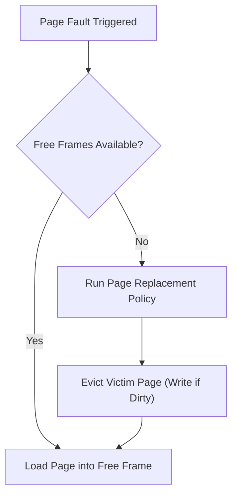
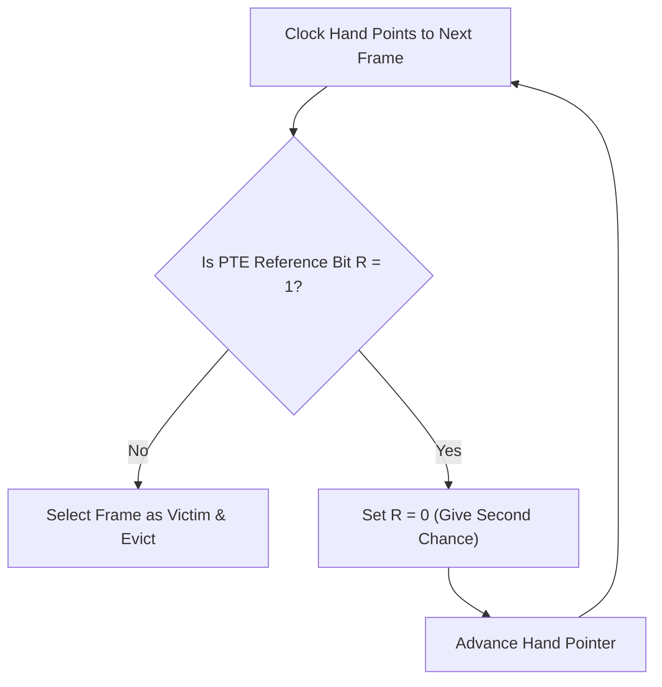

> [!abstract] Abstract
> When physical RAM runs at capacity, servicing a [[Demand Paging & Page Faults|page fault]] requires evicting an existing physical page frame to disk before loading the requested virtual page. **Page Replacement Algorithms** dictate which page frame to evict to maximize the system page hit rate and minimize disk I/O latency.
> 
> - **Category:** Memory Management Policy
> - **Primary Metric:** Hit Rate ($1 - \text{Page Fault Rate}$).
> - **Core Challenge:** Predicting future memory access patterns without hardware overhead.

---

## The Page Replacement Problem

Operating systems typically maintain a small free-frame pool. Once physical RAM fills up, every demand paging request forces a page replacement.

The ideal victim page to evict is one that will never be accessed again or will be accessed farthest in the future.

---

## Belady's Optimal Algorithm (MIN)

Belady's Optimal Algorithm evicts the page that will not be accessed for the longest period in the future.

![[Pasted image 20260727201620.png]]

### Evaluation & Properties
*   **Optimal Standard:** Formally proven to achieve the lowest possible page fault rate for any given reference string and frame count.
*   **Impracticality:** Requires perfect prescience of future process execution; used solely as an offline benchmark to evaluate other algorithms.

### Belady's Anomaly
Belady's Anomaly describes a counterintuitive scenario where increasing the number of physical page frames results in **more** page faults for certain replacement algorithms (such as FIFO):

$$\text{More Frames} \nRightarrow \text{Fewer Page Faults}$$

Algorithms immune to Belady's Anomaly are called **Stack Algorithms** (e.g., LRU, Optimal).

---

## Common Page Replacement Algorithms

### 1. Random Replacement
Chooses a victim page at random.
*   **Pros:** Simple; zero state tracking overhead.
*   **Cons:** Non-deterministic performance; can evict heavily accessed hot pages.

### 2. First-In, First-Out (FIFO)
Evicts the page that has been in physical RAM the longest, using a queue structure.

![[Pasted image 20260727202259.png]]

![[Pasted image 20260727202435.png]]

*   **Pros:** Low overhead ($O(1)$ queue management).
*   **Cons:** Frequently evicts initialization pages or long-lived active memory structures; suffers from Belady's Anomaly.

### 3. Least Recently Used (LRU)
Evicts the page that has not been referenced for the longest duration, exploiting temporal locality.

![[Pasted image 20260727203835.png]]

![[Pasted image 20260727204031.png]]

*   **Pros:** Excellent practical approximation of Belady's MIN algorithm; immune to Belady's Anomaly.
*   **Cons:** High hardware overhead; updating timestamps or reordering a doubly linked list on **every single memory reference** slows down execution unacceptable for production MMUs.

---

## Approximating LRU: The Clock Algorithm

To capture LRU benefits without per-reference hardware updates, hardware MMUs set a **Reference Bit ($R$)** in the [[Page Table Entries & Memory Overhead|Page Table Entry]] whenever a page is accessed.

![[Pasted image 20260727204317.png]]

The **Clock (Second-Chance) Algorithm** arranges physical frames in a circular list with a moving hand pointer:

### Clock Algorithm Mechanics
1.  **Reference Bit Inspection:** The hand inspects the current frame's $R$ bit.
2.  **Second Chance Granted ($R = 1$):** The OS clears $R \to 0$ and advances the hand pointer to the next frame.
3.  **Eviction ($R = 0$):** The page has not been referenced since the last sweep; it is selected for immediate eviction.

> [!tip] Clock Execution Edge Cases
> *   If every frame has $R = 1$, the clock hand sweeps through the entire circular buffer, clearing $R \to 0$ for all pages, and selects the initial page for replacement.
> *   On large-memory systems, a two-handed clock algorithm is used: a front hand clears reference bits while a trailing hand selects eviction victims.

---

## Related Notes

- [[Demand Paging & Page Faults|Demand Paging & Page Faults]]
- [[Page Table Entries & Memory Overhead|Page Table Entries & Memory Overhead]]
- [[Thrashing & Frame Allocation Policies|Thrashing & Frame Allocation Policies]]
- [[Translation Lookaside Buffer (TLB)|Translation Lookaside Buffer (TLB)]]