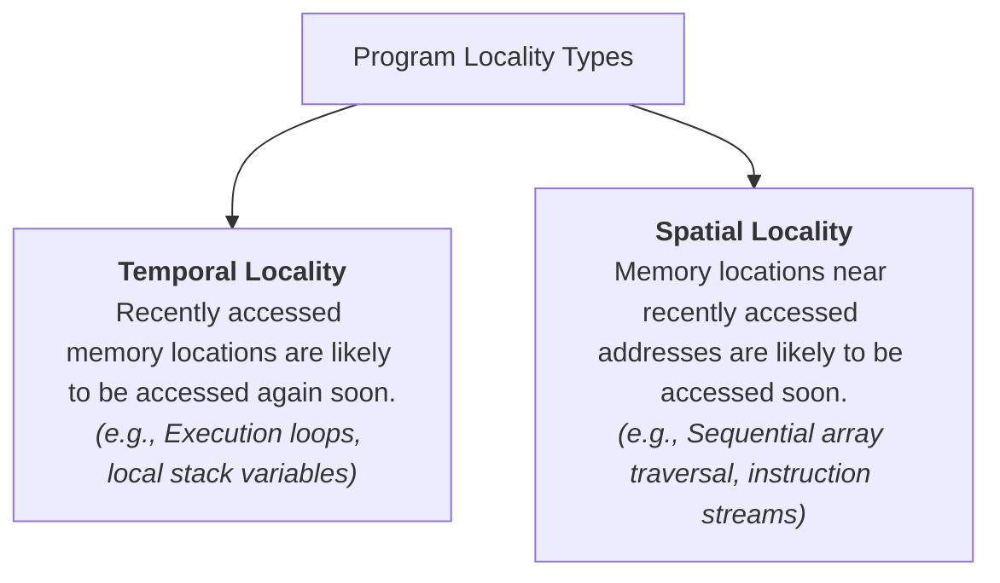
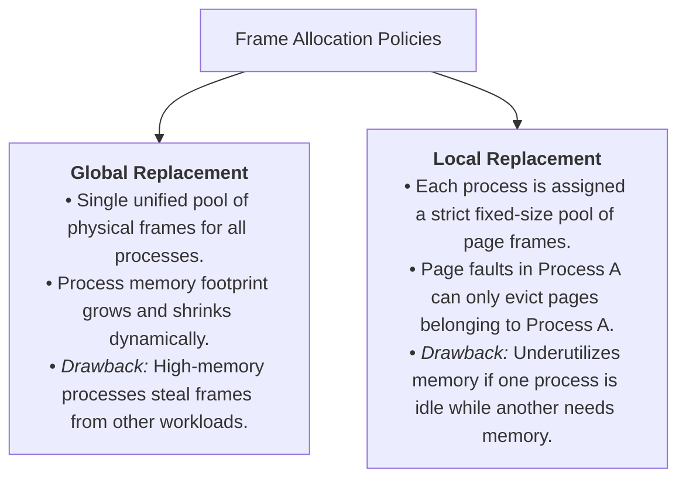
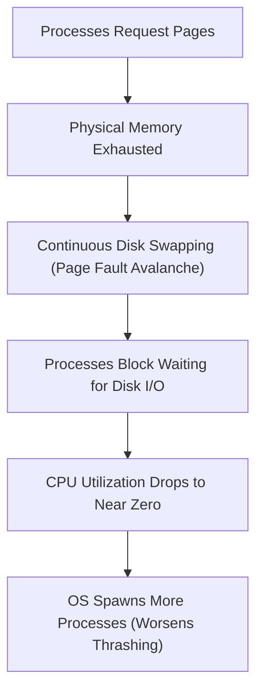

> [!abstract] Abstract
> Virtual memory performance relies on **Program Locality**. When the collective memory footprint of active processes exceeds physical RAM capacity, the system spends more time reading and writing pages to disk than executing instructions—a catastrophic state known as **Thrashing**. Managing frame allocation across competing processes requires tracking their dynamic **Working Sets**.
> 
> - **Category:** System Memory Scheduling & Performance
> - **Core Problem:** I/O thrashing destroying CPU utilization.
> - **Key Mitigation:** Working Set Model and Out-of-Memory (OOM) Process Termination.

---

## Program Locality

Operating systems rely on application access patterns to optimize [[Page Replacement Algorithms|page replacement]]:

---

## Synchronous vs. Asynchronous Page Eviction

Evicting pages can occur inline during execution or in the background:

| Eviction Paradigm         | Execution Flow                                                                                                                                        | Performance Characteristics                                                                                       |
| ------------------------- | ----------------------------------------------------------------------------------------------------------------------------------------------------- | ----------------------------------------------------------------------------------------------------------------- |
| **Synchronous Eviction**  | Executed directly inside the [[Demand Paging & Page Faults\|page fault handler]] when a fault occurs on full RAM. | High latency; the faulting thread blocks while the OS selects a victim page and flushes dirty frames to disk.     |
| **Asynchronous Eviction** | A dedicated kernel daemon (e.g., `kswapd` in Linux) wakes periodically to maintain a pool of clean, free page frames.                                 | Low latency; faulting threads immediately claim pre-cleaned free frames, batching disk flushes in the background. |

---

## Multi-Process Frame Allocation: Global vs. Local

When multiple processes compete for memory, the kernel allocates physical frames using one of two strategies:

---

## Thrashing & The Working Set Model

### The Working Set Model
Defined by Peter Denning, a process's **Working Set ($WS$)** models its dynamic memory requirements over time:

$$WS(t, \Delta) = \text{Set of unique pages referenced by process } P \text{ during time window } (t - \Delta, t)$$

*   **Working Set Size ($WSS$):** Total number of physical pages needed to execute without frequent page faults.
*   **System Demand:** Total memory demand across all active processes is $\sum WSS_i$.

### Thrashing Mechanics
When the sum of working sets exceeds total physical RAM ($\sum WSS_i > \text{Total RAM}$), processes starve for frames, causing an avalanche of page faults:

![[Pasted image 20260727210127.png]]

### Thrashing Mitigations
1.  **Process Suspension / Swapping:** De-schedule entire processes and swap their allocated memory to disk to allow remaining processes' working sets to fit in RAM.
2.  **Out-Of-Memory (OOM) Killer:** The kernel evaluates process scores and terminates high-memory processes when physical RAM and swap space are exhausted.
3.  **Hardware Expansion:** Adding physical RAM capacity.

---

## Related Notes

- [[Page Replacement Algorithms|Page Replacement Algorithms]]
- [[Demand Paging & Page Faults|Demand Paging & Page Faults]]
- [[Process Abstraction & PCB|Process Abstraction & PCB]]
- [[Process Address Space Allocation (Stack & Heap)|Process Address Space Allocation (Stack & Heap)]]