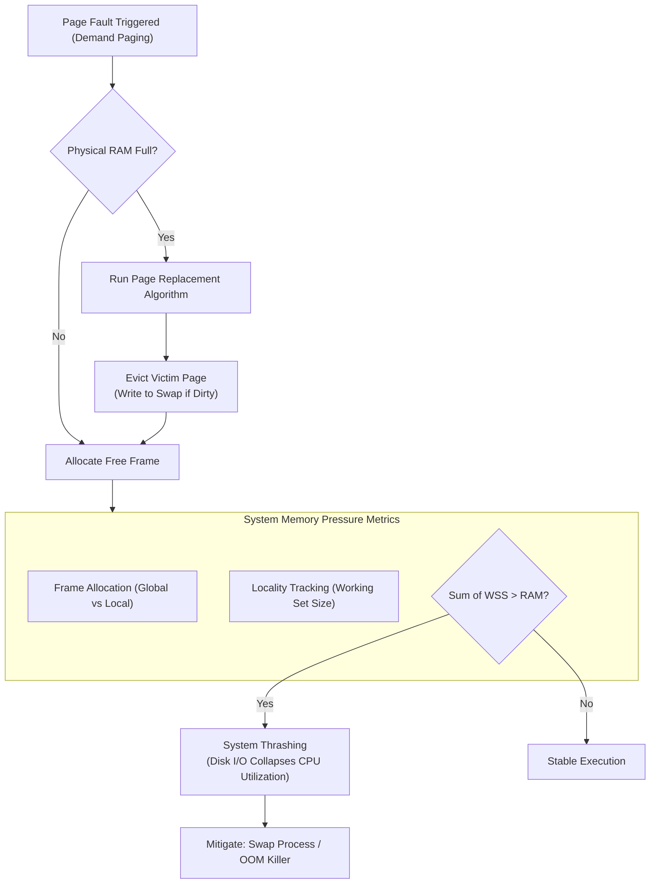

> [!abstract] Overview
> **Page Replacement Policies** dictate how the operating system manages physical RAM under memory pressure. When physical frame capacity is reached during [[Demand Paging & Page Faults|Demand Paging]], the kernel must select an existing physical frame to evict to disk. This module covers page eviction algorithms, physical frame allocation across competing processes, program locality, and strategies to prevent catastrophic **Thrashing**.

---

## Module Notes

| Note Link | Description | Key Concepts |
|---|---|---|
| **[[Page Replacement Algorithms\|Page Replacement Algorithms]]** | Analysis of eviction policies under memory pressure, hardware requirements, and algorithmic trade-offs. | Belady's Optimal (MIN), FIFO, Belady's Anomaly, LRU, Clock (Second-Chance) |
| **[[Thrashing & Frame Allocation Policies\|Thrashing & Frame Allocation Policies]]** | Program locality models, synchronous vs. asynchronous page eviction, multi-process frame allocation, Working Set theory, and Thrashing mitigations. | Temporal/Spatial Locality, Global vs. Local Allocation, Working Set Model, OOM Killer |

---

## Page Eviction & Allocation Lifecycle

When physical RAM fills up, the memory subsystem balances page eviction and process frame distribution:

---

## Algorithm Summary Comparison

| Algorithm | Basis for Eviction | Hardware Support Required | Belady's Anomaly Subject? | Practical Utility |
|---|---|---|---|---|
| **Optimal (MIN)** | Farthest access in future | Requires future prescience | No | Offline Benchmark Only |
| **FIFO** | Oldest page brought into RAM | None | **Yes** | Poor |
| **LRU** | Least recently accessed page | Hardware Timestamps / Stack | No | High Cost / Theoretical |
| **Clock** | Approximates LRU via circular scan | PTE Reference Bit ($R$) | No | Standard Production Implementation |

---

## Related Modules

- [[Demand Paging & Page Faults|Demand Paging & Page Faults]]
- [[Page Table Entries & Memory Overhead|Page Table Entries & Memory Overhead]]
- [[Process Address Space Allocation (Stack & Heap)]]
- [[Computer Systems/Operating Systems/Memory Management/index|Memory Management Main Directory]]