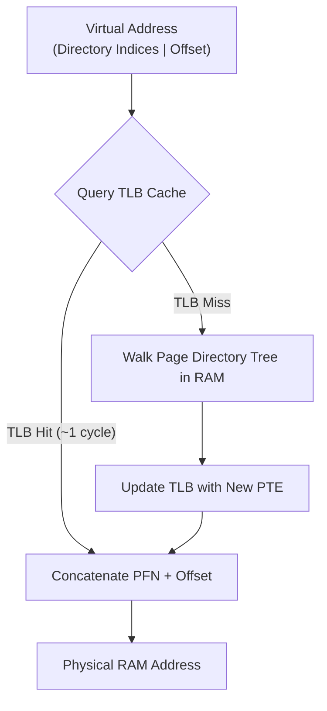

> [!abstract] Abstract
> Most applications utilize only a tiny, sparse fraction of their total [[Virtual Memory & Address Translation Fundamentals|Virtual Address Space]]. **Multi-Level Page Tables** exploit this sparsity by introducing a tree-like hierarchy of page directories. By allocating secondary page tables only for virtual address regions currently in use, hierarchical page tables eliminate the massive memory overhead of flat linear tables.
> 
> - **Category:** Hierarchical Address Translation Architectures
> - **Core Principle:** Indirection via a Page Directory tree.
> - **Primary Advantage:** Memory overhead scales with actual memory usage, not total address space capacity.

---

## The Need for Hierarchical Paging

A flat linear table allocates [[Page Table Entries & Memory Overhead|Page Table Entries (PTEs)]] for every possible virtual page, even if those pages are unmapped.

![[Pasted image 20260726000343.png]]

By adding a level of indirection, **Multi-Level Page Tables** dynamically allocate secondary page tables only when a process actually uses that region of memory:

![[Pasted image 20260726000439.png]]

---

## Two-Level Page Table Architecture

In a two-level scheme, the virtual address is divided into three distinct bitfields:

![[Pasted image 20260726000718.png]]

1.  **Directory Page Table (Root / Page Directory):** Maps the upper virtual address bits to a secondary page table. If an entire range of memory is unused, its directory entry is marked invalid (`0`), and no secondary page table is allocated.
2.  **Secondary Page Table:** Maps the middle virtual address bits to physical Page Frame Numbers (PFN).
3.  **Offset:** Indexes directly into the physical page frame.

![[Pasted image 20260726000800.png]]

---

## Bit-Splitting Calculation Example

Assume a **32-bit address space**, **$4\text{ KB}$ page size**, and **$4\text{-byte}$ PTEs**:

![[Pasted image 20260726001338.png]]

1.  **Offset Bits:**
    $$\text{Page Size} = 4\text{ KB} = 4096\text{ bytes} = 2^{12}\text{ bytes} \implies \mathbf{12\text{ bits}}$$
2.  **Page Directory Sizing:**
    To ensure every page table fits cleanly inside a single $4\text{ KB}$ page frame:
    $$\text{Entries per Page} = \frac{4\text{ KB}}{4\text{ bytes per entry}} = 1024\text{ entries} = 2^{10} \implies \mathbf{10\text{ bits}}$$
3.  **Secondary Page Table Sizing:**
    $$\text{Remaining Bits} = 32 - 12\text{ (Offset)} - 10\text{ (Directory)} = \mathbf{10\text{ bits}}$$

![[Pasted image 20260726001355.png]]

This $10\text{-}10\text{-}12$ bit split allows each secondary table to fit inside one $4\text{ KB}$ page ($2^{10} \times 4\text{ bytes} = 4\text{ KB}$). If a process uses only its code and stack segments, it requires only the Page Directory plus two secondary page tables ($12\text{ KB}$ total instead of $4\text{ MB}$).

---

## Generalizing to Multi-Level Paging & x86-64

Hierarchical paging extends to $N$ levels to accommodate 64-bit architectures. Unmapped subtrees in the page map hierarchy are omitted entirely:

![[Pasted image 20260726001513.png]]

### x86-64 4-Level Paging Scheme
Standard x86-64 hardware utilizes a **4-level page table** handling a $48\text{-bit}$ canonical address space ($256\text{ TB}$):

![[Pasted image 20260726001626.png]]

*   Page Size: $4\text{ KB}$.
*   PTE Size: $8\text{ bytes}$.
*   Entries per Page: $\frac{4\text{ KB}}{8\text{ bytes}} = 512 = 2^9 \implies \mathbf{9\text{ bits per level}}$.
*   Highest $16\text{ bits}$: Unused / Sign-extended.
---
## Multi-level Paging with TLB Caching

---

## Related Notes

- [[Page Table Entries & Memory Overhead|Page Table Entries & Memory Overhead]]
- [[Paging|Paging & Page Tables]]
- [[Kernel Address Space & Page Table Storage|Kernel Address Space & Page Table Storage]]
- [[Virtual Memory & Address Translation Fundamentals|Virtual Memory & Address Translation Fundamentals]]