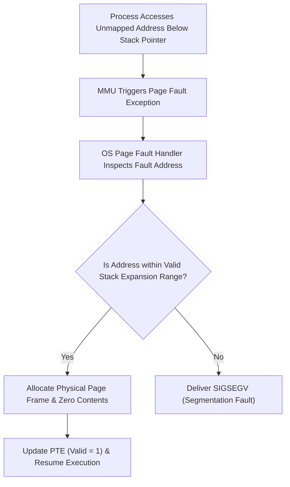
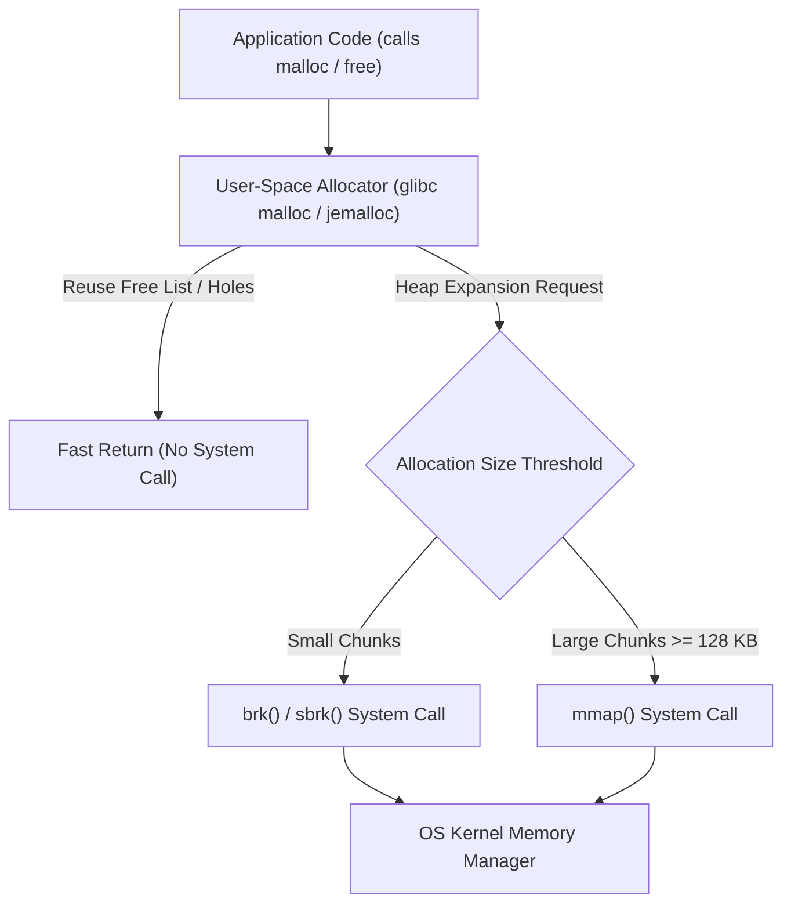

> [!abstract] Abstract
> An application's [[Virtual Memory & Address Translation Fundamentals|Virtual Address Space]] consists of mapped and unmapped memory regions. As applications execute, their dynamic memory needs change. The operating system handles automatic **Stack Growth** via page fault intercepts, while **Heap Growth** is managed by user-space allocators (`malloc`/`free`) interacting with the kernel via `brk` and `mmap` [[System Calls|system calls]].
> 
> - **Category:** Virtual Memory Layout & Process Execution
> - **Stack Mechanism:** Auto-expanding downward via guard page faults.
> - **Heap System Interfaces:** `brk()`, `sbrk()`, and `mmap()`.

---

## Process Virtual Address Space Layout

Thread execution contexts share global segments while retaining isolated execution stacks within a process's virtual address space:

![[Pasted image 20260727223723.png]]

Unmapped regions between the heap and stacks trigger a **Segmentation Fault (`SIGSEGV`)** if accessed improperly.

---

## Automatic Stack Expansion

Process stacks grow downward toward lower virtual memory addresses:

> [!important] Zeroing Allocated Memory
> When the kernel allocates a physical frame to expand a process stack, it must overwrite the frame with zeroes (`0x00`) to prevent security leaks of lingering data from former process allocations.

---

## Heap Management & Memory Allocator Layering

The heap grows upward toward higher virtual addresses. Because system calls carry execution context switch overhead, memory allocation uses a layered architecture:

![[Pasted image 20260727210922.png]]

### User-Space Allocators (`malloc` / `free`)
User-space libraries manage a pool of heap memory using free lists or arena bins. They handle small allocations directly in user space to avoid kernel traps, requesting large chunks from the kernel only when their local free list is exhausted.

### Kernel System Interfaces for Heap Growth

| System Call | Interface Mechanism | Usage Characteristics |
|---|---|---|
| **`brk(addr)` / `sbrk(incr)`** | Moves the process **Program Break** boundary line upward to expand contiguous heap space. | Used for small, frequent dynamic allocations; can suffer from external fragmentation if low-address allocations block break reduction. |
| **`mmap(addr, length, ...)`** | Maps an unallocated chunk of virtual memory anywhere within the address space. | Used for large memory requests (e.g., $\ge 128\text{ KB}$); easily returned to the OS via `munmap()` without heap fragmentation constraints. |

---

## Related Notes

- [[Virtual Memory & Address Translation Fundamentals|Virtual Memory & Address Translation Fundamentals]]
- [[Demand Paging & Page Faults|Demand Paging & Page Faults]]
- [[System Calls|System Calls]]
- [[Thrashing & Frame Allocation Policies|Thrashing & Frame Allocation Policies]]