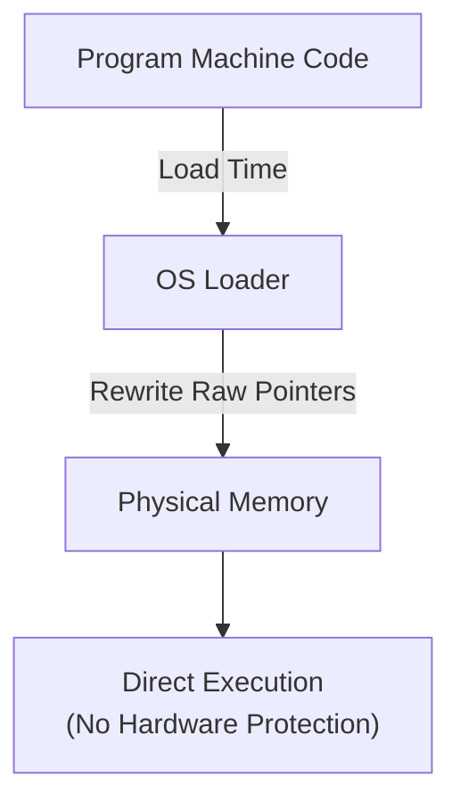
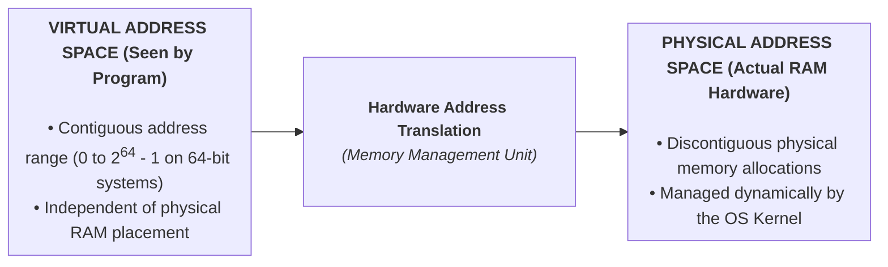

> [!abstract] Abstract
> Sharing finite physical memory among multiple running applications presents severe safety and efficiency challenges. Operating systems resolve these challenges using **Virtual Memory**, providing each process with an isolated, contiguous **Virtual Address Space**. Addresses used by user applications are dynamically translated to physical RAM addresses at runtime by the hardware **Memory Management Unit (MMU)**.
> 
> - **Category:** OS Virtualization Fundamentals
> - **Core Invariant:** User programs execute strictly with Virtual Addresses; the CPU hardware translates them to Physical Addresses on every memory access.
> - **Hardware Enforcer:** Memory Management Unit (MMU).

---

# 1. Memory Management Challenges & Goals

![[Pasted image 20260714095236.png]]

Managing physical RAM across multi-threaded and multi-process workloads creates four fundamental challenges:

1.  **Finite Capacity:** Physical RAM is limited; processes in aggregate may demand more memory than physically exists.
2.  **Data Location:** Dynamically tracking where each process's data resides in RAM as processes are launched, expanded, and terminated.
3.  **Protection & Isolation:** Preventing buggy or malicious applications from reading/writing memory assigned to other processes or the OS kernel.
4.  **Efficiency:** Maximizing RAM utilization while minimizing CPU execution overhead during memory access operations.

### The Four Architectural Goals
*   **Multitasking:** Allow multiple distinct process address spaces to reside in RAM simultaneously.
*   **Transparency:** Provide a convenient abstraction so applications operate without knowing memory is shared or where in physical RAM they reside.
*   **Isolation & Protection:** Enforce strict access boundaries; a process cannot corrupt other applications or kernel space.
*   **Efficiency:** Maintain high CPU speed and memory utilization without incurring severe latency penalties during address lookup.

---

# 2. Early Approaches & Their Limitations

### 1. Single-Tasking Systems
In early computers, only one process executed at a time. The OS kernel occupied the highest physical memory addresses, while the active user application occupied physical memory starting at address $0$.

![[Pasted image 20260725111511.png]]

*   **Limitations:** Supports only one process at a time; user programs execute directly against physical addresses and can overwrite kernel memory.

### 2. Multitasking with Static Relocation
To support multiple processes without hardware translation, operating systems used **Load-Time Static Relocation**. When a program was loaded into a free contiguous block of physical RAM, a loader rewritten all memory addresses inside the binary code to match its new physical offset.

![[Pasted image 20260725111910.png]]

*   **Limitations:**
    1.  **No Protection:** A process can still forge pointers to read or write to other processes or kernel RAM.
    2.  **Inflexible / Low Utilization:** Addresses are fixed after loading. Processes cannot be moved in RAM at runtime to consolidate empty memory holes.
    3.  **No Sharing:** Processes cannot share portions of their address space (e.g., shared code libraries).
	![[Pasted image 20260725112052.png]]

---

# 3. The Virtual Memory Abstraction

**Virtual Memory** decouples the program's logical view of memory from physical RAM by establishing two distinct address spaces:

### Dynamic Memory Relocation
With dynamic memory relocation, processes generate **Virtual Addresses** during instruction execution. Every load, store, or instruction fetch passes through the hardware **Memory Management Unit (MMU)**, which translates the virtual address into a **Physical Address** in real time.

![[Pasted image 20260725211912.png]]

This allows the kernel to relocate processes anywhere in physical RAM or swap unused pages to disk completely transparently to the running program.

---

# Related Notes
- [[Base & Bound]]
- [[Segmentation|Segmentation]]
- [[Paging|Paging & Page Tables]]
- [[Process Abstraction & PCB|Process Abstraction & PCB]]
- [[Dual-Mode Operation & Memory Protection|Dual-Mode Operation & Memory Protection]]