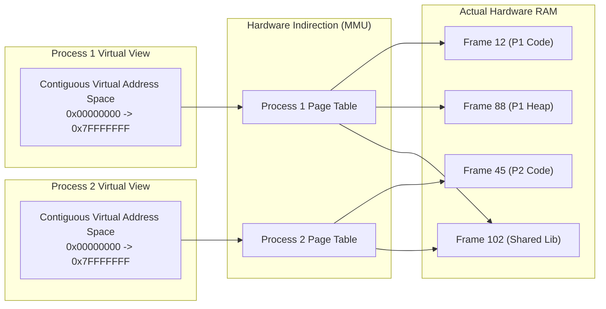
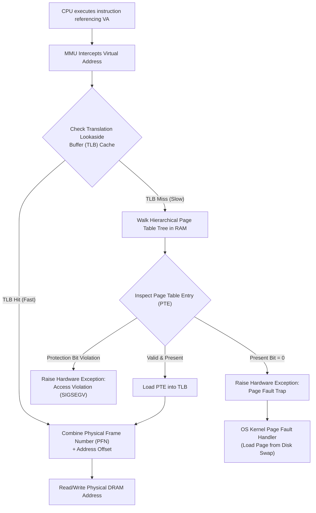

> [!abstract] Overview
> **Virtual Memory** is a hardware-software abstraction co-designed by the Operating System kernel and the CPU's **Memory Management Unit (MMU)**. It presents each application process with the illusion of a contiguous, private block of physical memory (the **Virtual Address Space**), while secretly scattering, sharing, and paging actual data across non-contiguous physical DRAM frames and secondary persistent disk storage.

---
# Module Notes

| Note Link | Description | Key Concepts & Hardware Primitives |
|---|---|---|
| **[[Virtual Memory & Address Translation Fundamentals\|Virtual Memory & Address Translation Fundamentals]]** | Core motivations for virtual memory, load-time vs dynamic relocation, hardware MMU pipelines, and physical vs logical address space decoupling. | Virtual Address, Physical RAM, MMU, Isolation, Transparency |
| **[[Kernel Address Space & Page Table Storage\|Kernel Address Space & Page Table Storage]]** | User/kernel virtual address space split (e.g., Higher-Half Kernel), `CR3` control register mechanics, page table RAM storage, and Meltdown mitigations (KPTI). | `CR3` Register, Higher-Half Kernel, KPTI, Page Table Storage |
| **[[Advanced Virtual Memory Features\|Advanced Virtual Memory Features]]** | Performance optimizations and kernel primitives leveraging virtual indirection: Shared Memory (`shm_open`), Copy-on-Write (`fork` optimization), and Memory-Mapped Files (`mmap`). | Copy-on-Write (CoW), Memory-Mapped Files (`mmap`), Shared Memory |

---

# Architecture Overview of Virtual Memory

## Core Objectives & Guarantees

1.  **Memory Protection & Isolation:** Processes cannot read or write to memory belonging to other processes or the kernel without explicit permission. A bug or exploit in Process A cannot corrupt Process B.
2.  **Transparency:** Applications execute as if they have access to a large, contiguous memory space starting at address `0x0`, completely oblivious to the physical RAM configuration or competing processes.
3.  **Efficiency & Flexibility:** Physical RAM can be fragmented across non-contiguous frames. Infrequently accessed data can be transparently swapped out to disk via [[Demand Paging & Page Faults|Demand Paging]] without altering process execution.

## Dual-Address Space Paradigm

In a virtual memory architecture, two distinct address realms exist simultaneously:

- **Virtual Address (VA):** An address generated by the CPU during instruction fetch/execution (e.g., `mov rax, [rbx]`). Every application operates strictly with Virtual Addresses.
- **Physical Address (PA):** The actual hardware bus signal addressing physical DRAM chips. Physical RAM is managed in fixed-size blocks called **Page Frames**.

## The Address Translation Pipeline
Whenever a process issues a memory reference, hardware intercepts and translates the address before accessing physical RAM:

### User/Kernel Virtual Address Space Split

Modern operating systems map both user application memory and kernel memory into every process's single virtual address space to eliminate the need to switch entire page tables during a [[System Calls|system call]].
- **User Space:** Accessible in both User Mode and Kernel Mode. Holds user executable code, stack, heap, and dynamic libraries.
- **Kernel Space:** Accessible **only** when CPU executes in Kernel Mode (Ring 0). Contains kernel data structures, device drivers, and page tables. Protected by hardware supervisor flags in the [[Page Table Entries & Memory Overhead|Page Table Entry]].

## Advanced Capabilities Enabled by Virtual Memory

Because virtual addresses are decoupled from physical storage, operating systems leverage this indirection for zero-copy performance features:

1. **Copy-on-Write (CoW):** When a process forks, child and parent share identical physical pages marked read-only. Pages are replicated only when one process attempts a write operation.
2. **Memory-Mapped Files (`mmap`):** Maps persistent files directly into a process's virtual memory address space, substituting disk I/O calls (`read`/`write`) with fast memory access.
3. **Shared Memory (`shm_open`):** Maps the exact same physical DRAM frames into the virtual address spaces of two distinct processes, enabling ultra-fast Inter-Process Communication (IPC).

---
## Related Modules

- [[Paging]]
- [[Translation Lookaside Buffer (TLB)]]
- [[Demand Paging & Page Faults|Demand Paging & Page Faults]]
- [[Dual-Mode Operation & Memory Protection|Dual-Mode Operation & Memory Protection]]
- [[Computer Systems/Operating Systems/Memory Management/index|Memory Management Directory]]