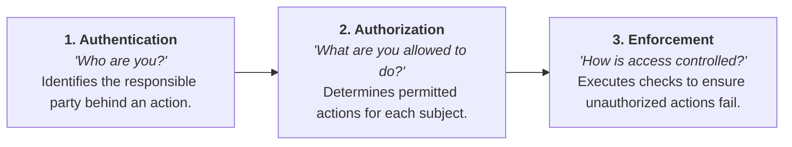
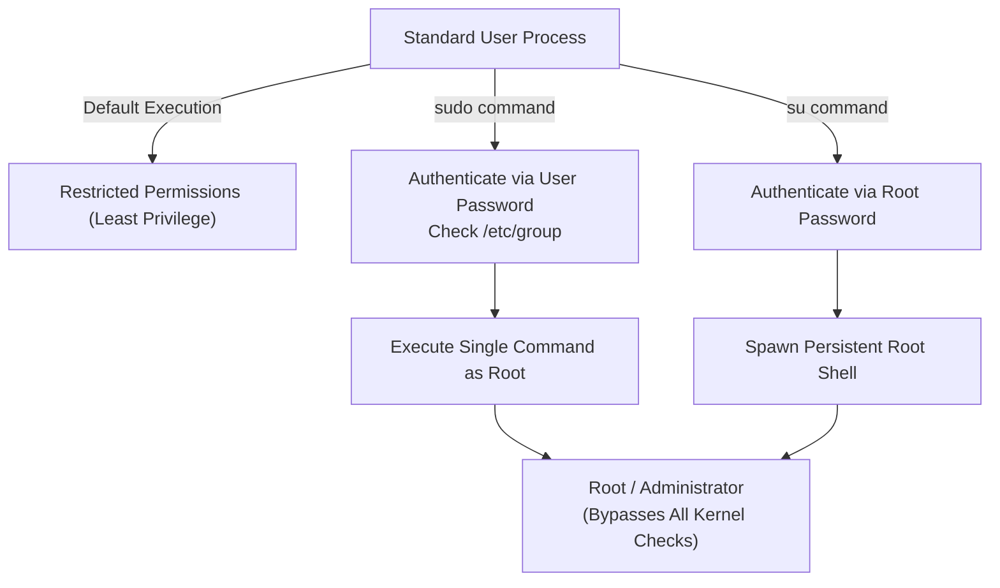
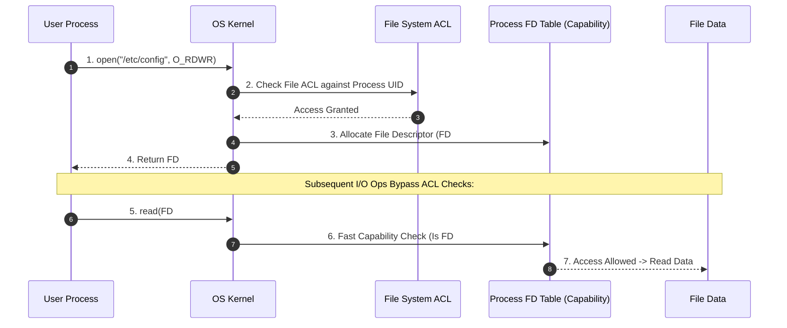

> [!abstract] Abstract
> **System Protection** encompasses the OS mechanisms that prevent accidental or malicious misuse of system resources. Protection rests on three foundational pillars: **Authentication** (identity verification), **Authorization** (permission policy), and **Enforcement** (access control execution). Modern operating systems combine **Access Control Lists (ACLs)** for static, user-friendly file policy definition with **Capabilities** (e.g., File Descriptors and Page Table Entries) for high-performance hardware and kernel enforcement.

---

## Core Components of Protection

Operating system protection mechanisms resolve three distinct operational questions:

---

## Key Protection Principles

System security architectures follow five canonical design guidelines:

1. **Permission Rather Than Exclusion (Default Deny):** Default state grants zero access. Missing or misconfigured permissions fail safely by denying access.
2. **Complete Mediation:** Every access to every object—including every instruction execution and memory reference—must be verified against authorization rules.
3. **Open Design (Kerckhoffs's Principle):** System security must not rely on keeping the implementation secret. Open-source systems (e.g., Linux) remain secure because safety depends on keys/credentials rather than algorithmic obscurity.
4. **Principle of Least Privilege:** Subjects (users, processes) must execute with only the minimum set of privileges necessary to complete their task, reducing the blast radius of errors or exploits.
5. **Usable Security:** Protection interfaces must be simple for users to manage. Overly complex security controls lead users to find dangerous workarounds.

---

## User Identity & Privilege Escalation

All process execution in an operating system is tied to a **User ID (UID)**, which serves as the base context for kernel permission checks.

* **Root (Unix) / Administrator (Windows):** A special administrative principal that bypasses kernel permission checks. Running routinely as root violates the Principle of Least Privilege because accidental commands (e.g., `rm -rf /`) execute unconditionally.
* **`sudo` vs. `su`:**
  * **`sudo`:** Executes a *single command* with root privileges. Authenticates using the *user's own password* (if listed in `/etc/group` or `sudoers`). Aligns with least privilege.
  * **`su`:** Spawns a persistent *root shell*. Authenticates using the *root user's password*. Higher risk due to persistent elevated context.

---

## Authorization Models: ACLs vs. Capability Lists

Authorization evaluates actions attempted by **Subjects** (e.g., users, processes) on **Objects** (e.g., files, memory pages, sockets).

$$\text{Authorization Check: } \langle \text{Subject}, \text{Action}, \text{Object} \rangle \to \text{Allow / Deny}$$

The authorization matrix can be represented in two distinct dimensional structures:

![[Pasted image 20260804000539.png|760]]

| Dimension | Representation | Primary Characteristics | OS Usage |
|---|---|---|---|
| **Columns (Object-Centric)** | **Access Control List (ACL)** | Each object maintains a list of allowed subjects and their permissions. Easy to manage, grant, and revoke. Slow to check at runtime. | File System Permissions (`rwx`, POSIX ACLs) |
| **Rows (Subject-Centric)** | **Capability List** | Each subject holds a collection of unforgeable tokens ("keys") granting access to specific objects. Fast to verify, easy to transfer. | File Descriptors (FDs), Page Table Entries (PTEs) |

---

## Operating System Hybrid Protection Paradigm

Because ACLs excel at policy management while Capabilities excel at runtime execution speed, operating systems combine both models across system layers:

1. **File System Protection (Static ACLs $\to$ Capabilities):**
   * **Policy Phase (ACL):** Files store ACLs (Owner/Group/Public `rwx`). When a process calls `open()`, the kernel performs an expensive ACL lookup against the process UID.
   * **Execution Phase (Capability):** If allowed, `open()` returns a **File Descriptor (FD)**. The FD acts as a process-local capability token. Subsequent `read()` and `write()` calls validate the FD table directly ($O(1)$ capability check), bypassing the ACL.

2. **Virtual Memory Protection (Dynamic Capabilities via PTEs):**
   * Memory protection requires checking **every single instruction fetch and load/store** in hardware.
   * **Page Table Entries (PTEs)** function as hardware capabilities managed by the kernel and verified by the Memory Management Unit (MMU).

![[Pasted image 20260804001855.png|760]]

### Derivation of Memory Capabilities
When creating process address spaces, the kernel sets PTE protection bits based on segment function:

| Memory Segment | Permitted Operations | PTE Protection Bits |
|---|---|---|
| **Code Segment (`.text`)** | Read & Execute | Read-Only, Executable (`R-X`) |
| **Data Segment (`.data` / `.bss`)** | Read & Write | Read/Write, No-Execute (`RW-`) |
| **Stack & Heap** | Read & Write | Read/Write, No-Execute (`RW-`) |

---

## Related Notes

- [[Dual-Mode Operation & Memory Protection|Dual-Mode Operation & Memory Protection]]
- [[System Calls|System Calls]]
- [[File Systems & Storage Technologies#Protection & Access Rights|File Protection]]
- [[Page Table Entries & Memory Overhead|Page Table Entries & Memory Overhead]]
- [[Computer Systems/Operating Systems/Kernel & Architecture/index|Kernel & Architecture Main Directory]]