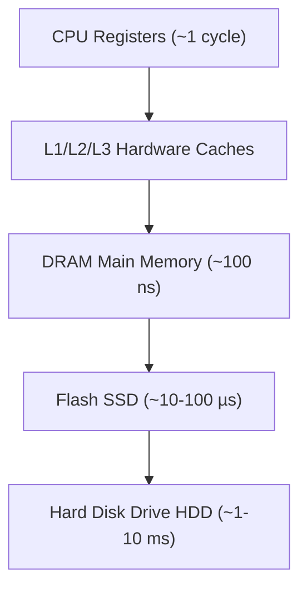
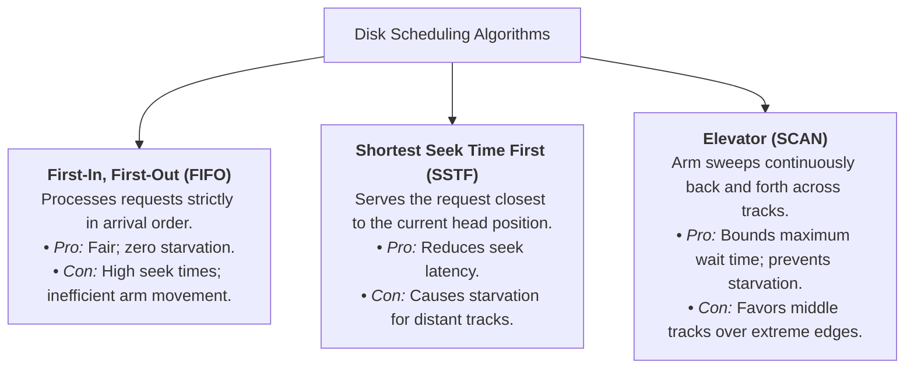

> [!abstract] Abstract
> **Hard Disk Drives (HDDs)** have served as the primary persistent storage mechanism for decades. Because HDDs rely on mechanical moving parts (spinning platters and moving actuator arms), disk access carries massive latency compared to physical RAM. The operating system abstracts complex physical disk geometries into a simple array of logical blocks and applies **Disk Scheduling Policies** to minimize physical arm movement and rotational delay.
> 
> - **Category:** Physical Storage & Mechanical Devices
> - **Primary Abstraction:** Logical Block Addressing (LBA / Block Interface).
> - **Bottleneck:** Physical seek time and rotational latency.

---

## Memory Hierarchy & Persistence

Storage devices occupy the lower tiers of the system memory hierarchy, offering vast non-volatile storage capacity at the cost of significantly higher latency:

![[Pasted image 20260727223932.png]]

While [[Virtual Memory & Address Translation Fundamentals|DRAM]] loses its state when power is removed, persistent storage devices maintain data indefinitely external to the CPU.

---

## HDD Physical Architecture

Hard Disk Drives read and write magnetic data using mechanical components operating in tight physical synchronization:

![[Pasted image 20260727224426.png]]

![[Pasted image 20260727224523.png]]

*   **Platters:** Circular magnetic disks mounted on a central rotating **Spindle**.
*   **Read/Write Head:** Electromagnetic sensors positioned nanometers above platter surfaces.
*   **Actuator Arm:** Rotates the read/write heads radially across concentric tracks on the platters.
*   **Cylinder:** The set of matching tracks aligned vertically across all platters.

### Reading Disk Sector
![[Pasted image 20260727225103.png|757]]
![[Pasted image 20260727225019.png]]

---

## Mechanical Access Latency Calculations

Total disk latency to read or write a sector is governed by three distinct physical phases:

$$\text{Disk Latency} = T_{\text{seek}} + T_{\text{rotation}} + T_{\text{transfer}}$$

1.  **Seek Time ($T_{\text{seek}}$):** The mechanical delay required to swing the actuator arm to the correct track. This is bounded by physics and represents the slowest component.
2.  **Rotational Delay ($T_{\text{rotation}}$):** The time spent waiting for the target magnetic sector to rotate under the read/write head. Average rotational latency equals the time for half a revolution.
3.  **Transfer Time ($T_{\text{transfer}}$):** The time required to read data from the platter surface into the disk controller electronics.

### Sample Latency Calculation
Assume a disk with $15,000\text{ RPM}$, an average seek time of $4\text{ ms}$, and a transfer rate of $125\text{ MB/s}$ reading two $512\text{-byte}$ sectors ($1024\text{ bytes}$ total):

*   **Seek Time:** $T_{\text{seek}} = 4\text{ ms}$
*   **Average Rotational Latency:**
    $$T_{\text{rotation}} = \frac{1}{2} \times \left( \frac{1\text{ min}}{15000\text{ rev}} \times \frac{60000\text{ ms}}{1\text{ min}} \right) = \frac{1}{2} \times 4\text{ ms} = 2\text{ ms}$$
*   **Transfer Time:**
    $$T_{\text{transfer}} = \frac{1024\text{ Bytes}}{125 \times 10^6\text{ Bytes/sec}} = 8.192 \ \mu\text{s} \approx 0.008\text{ ms}$$
*   **Total Latency:**
    $$\text{Total Latency} \approx 4\text{ ms} + 2\text{ ms} + 0.008\text{ ms} = \mathbf{6.008\text{ ms}}$$

---

## The OS Block Interface Abstraction

Historically, operating systems specified raw disk accesses via **CHS** geometry (Cylinder, Head, Sector). Modern drives encapsulate this complexity inside internal disk controllers, exposing a simple **Logical Block Interface**:

*   **Advantage:** Simplifies OS drivers; internal drive electronics handle bad-block remapping and defect management transparently.
*   **Disadvantage:** Hides exact physical geometry, making it harder for the OS to optimize track placement.

---

## Disk Scheduling Policies

To minimize actuator arm movement, the OS orders pending disk I/O requests:

---

## Related Notes

- [[Solid State Drives & NAND Flash|Solid State Drives & NAND Flash]]
- [[RAID Architectures|RAID Architectures]]
- [[Virtual Memory & Address Translation Fundamentals|Virtual Memory & Address Translation Fundamentals]]