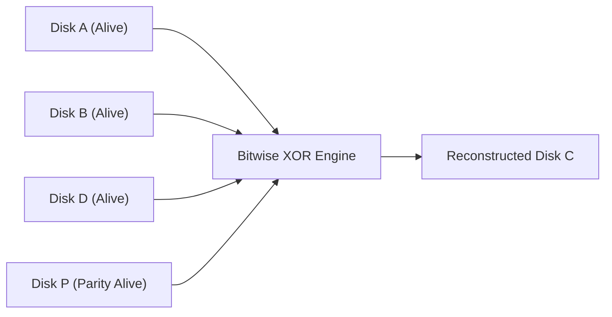

> [!abstract] Abstract
> **Redundant Array of Inexpensive Disks (RAID)** combines multiple physical storage drives into a single logical storage unit managed by the operating system or dedicated hardware controllers. RAID architectures leverage data striping, mirroring, or bitwise parity to achieve higher I/O throughput, increased storage capacity, and fault tolerance against drive failure.
> 
> - **Category:** Distributed Storage & Reliability
> - **Core Objectives:** High throughput, increased capacity, and fault recovery.
> - **Mathematical Foundation:** Bitwise XOR ($\otimes$) parity calculations.

---

## RAID Level 0: Striping (Performance)

RAID 0 splits data sequentially into blocks and stripes them round-robin across $N$ physical drives:

![[Pasted image 20260728145400.png]]

*   **Read / Write Throughput:** Multiplied by up to $N$ times through parallel drive access.
*   **Storage Efficiency:** $100\%$ ($N$ disks provide $N \times \text{Capacity}$).
*   **Fault Tolerance:** Zero ($0$). If a single drive fails, the entire array's data is lost.

---

## RAID Level 1: Mirroring (Redundancy)

RAID 1 maintains identical copies of all data on secondary mirror drives:

![[Pasted image 20260728145931.png]]

*   **Read Throughput:** Enhanced; reads can be serviced in parallel from either drive.
*   **Write Throughput:** Slightly constrained; writes must update both physical disks simultaneously.
*   **Storage Efficiency:** $50\%$ ($2N$ disks yield $N \times \text{Capacity}$).
*   **Fault Tolerance:** High; survives the complete failure of any single drive in a mirrored pair.

---

## RAID Level 4: Dedicated Parity Disk (XOR Reconstruction)

RAID 4 stores data blocks striped across $N-1$ data drives while dedicating a single disk exclusively to store bitwise **Parity ($P$)**:

![[Pasted image 20260728150900.png]]

### Bitwise Parity Mathematics
Parity is calculated by evaluating the bitwise XOR ($\otimes$) across matching blocks on all data disks:

$$P = A \otimes B \otimes C \otimes D$$

By definition of XOR arithmetic, combining all data blocks and the parity block yields zero:

$$(A \otimes B \otimes C \otimes D \otimes P) == 0$$

### Fault Recovery Walkthrough
If Disk $C$ fails physically, its data is reconstructed by XORing the surviving data disks together with the parity disk:

$$C = A \otimes B \otimes D \otimes P$$

### Performance Bottleneck: The Parity Write Penalty
Because **every** write operation to any data disk requires updating the dedicated parity disk, the parity drive becomes a severe bottleneck under concurrent write workloads. Modern systems use **RAID 5** (Distributed Parity) to rotate parity blocks evenly across all drives.

---

## RAID Level Trade-Off Summary

| RAID Level | Structural Pattern | Minimal Disks | Capacity Utilization | Fault Tolerance | Primary Use Case |
|---|---|---|---|---|---|
| **RAID 0** | Striping | 2 | $100\%$ ($N$) | None (0 drive failures) | High-performance scratch storage |
| **RAID 1** | Mirroring | 2 | $50\%$ ($\frac{N}{2}$) | 1 drive per mirrored pair | Mission-critical OS boot drives |
| **RAID 4** | Dedicated Parity | 3 | $\frac{N-1}{N}$ | 1 drive failure | Read-heavy redundant arrays |

---

## Related Notes

- [[Hard Disk Drive Mechanics & Scheduling|Hard Disk Drive Mechanics & Scheduling]]
- [[Solid State Drives & NAND Flash|Solid State Drives & NAND Flash]]
- [[Dual-Mode Operation & Memory Protection|Dual-Mode Operation & Memory Protection]]