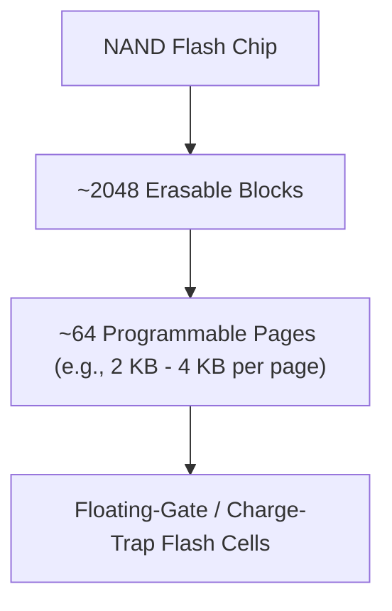
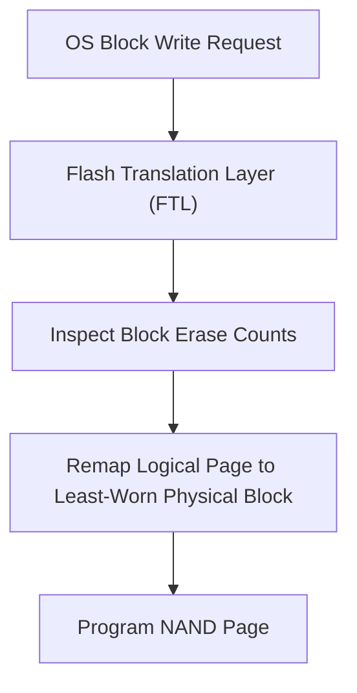

> [!abstract] Abstract
> **Solid State Drives (SSDs)** utilize persistent **NAND Flash Memory** chips, completely eliminating mechanical platters and moving actuator arms. SSDs provide orders of magnitude faster random read/write access than traditional [[Hard Disk Drive Mechanics & Scheduling|Hard Disk Drives]]. However, NAND flash introduces asymmetric operational constraints: memory can be programmed in small **Pages** but must be erased in large **Blocks**, requiring onboard **Wear-Leveling** algorithms to prevent cell degradation.
> 
> - **Category:** Non-Volatile Semiconductor Storage
> - **Core Architecture:** Flash Translation Layer (FTL) over NAND chips.
> - **Key Constraint:** Erase-before-write asymmetry and finite cell write endurance.

---

## NAND Flash Architecture & Sizing Hierarchy

NAND flash chips are organized in a strict structural hierarchy:

![[Pasted image 20260728103150.png]]

### Asymmetric Read, Write, and Erase Rules
Unlike DRAM or magnetic storage, NAND flash cannot overwrite existing bits directly:

| Operation | Unit Granularity | Execution Constraints |
|---|---|---|
| **Read** | **Page** ($2\text{ KB} - 4\text{ KB}$) | Fast ($\sim 10\text{--}50 \ \mu\text{s}$). Direct access by page index. |
| **Program (Write)** | **Page** ($2\text{ KB} - 4\text{ KB}$) | Can only program pages whose bits have been completely erased (set to `1`). |
| **Erase** | **Block** ($\sim 128\text{ KB} - 2\text{ MB}$) | Slow ($\sim 1\text{--}5\text{ ms}$). Resets all cells in an entire block to `1`. |

---

## Flash Wear-Out & Wear-Leveling

Repeatedly erasing NAND flash blocks damages the insulating oxide layer of individual cells, leading to physical wear-out and bit degradation after a finite number of Program/Erase (P/E) cycles.

To maximize drive lifespan, SSD controllers implement an internal microcontroller running a **Flash Translation Layer (FTL)**:

*   **Wear-Leveling Algorithms:** Distributes page writes uniformly across all physical blocks on the drive, ensuring no single block wears out prematurely.
*   **Garbage Collection:** Consolidates valid pages from partially invalidated blocks into fresh blocks, enabling background block erasures.
*   **Out-of-Place Writes:** Modifying an existing page writes the new data to an unused page elsewhere on the chip and marks the old physical page invalid.

---

## HDD vs. SSD Architecture Comparison

| Attribute | Hard Disk Drives (HDD) | Solid State Drives (SSD) |
|---|---|---|
| **Primary Technology** | Magnetic platters & mechanical arms | Non-volatile NAND flash memory chips |
| **Random I/O Latency** | High ($\sim 5\text{--}10\text{ ms}$ seek/rotation) | Extremely Low ($\sim 10\text{--}100 \ \mu\text{s}$) |
| **Sequential Throughput** | Moderate ($\sim 100\text{--}250\text{ MB/s}$) | Extremely High ($\sim 500\text{--}7000\text{ MB/s}$) |
| **Mechanical Reliability** | Sensitive to physical drops and vibration | High physical durability (no moving parts) |
| **Cost Per Bit** | Low (economical for cold archival data) | Higher ($5\times\text{--}10\times$ more expensive per GB) |
| **Wear Degradation** | No write-cycle limits on magnetic media | Finite P/E write cycles per flash cell |

---

## OS File System Integration

Modern operating systems preserve the standard [[Hard Disk Drive Mechanics & Scheduling|Block Interface]] for SSD compatibility. However, mechanical optimizations (such as track placement and elevator disk scheduling) are bypassed on flash media. New file systems incorporate explicit TRIM commands to inform the SSD controller when file blocks are deleted.

---

## Related Notes

- [[Hard Disk Drive Mechanics & Scheduling|Hard Disk Drive Mechanics & Scheduling]]
- [[RAID Architectures]]
- [[Demand Paging & Page Faults|Demand Paging & Page Faults]]